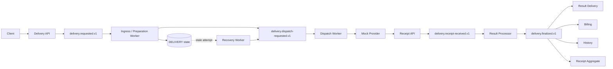

# 요구사항과 전체 설계

> 최신 물리 테이블은 `ORIGIN`·`STEP`이다. 기존 `delivery_state`가 있는 환경은 [테이블 분리·이관 절차](36-원본과-단계-테이블-분리와-경로별-쓰기-내역.md)를 먼저 따른다.

> 2026-09-25 최신 정책: 완료 후 작은 DDB 기록 의무 보관은 [ADR-022](adr/ADR-022-처리-중-DynamoDB-선점과-완료-후-Redis-중복-차단.md)의 Redis TTL 차단으로 대체한다. Redis 소실 시에도 DDB 조건까지 통과하면 재발송을 허용한다. SQL 이력·통지 저장 전 원본 보존은 유지한다. 아래의 이전 완료 기록 정책은 이 결정이 우선하며, 새 API의 v2 경로에 적용했다. 세부 경계와 기존 v1 호환 범위는 [최신 구현·검증](35-원본과-단계-최소-저장-및-Redis-완료-중복-차단.md)을 따른다.

## 1. 목표와 범위

이 시스템의 산출물은 Event Delivery API 자체보다 다음 질문을 코드, 저장 데이터, 메트릭, 테스트 결과로 설명하는 것입니다.

- 접수된 Delivery가 각 순간에 어디에 있는가?
- 어느 구간에서 유실 또는 중복될 수 있는가?
- 어느 프로세스가 죽어도 무엇을 기준으로 재개하는가?
- 외부 호출 결과를 알 수 없을 때 어떤 상태와 운영 절차를 사용하는가?
- 병목과 lag가 발생하면 어떤 컴포넌트를 얼마나 확장하는가?

실제 업체·API 대신 자체 외부 발송 시뮬레이터를 사용합니다. 1차는 HTTP, 2차는 TCP/IP 소켓 통신입니다. 2차 TCP 응답은 수신·접수 확인이며 최종 발송 결과는 HTTP 웹훅으로 받습니다. [통신 계약](08-함께-결정할-설계-사항.md#q2-통신-방식과-tcp-계약)에 따라 접수 응답만으로 전체 발송 성공을 기록하지 않습니다. 결과 조회 API는 제공하지 않으며, 외부 중복 방지는 보조 수단으로만 취급합니다. 내부 멱등성과 외부 결과 불명 상태의 한계는 [Q2 결정 기록](08-함께-결정할-설계-사항.md#q2-확정-내용과-보장-한계)에 구분합니다. Kubernetes, KEDA, CDC는 핵심 전달 보장을 검증한 뒤 적용합니다.

리전 전체 장애를 제외한 데이터 무손실을 목표로 합니다. 접수 원본·실행 및 멱등 상태·최종 결과의 보존과 복구를 함께 설계합니다. [Q3 장애 범위와 근거](08-함께-결정할-설계-사항.md#q3-리전-전체-장애를-제외한-무손실-목표)에 따라 실제 복제 배치·쓰기 확인·보관·복원 시험으로 입증해야 하며 현재 로컬 구성이 이 범위를 보장한다는 뜻은 아닙니다.

## 2. 설계 불변조건

구현과 테스트는 아래 조건을 계속 만족해야 합니다.

1. **접수 응답의 근거가 남는다.** 성공 응답한 Delivery는 Kafka에서 다시 처리할 수 있어야 합니다.
2. **전달은 at-least-once이다.** Consumer는 동일 event가 여러 번 도착해도 상태와 부수 효과가 망가지지 않아야 합니다.
3. **상태 전이는 단조롭다.** 늦게 도착한 낮은 단계의 이벤트가 최종 상태를 되돌리지 않아야 합니다.
4. **외부 부수 효과에는 별도 방어선이 있다.** 내부 Consumer 멱등성과 Provider 호출 멱등성을 구분합니다.
5. **재시도에는 한도가 있다.** 횟수, 마감 시간, 다음 시각, 최종 격리 사유를 기록합니다.
6. **복구는 원장에서 시작한다.** Redis 데이터 손실만으로 Delivery 원본이나 최종 결과가 사라지지 않아야 합니다.
7. **장애는 단계별로 격리된다.** Provider 지연이 API 접수와 독립 Consumer Group까지 전파되지 않아야 합니다.
8. **관측 정보는 식별자로 연결된다.** `deliveryId`, `eventId`, `attemptId`, `tenantId`, `providerRequestId`, `traceId`로 로그와 메트릭을 추적할 수 있어야 합니다.

## 3. 목표 처리 흐름

`delivery.finalized.v1` 이후 기능은 서로 다른 Consumer Group을 사용합니다. 한 기능의 장애나 재처리가 다른 기능의 offset과 처리량에 영향을 주지 않게 하기 위해서입니다.

## 4. 식별자와 이벤트 계약

| 필드 | 역할 | 생성 위치 | 규칙 |
|---|---|---|---|
| `deliveryId` | 고객이 인식하는 Delivery 단위 | API | tenant와 Client Idempotency-Key에서 안정적으로 생성 |
| `eventId` | 한 번의 상태 전이 이벤트 | 각 Producer | Consumer deduplication 기준 |
| `attemptId` | Provider 호출 한 번 | Dispatch Worker | 호출 결과, Retry와 Fallback 추적 |
| `tenantId` | 고객/서비스 격리 | 인증 정보 | partition key, TPS, quota 기준 후보 |
| `idempotencyKey` | 동일 요청 또는 Provider 호출 식별 | Client/API 또는 Sender | 범위와 보존 기간을 명시 |
| `correlationId` | 전체 흐름 연결 | API | 로그와 trace에 전파 |

모든 Kafka event에는 최소한 `schemaVersion`, `eventId`, `eventType`, `occurredAt`, `deliveryId`, `tenantId`, `correlationId`, `causationId`, `payload`가 필요합니다. 현재 최초 요청과 Dispatch 요청은 단계별로 안정적인 eventId를 만들고 `causationId`로 연결합니다.

## 5. 저장소 책임

각 저장소의 선택 이유·보장 조건·실패 사례는 [저장소 특성과 내구성](07-저장소별-특성과-데이터-유실-복구-조건.md)과 [ADR-002 제안](adr/ADR-002-저장소-역할과-선택-이유.md)을 참고합니다. 장애 범위와 1·2차 발송 계약 등 미확정 사항은 [설계 논의 목록](08-함께-결정할-설계-사항.md)에 기록하며, 기존 흐름의 모든 보장이 검증됐다는 의미는 아닙니다.

| 저장소 | 책임 | 저장하지 않을 것 |
|---|---|---|
| DynamoDB `DELIVERY_STATE` | Delivery projection, Dispatch Attempt, retry/recovery 근거 | 모든 내부 계산의 중간 결과 |
| PostgreSQL | 최종 이력, 실패 이력, 운영 기준정보, 통계 | 초고빈도 임시 lock |
| Redis | TPS, quota의 빠른 카운터, cache, 짧은 dedupe | 유일한 원본 또는 복구 근거 |
| Kafka | 최초 접수 원장, 단계 사이의 전달과 fan-out | 장기 상태 조회 projection |

Quota가 과금 또는 계약상 정확해야 한다면 Redis 증가만으로 확정하지 않고, 내구성 있는 사용 이벤트와 정산 절차를 둡니다. Redis 장애 시 TPS·Quota는 전부 우회하는 정책으로 확정했습니다. 장애 구간의 사용량 보정과 복구 후 정책 재적용은 별도로 설계합니다.

## 6. 상태 모델

상태는 Delivery 전체 상태와 Provider Attempt 상태를 구분합니다.

### Delivery 상태 예시

`ACCEPTED → DISPATCH_REQUESTED → PROVIDER_ACCEPTED → DELIVERED | DELIVERY_FAILED`

예외 상태는 다음 의미를 갖습니다.

- `RETRY_SCHEDULED`: 결과를 알고 있으며 일시 실패라 다시 실행할 예정
- `UNKNOWN`: Provider가 요청을 받았는지 확인할 수 없음
- `RECOVERY_REQUIRED`: 정상 이벤트 흐름이 끊겨 원장을 기준으로 복구 필요
- `DEAD`: 자동 처리 한도를 넘겨 운영 판단 필요

### 단계 상태

`READY → PROCESSING → COMPLETED | FAILED | UNKNOWN`

상태 변경은 conditional update와 version을 사용합니다. `DELIVERED`가 기록된 뒤 늦은 Sender 응답이 와도 `PROVIDER_ACCEPTED`로 돌아가지 않습니다. Receipt가 HTTP 응답보다 먼저 도착해도 결과 이벤트의 단계 우선순위와 provider event time을 이용해 수렴시킵니다.

## 7. 전달 보장과 원자성 경계

API는 Kafka-first 방식을 사용합니다. `DeliveryRequested`가 broker에서 ack된 뒤에만 `202 Accepted`를 반환하고 DynamoDB projection은 downstream Consumer가 만듭니다. 따라서 API의 DynamoDB write와 publish status update가 필요하지 않습니다.

Ingress Consumer는 `DynamoDB conditional insert → DispatchRequested 발행 ack → listener 완료` 순서로 처리합니다. 저장과 Kafka 발행은 하나의 transaction이 아니므로 프로세스 종료 시 Dispatch event가 중복될 수 있습니다. 동일 event 재전달, conditional write와 downstream 멱등성을 정상 동작으로 취급합니다.

Kafka Producer는 `acks=all`, idempotence, 적절한 replication factor와 `min.insync.replicas`를 사용합니다. 이것은 Kafka 내부 재전송 중복을 줄이지만 HTTP Provider 호출을 exactly-once로 만들지는 않습니다.

## 8. Sender 멱등성

Sender는 처리 기록을 먼저 점유하고 외부 호출을 수행합니다. 권장 흐름은 다음과 같습니다.

1. `deliveryId + provider + attemptPurpose`로 발송 작업을 conditional claim합니다.
2. 이미 `COMPLETED`면 외부 호출 없이 ack합니다.
3. lease가 유효한 `PROCESSING`이면 다른 Consumer가 수행 중인 것으로 처리합니다.
4. Provider에 안정적인 idempotency key를 전달합니다.
5. 명확한 성공/실패는 상태에 기록한 뒤 offset을 commit합니다.
6. 응답 미수신은 그 사유와 재시도 계획을 기록한 뒤 재시도합니다. 결과를 기록하지 못한 채 Worker가 종료된 건은 운영 확인으로 넘깁니다.

이번 설계에서는 Provider 결과 조회를 사용할 수 없고 외부 멱등성에 의존하지 않습니다. 내부 완료 기록이 없는 timeout·프로세스 종료 후의 재호출은 외부 중복 가능성이 있으므로 lease 만료만으로 안전한 재발송이라고 판단하지 않습니다. 무응답 재시도·프로세스 종료 시 운영 확인·웹훅 대기 만료는 [Q6 결정 기록](08-함께-결정할-설계-사항.md#q6-확정-내용과-남은-결정)을 따릅니다. 재시도는 3회입니다. 1차 만료는 인입 시각, 2차 만료는 1차 결과를 판단해 전환을 결정한 시각을 기준으로 하며 테스트 기준 기간은 1차 3시간·2차 4시간이며 독립적으로 설정합니다. 전체 최대 기한은 인입부터 7시간입니다. 전환을 결정한 응답/웹훅 수신 시각, 1차 만료 시각 또는 1차 무응답 재시도 소진 판단 시각으로 기준을 한 번 고정하며, 재처리나 중복 응답으로 연장하지 않습니다. 만료 후 해당 단계의 웹훅은 로그만 남기고 폐기합니다. 내부 중복 제어만으로 최종 전달 완료와 외부 중복 0회를 동시에 보장한다고 표현하지 않습니다.

## 9. Provider Fallback

2차는 다른 업체로의 대체 발송이며 **최초 메시지에서 2차 발송을 설정한 경우에만** 허용합니다. 1차 발송 응답 또는 업체의 결과 웹훅으로 받은 실패 에러 코드에 따라 1차 재시도와 2차 전환을 구분합니다. 확정 근거와 남은 정책은 [Q1 결정 기록](08-함께-결정할-설계-사항.md#q1-확정-내용과-남은-세부-정책)에 남깁니다.

| 구분 | 의미 | 예시 |
|---|---|---|
| Retry | 같은 Provider에 다시 시도 | 재시도 대상으로 분류한 실패 코드에 대해 지정 시간 후 실행. 1초·10초는 예시 |
| Fallback | 다른 Provider로 경로 변경 | 2차 전환 대상 실패 코드, 1차 만료 또는 1차 무응답 재시도 3회 소진이며 최초 메시지에서 2차 허용 |

Fallback 정책은 tenant, event type, destination별로 `primaryProvider`, `fallbackProviders`, 전환 가능한 오류, Provider별 최대 시도 횟수와 전체 deadline을 가집니다. 하나의 `deliveryId` 아래 Provider 호출마다 별도의 `attemptId`와 `routeOrder`를 기록합니다.

업체별 코드의 의미와 분류는 Q2에서 확인합니다. 1차 무응답 재시도 3회 소진 시 요청에서 허용했다면 만료까지 기다리지 않고 즉시 TCP 2차 발송으로 전환합니다. 첫 무응답 자체나 circuit open, HTTP 5xx 자체만으로 즉시 전환하는 정책은 아닙니다. 1차 만료 시에도 요청의 2차 허용 설정에 따라 전환합니다. 프로세스 종료 후 운영 확인 중인 건도 동일한 만료 전환을 적용합니다. 운영 확인은 기한을 중지·연장하지 않으며 운영자는 기한 내에 처리해야 합니다. 고객에게 최대 만료 시간 내 종료 결과를 제공해야 하며 전체 최대 기한과 제공 방식은 [Q4 기한 계약](08-함께-결정할-설계-사항.md#q4-고객-결과-제공-기한)에 정리합니다. 2차 비허용·명확한 실패 코드의 재시도 소진·2차 자체 소진·전체 발송 실패 시의 종료 처리는 후속 논의로 남깁니다.

## 10. Retry와 Recovery

| 구분 | Retry | Recovery |
|---|---|---|
| 원인 | 일시 실패 또는 Worker가 관찰·기록한 응답 미수신 | 정상 흐름 이탈, 프로세스 종료, 발행 누락 |
| 시작점 | 실패한 Consumer | Kafka 재전달 또는 만료된 Attempt scan |
| 입력 | 실패 event와 오류 분류 | Kafka record, `DELIVERY_STATE` |
| 스케줄 | 10초, 30초, 1분, 5분 등 | `nextRecoveryAt` 기준 |
| 종료 | 성공, 한도 초과 후 DLT/DEAD | 정상 flow 복귀 또는 운영 격리 |

Retry event에는 `attempt`, `firstFailedAt`, `nextAttemptAt`, `lastErrorCode`, `originalTopic`을 둡니다. Retry Manager는 여러 delay topic 또는 시간 인덱스가 있는 저장소 방식 중 하나를 선택합니다. Kafka topic에 넣고 Consumer를 sleep시키는 방식은 partition 전체를 막으므로 사용하지 않습니다.

Recovery scan은 분산 실행을 고려해 bucket과 lease를 사용합니다. 재발행 직전 죽어도 중복 가능하므로 downstream 멱등성이 항상 필요합니다.

## 11. Partition과 순서

- 동일 Delivery의 순서가 중요하면 Kafka key는 `deliveryId`로 둡니다.
- tenant 간 공정성이 필요하면 hot tenant가 한 partition을 독점하지 않도록 key와 rate limit 전략을 별도 검토합니다.
- Consumer scale-out 상한은 활성 partition 수입니다.
- partition 수 증가는 기존 key의 partition 배치를 바꿀 수 있으므로 전역 순서를 가정하지 않습니다.

## 12. 관측성과 운영 기준

무손실을 유지하며 장애가 난 의존성의 작업만 중단하고 정상 구간은 계속합니다. [저장소 장애 시 중단 범위와 복구 절차](09-저장소-장애-시-중단-범위와-복구-절차.md)에 Kafka·DynamoDB·PostgreSQL·Redis별 감지, 안전한 중단, 복구 확인과 단계적 재개를 정리합니다. 장기 장애에 묶인 작업은 복구 후 만료 처리하며 Redis TPS·Quota는 장애 시 전부 우회합니다. 고객 결과는 동일 고객별 최대 100건으로 짧게 묶어 HTTP 전송합니다. [완료 데이터 정리와 결과 통지](10-고객-결과-묶음-전송과-발송-완료-데이터-정리.md)에 내구성 인계, 이력 한 줄과 작은 DynamoDB 완료 기록을 유지하는 확정 방식을 기록합니다.

모든 단계에 처리량, 성공/실패/중복 건수, 처리 시간, retry/recovery 횟수와 age를 기록합니다. 평균만 보지 않고 p50, p95, p99를 사용합니다.

필수 경보 후보는 다음과 같습니다.

- Consumer lag와 oldest record age가 지속 증가
- `UNKNOWN`, `DEAD`, recovery 대상의 건수와 oldest age 증가
- Provider 오류율/timeout/latency 임계 초과
- Provider별 fallback 전환율, 성공률과 fallback exhaustion
- Kafka produce 실패, ISR 감소, DLT 유입
- DynamoDB/PostgreSQL/Redis latency와 오류율 증가

`tenantId`와 `deliveryId`를 metric label로 사용하면 cardinality가 폭증하므로 로그/trace에 두고 metric은 provider, result, error class처럼 제한된 값을 사용합니다.

## 13. 성능 검증 원칙

100 → 1,000 → 5,000 → 10,000 TPS 순으로 올리되 각 단계에서 아래를 함께 기록합니다.

- API accepted rate와 p95/p99 latency
- Kafka produce/consume rate, lag, oldest age
- 단계별 throughput과 end-to-end p95/p99
- Provider 호출 concurrency, latency, error rate
- CPU, memory, GC, connection pool, DB consumed capacity
- 유실 수: accepted 수와 terminal/known in-flight 수의 보존식
- 중복 수: event 중복과 실제 Provider 부수 효과 중복을 별도로 측정

튜닝은 병목 측정 뒤 진행합니다. `batch.size`, `linger.ms`, compression, poll/fetch, DB batch 크기를 한 번에 하나씩 변경하고 throughput과 tail latency를 같이 비교합니다.
