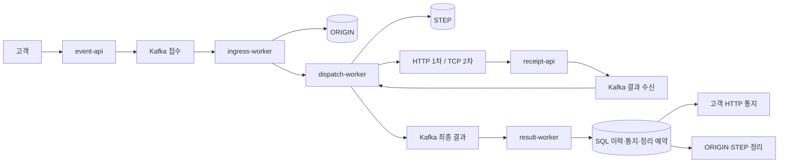

# 요구사항과 전체 설계

기준: 2026-09-25, 신규 v2 경로. 합의된 요구사항과 현재 설계를 한곳에 정리한다. 세부 논의의 경과는 [기존 논의 기록](08-함께-결정할-설계-사항.md), 실제 완료 여부는 [현재 상태](01-현재-구현-상태와-남은-작업.md)를 참고한다.

## 1. 목표와 범위

핵심은 **외부 업체에 대한 HTTP 1차·TCP/IP 2차 발송**이다. 실제 업체 대신 자체 시뮬레이터를 사용한다. 업체의 결과 조회 API는 없고, 외부 중복 방지를 내부 정확성의 전제로 삼지 않는다. 고객에게 나가는 결과 HTTP 통지는 발송과 별개다.

리전 전체 장애를 제외한 데이터 무손실과 가능한 한 서비스 지속을 목표로 한다. DynamoDB에는 처리 중 원본·선점·멱등·복구에 필요한 정보만 최소 저장한다. 로컬 단일 노드 시험이 다중 AZ 무손실을 입증하지는 않는다. 제품의 조건과 공식 근거는 [저장소 특성](07-저장소별-특성과-데이터-유실-복구-조건.md)에 있다.

전체 최종 성능 목표는 **10,000 TPS**다. 기능·장애 복구·운영 개발 완료 → 설정·튜닝 → 서비스별 Pod 1개 지속 성능 → 전체 확장 시험 순서로 진행한다. 기능 검증은 Java/JUnit 중심, 성능 부하 생성기는 k6다.

## 2. 확정한 업무 규칙

| 상황 | 처리 |
|---|---|
| 최초 접수 | Kafka 저장 ack 뒤에만 202 응답. 202는 최종 발송 성공이 아님 |
| 업체 접수 응답 | HTTP·TCP 모두 접수 확인. 최종 결과는 별도 HTTP 웹훅으로 수신 |
| 재시도 대상 코드·관찰한 무응답 | 해당 단계 최초 1회 + 최대 3회 재시도. 코드별 지연 적용 |
| 2차 전환 대상 실패 | 최초 요청의 fallbackAllowed가 참일 때만 다른 업체로 TCP 발송 |
| 1차 무응답 재시도 소진 | 대체 허용 시 만료까지 기다리지 않고 2차로 전환 |
| 선점 저장 후 프로세스 종료·결과 미기록 | 운영 확인. lease 만료만으로 자동 재발송하지 않음 |
| 운영 확인 중 만료 | 원래 만료 정책 적용. 운영자가 기한을 중지·연장할 수 없음 |
| 1차 만료 | 최초 인입 +3시간. 대체 허용 시 2차 전환 |
| 2차 만료 | 1차 결과 판단 시각 +4시간. 실제 2차 호출 시작 시각으로 다시 계산하지 않음 |
| 늦은 웹훅 | 만료된 단계의 웹훅은 로그·관측만 남기고 폐기. 업무 결과를 정정하지 않음 |
| 장기 장애 후 복구 | 원래 기한이 지난 작업은 만료 처리. 이미 확정된 성공은 보존 |
| Redis 장애 | TPS·Quota 제한 우회. 인증·Kafka 저장 확인·DynamoDB 선점은 유지 |
| 고객 결과 통지 | 같은 고객의 결과를 최대 100건 묶어 HTTP 전송. 건수를 채우느라 오래 기다리지 않음 |
| 고객 결과 재전송 | 최초 전송 + 최대 20회, 총 21회까지. 외부 발송의 재시도 3회와 별개 |

1차 결과 판단 시각은 전환을 결정한 응답·웹훅 수신 시각, 무응답 소진 판단 시각 또는 **원래 1차 만료 시각**으로 고정한다. 재처리·중복 응답·늦은 복구로 연장하지 않는다. 3시간·4시간은 독립 설정하는 시험 기준이며, 이 기준에서 업무상 전체 최대 기한은 인입부터 7시간이다. 아직 기한이 남은 요청까지 장기 장애를 이유로 일괄 만료하는 정책은 확정하지 않았다.

고객에게 최대 만료 시간 내 결과를 제공하는 것이 요구사항이다. 다만 저장소 장기 장애, 복구 조회 지연, 고객 서버 장애가 있으면 실제 전달이 늦어질 수 있다. 장기 장애는 복구 후 원래 기한으로 만료·통지하며, 이를 기한 내 수신 보장을 이미 달성한 것으로 표현하지 않는다.

## 3. 현재 처리 구조

세부 호출 순서, 중간 종료 지점, 재시도·만료 분기는 [전체 Call Flow](04-요청-접수부터-최종-결과까지의-전체-흐름.md)에만 상세히 유지한다.

| 저장소 | 현재 책임 |
|---|---|
| Kafka | 최초 접수와 단계별 내구성 인계·재시도·DLT·최종 결과 전달 |
| DynamoDB ORIGIN | 고객 요청별 활성 원문, 실행 ID, 완료 보호·복구 정보 |
| DynamoDB STEP | 실행별 1·2차 선점, 설정, 회차·버전·기한, 결과와 최종 이벤트 |
| PostgreSQL | 최종 이력, 고객 통지 묶음·재전송, 정리 예약, DLT 수동 복구 조치 기록 |
| Redis | TPS·Quota, 만료 후보 Sorted Set, 완료 후 추가 중복 차단 TTL |

API에서 DynamoDB에 쓰지 않는다. ingress가 ORIGIN을 조건부 저장하고, dispatch가 STEP을 선점한 뒤 업체를 호출한다. 최종 결과는 STEP에 보존하며, SQL 이력·통지·정리 예약의 commit을 확인한 뒤 해당 실행의 ORIGIN·STEP을 삭제한다. 별도 FINAL 항목·웹훅 전용 중복 장부·재시도 예약용 STEP Update는 신규 v2 경로에서 사용하지 않는다.

## 4. 식별자와 멱등성의 범위

| 식별자 | 의미 |
|---|---|
| requestKey | tenantId + ClientMsgId(Idempotency-Key)의 안정적인 요청 키. API 응답의 deliveryId는 호환상 이 값 |
| 실행 deliveryId | ORIGIN 신규 선점 시 만드는 UUID. 허용된 새 접수는 이전 실행과 분리 |
| attemptId | 실행·업체·단계 ID. 같은 단계 재시도는 회차·version으로 구분 |
| eventId | 같은 논리 이벤트의 안정적인 ID. 최종 이벤트 중복은 SQL에서 같은 이력으로 수렴 |

진행 중에는 ORIGIN·STEP의 조건부 선점으로 중복을 막는다. 완료 후에는 SQL 저장·DDB 정리와 함께 Redis 표식으로 같은 요청을 차단한다. Redis 표식이 없고 DDB 선점 조건도 통과하면 새 실행을 허용한다. **완료 후 Redis 소실에 따른 재발송은 합의한 허용 범위이며 처리 중 데이터 유실 허용이 아니다.** 작은 DDB 완료 기록 영구 유지는 이전 정책이며, 기존 v1 데이터 호환 경로에만 남는다. [현재 결정과 근거](adr/ADR-022-처리-중-DynamoDB-선점과-완료-후-Redis-중복-차단.md).

업무 deadline과 완료 후 TTL은 별개다. 완료 TTL의 PoC 기본값은 finalizedAt +24시간이며 운영 확정값은 아니다. Redis 일정은 기본 1초마다 확인하고, 일부 일정 유실도 찾기 위해 ORIGIN·STEP 복구 인덱스를 기본 10분마다 조회한다. 10분은 복구 완료 상한이 아니다. DynamoDB TTL 삭제 이벤트로 업무 만료를 처리하지 않는다.

## 5. 유지해야 할 경계

- Kafka 입력은 업무 처리 또는 내구성 있는 후속 인계 뒤에 완료한다. DLT/재시도 발행 실패를 원본 처리 성공으로 간주하지 않는다.
- DB와 Kafka, 외부 HTTP/TCP는 단일 트랜잭션이 아니다. 같은 이벤트 재전달과 고정된 회차·실행 ID로 복구한다.
- 무응답 재시도나 결과 불명 1차의 만료 후 대체 발송에는 외부 중복 가능성이 남는다. 내부 선점만으로 외부 exactly-once를 보장하지 않는다.
- 고객 HTTP 응답 유실 시 같은 묶음이 다시 도착할 수 있다. 묶음 ID·결과 eventId를 유지하고 고객도 중복을 제거해야 한다.
- SQL commit 전 원본을 지우지 않는다. SQL 저장 이후 고객 통지와 DDB 정리는 독립 진행한다.
- DLT의 ORIGIN 없음은 미발송 증거가 아니다. 현재 수동 도구는 대조 가능한 기존 실행만 재개한다.

정상 1차 성공의 DDB 사용량은 **5회 API 호출·7항목 변경(삭제 포함)**이다. 조건 검사·읽기·GSI·과금은 별도이며, 복잡한 경로와 각 쓰기의 이유는 [ORIGIN·STEP 쓰기 내역](36-원본과-단계-테이블-분리와-경로별-쓰기-내역.md)을 따른다.

## 6. 추가 결정이 필요한 시점

현재 개발을 진행하기 위해 이미 확정한 정책을 다시 논의할 필요는 없다. 고객 장애 시 결과 제공 방식·재전송 소진 후 수동 조치, 보관 기간·복원 범위, 운영 보안·복제 배치·성능 SLO는 해당 기능이나 배포 준비 단계에서 정한다. 미확정값을 구현 기본값과 혼동하지 않는다. [남은 작업과 결정 시점](01-현재-구현-상태와-남은-작업.md).
