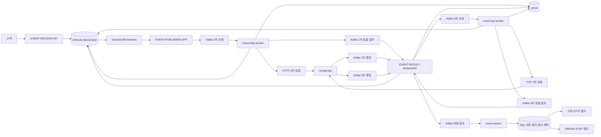

# 요구사항과 전체 설계

기준: 2026-10-02. 합의된 목표 설계를 정리한다. 접수 경로의 ORIGIN 선저장·Streams 발행과 HTTP·TCP 발송 Pod 분리는 아직 구현 전이며, 실제 완료 여부는 [현재 상태](01-현재-구현-상태와-남은-작업.md)를 참고한다. 결정과 장애 경계는 [ADR-023](adr/ADR-023-ORIGIN-선접수와-Streams-Kafka-발행.md)·[ADR-024](adr/ADR-024-HTTP와-TCP-발송-워커-분리.md)에 둔다.

## 1. 목표와 범위

핵심은 **외부 업체에 대한 HTTP 1차·TCP/IP 2차 발송**이다. 실제 업체 대신 자체 시뮬레이터를 사용한다. 업체의 결과 조회 API는 없고, 외부 중복 방지를 내부 정확성의 전제로 삼지 않는다. 고객에게 나가는 결과 HTTP 통지는 발송과 별개다.

리전 전체 장애를 제외한 데이터 무손실과 가능한 한 서비스 지속을 목표로 한다. DynamoDB에는 처리 중 원본·선점·멱등·복구에 필요한 정보만 최소 저장한다. 로컬 단일 노드 시험이 다중 AZ 무손실을 입증하지는 않는다. 제품의 조건과 공식 근거는 [저장소 특성](07-저장소별-특성과-데이터-유실-복구-조건.md)에 있다.

전체 최종 성능 목표는 **10,000 TPS**다. 기능·장애 복구·운영 개발 완료 → 설정·튜닝 → 서비스별 Pod 1개 지속 성능 → 전체 확장 시험 순서로 진행한다. 기능 검증은 Java/JUnit 중심, 성능 부하 생성기는 k6다.

## 2. 확정한 업무 규칙

| 상황 | 처리 |
|---|---|
| 최초 접수 | EVENT-RECEIVE-API가 ORIGIN `RECEIVED` 저장을 확인한 뒤 202 응답. Kafka 저장·업체 발송·최종 성공은 별개 |
| 최초 Kafka 발행 | DynamoDB Streams를 읽는 별도 Java 발행 앱이 수행. Kafka ack 확인 뒤 Streams 체크포인트 진행 |
| 발송 허가 | HTTP·TCP sender가 각자의 Kafka 레코드를 소비한 뒤 ORIGIN 상태와 해당 STEP의 조건부 선점을 확인. 완료·취소·만료 실행의 새 발송 금지 |
| 업체 접수 응답 | HTTP·TCP 모두 접수 확인. 최종 결과는 별도 HTTP 웹훅으로 수신 |
| 재시도 대상 코드·관찰한 무응답 | 해당 단계 최초 1회 + 최대 3회 재시도. 코드별 지연 적용 |
| 2차 전환 대상 실패 | 최초 요청의 fallbackAllowed가 참일 때만 다른 업체로 TCP 발송 |
| 1차 무응답 재시도 소진 | 대체 허용 시 만료까지 기다리지 않고 2차로 전환 |
| 선점 저장 후 프로세스 종료·결과 미기록 | 운영 확인. lease 만료만으로 자동 재발송하지 않음 |
| 운영 확인 중 만료 | 원래 만료 정책 적용. 운영자가 기한을 중지·연장할 수 없음 |
| 1차 만료 | 최초 인입 +3시간. 대체 허용 시 2차 전환 |
| 2차 만료 | 1차 결과 판단 시각 +4시간. 실제 2차 호출 시작 시각으로 다시 계산하지 않음 |
| 늦은 웹훅 | 만료된 단계의 웹훅은 로그·관측만 남기고 폐기. 업무 결과를 정정하지 않음 |
| 장기 장애 후 복구 | 원래 기한이 지난 작업은 만료 처리. 이미 확정된 성공은 보존 |
| Redis 장애 | TPS·Quota 제한과 고객 요청 중복 차단을 일시적으로 우회. 인증·ORIGIN 저장·실행별 발송 선점은 유지 |
| 고객 결과 통지 | 같은 고객의 결과를 최대 100건 묶어 HTTP 전송. 건수를 채우느라 오래 기다리지 않음 |
| 고객 결과 재전송 | 최초 전송 + 최대 20회, 총 21회까지. 외부 발송의 재시도 3회와 별개 |

1차 결과 판단 시각은 전환을 결정한 응답·웹훅 수신 시각, 무응답 소진 판단 시각 또는 **원래 1차 만료 시각**으로 고정한다. 재처리·중복 응답·늦은 복구로 연장하지 않는다. 3시간·4시간은 독립 설정하는 시험 기준이며, 이 기준에서 업무상 전체 최대 기한은 인입부터 7시간이다. 아직 기한이 남은 요청까지 장기 장애를 이유로 일괄 만료하는 정책은 확정하지 않았다.

고객에게 최대 만료 시간 내 결과를 제공하는 것이 요구사항이다. 다만 저장소 장기 장애, 복구 조회 지연, 고객 서버 장애가 있으면 실제 전달이 늦어질 수 있다. 장기 장애는 복구 후 원래 기한으로 만료·통지하며, 이를 기한 내 수신 보장을 이미 달성한 것으로 표현하지 않는다.

## 3. 목표 처리 구조

```mermaid
flowchart LR
    C[고객] --> A[EVENT-RECEIVE-API]
    A --> O[(ORIGIN RECEIVED)]
    O --> T[DynamoDB Streams]
    T --> B[EVENT-PUBLISHER-APP]
    B --> K[Kafka 1차 요청]
    K --> H1[event-http-sender]
    H1 --> O
    H1 --> S[(STEP)]
    H1 --> P1[HTTP 1차 업체]
    H1 --> OH[Kafka 1차 호출 결과]
    OH --> M[EVENT-RESULT-MANAGER]
    M --> S
    M --> O
    M --> F1[Kafka 2차 요청]
    F1 --> T1[event-tcp-sender]
    T1 --> O
    T1 --> S
    T1 --> P2[TCP 2차 업체]
    P1 --> W[receipt-api]
    P2 --> W
    T1 --> OT[Kafka 2차 호출 결과]
    OT --> M
    W --> RH[Kafka 1차 웹훅]
    W --> RT[Kafka 2차 웹훅]
    RH --> M
    RT --> M
    M --> F[Kafka 최종 결과]
    F --> H[result-worker]
    H --> Q[(SQL 이력·통지·정리 예약)]
    Q --> N[고객 HTTP 통지]
    Q --> X[ORIGIN·STEP 정리]
```

세부 호출 순서, 중간 종료 지점, 재시도·만료 분기는 [전체 Call Flow](04-요청-접수부터-최종-결과까지의-전체-흐름.md)에만 상세히 유지한다.

| 저장소 | 현재 책임 |
|---|---|
| Kafka | 접수된 실행의 처리 전달과 단계별 내구성 인계·재시도·DLT·최종 결과 전달 |
| DynamoDB ORIGIN | 최초 접수 원장, 실행 ID·원문, 현재 실행 상태, 완료 보호·복구 정보 |
| DynamoDB STEP | 실행별 1·2차 선점, 설정, 회차·버전·기한, 결과와 최종 이벤트 |
| PostgreSQL | 최종 이력, 고객 통지 묶음·재전송, 정리 예약, DLT 원문·조회 위치·복구 조치와 운영 감사 |
| Redis | TPS·유형별 월 Quota 기록, 고객 요청 중복 차단, 만료 후보 Sorted Set |

API는 Kafka에 직접 발행하지 않고 ORIGIN을 조건부 저장한다. 발행 앱은 신규 ORIGIN의 Streams 기록을 빠른 트리거로 삼아 `event.http.requested.v1`에 발행하고, broker ack를 확인한 뒤 Streams 체크포인트를 진행한다. 최초 발행을 표시하기 위해 ORIGIN을 다시 쓰지 않는다. `event-http-sender`가 Kafka 레코드를 읽으면 최초 발행이 확인된 것이며, 실제 업체 호출 전 ORIGIN·1차 STEP 조건을 확인한다. 두 sender는 자기 단계의 업체 호출과 즉시 응답 기록만 맡는다. 업체의 즉시 결과와 receipt-api의 웹훅은 `EVENT-RESULT-MANAGER`로 전달한다. Manager가 재시도·2차 전환·최종화·만료를 한 곳에서 판단하고, 1차 판단을 STEP에 고정한 뒤 `event.tcp.requested.v1`로 인계하면 `event-tcp-sender`가 2차 STEP을 선점한다. 기존 `delivery-ingress-worker`의 최초 ORIGIN 저장 역할은 API로 이동하므로 목표 구조에 별도 ingress 워커를 두지 않는다. Streams 보존 기간을 넘는 장애에도 대비해 후속 진행 증거가 없는 ORIGIN을 STEP·최종 이력과 주기적으로 대조한다. 최종 결과는 STEP에 보존하며, SQL 이력·통지·정리 예약의 commit을 확인한 뒤 해당 실행의 ORIGIN·STEP을 삭제한다. 이는 목표 구조이며 현재 구현의 Kafka-first 흐름과 구분한다. 단계별 토픽과 책임은 [ADR-024](adr/ADR-024-HTTP와-TCP-발송-워커-분리.md)에 둔다.

## 4. 식별자와 멱등성의 범위

| 식별자 | 의미 |
|---|---|
| 고객 중복키 | 본문 `eventId`와 JWT의 `clientId`, 본문 `recipientNumber`의 조합. Redis에서 관리 |
| executionId | EVENT-RECEIVE-API가 허용된 새 실행마다 생성하는 UUID. ORIGIN·Kafka·STEP·이력의 실행 구분 |
| attemptId | 실행·업체·단계 ID. 같은 단계 재시도는 회차·version으로 구분 |
| eventId | 고객이 본문에 지정하는 이벤트 ID. 내부 Kafka 기록·최종 결과 ID와 구분 |

신규 API 본문은 `eventId`, `recipientNumber`(정확히 `01012345678` 형식의 11자리), `eventType`(`GENERAL`, `NOTI`, `ADV`, `ALERT`), `payload`, `fallbackAllowed`를 받는다. 우선순위는 없다. 고객별 계약의 TPS 한도, 10초 고정 구간 인입 기록, 유형별 월 Quota를 적용하며 중복 요청도 인입량과 월 Quota에 기록한다. 상세 순서와 유효하지 않은 본문의 처리 범위는 [ADR-023](adr/ADR-023-ORIGIN-선접수와-Streams-Kafka-발행.md)을 따른다.

Redis의 고객 중복키는 처리 중 새 실행을 차단한다. 최종 성공은 성공 시각부터 2시간 유지하고, 그 외 최종 결과는 SQL 이력 정리 시 해당 실행의 키를 제거한다. 이전 실행이 새 실행의 키를 지우지 않도록 `executionId`를 비교한다. Redis 장애 시 같은 고객 이벤트의 별도 실행은 허용될 수 있지만, **동일 `executionId`의 Kafka 재전달이 업체 재발송으로 이어진다는 뜻은 아니다.** 각 실행의 STEP 선점은 별도로 유지한다. [이전 정책](adr/ADR-022-처리-중-DynamoDB-선점과-완료-후-Redis-중복-차단.md)은 구현 이력으로 보존한다.

업무 deadline과 성공 후 중복 차단 2시간은 별개다. 현재 구현의 완료 TTL 기본값은 최종화 +24시간으로, 신규 정책으로 이관해야 한다. Redis 일정은 현재 기본 1초마다 확인하고, 일부 일정 유실도 찾기 위해 ORIGIN·STEP 복구 인덱스를 기본 10분마다 조회한다. 신규 발행 복구의 조회 주기·지연 목표는 부하 시험으로 정한다. DynamoDB TTL 삭제 이벤트로 업무 만료나 최초 발행을 처리하지 않는다.

## 5. 유지해야 할 경계

- Kafka 입력은 업무 처리 또는 내구성 있는 후속 인계 뒤에 완료한다. DLT/재시도 발행 실패를 원본 처리 성공으로 간주하지 않는다.
- 최초 Kafka 발행의 ack가 불명확하면 같은 `executionId`로 재시도한다. Kafka 소비자가 기존 레코드를 읽으면 후속 처리할 수 있으며, 실제 업체 발송은 ORIGIN 상태 확인과 STEP 선점 뒤에만 허용한다.
- DB와 Kafka, 외부 HTTP/TCP는 단일 트랜잭션이 아니다. 같은 이벤트 재전달과 고정된 회차·실행 ID로 복구한다.
- 무응답 재시도나 결과 불명 1차의 만료 후 대체 발송에는 외부 중복 가능성이 남는다. 내부 선점만으로 외부 exactly-once를 보장하지 않는다.
- 고객 HTTP 응답 유실 시 같은 묶음이 다시 도착할 수 있다. 묶음 ID·결과 eventId를 유지하고 고객도 중복을 제거해야 한다.
- SQL commit 전 원본을 지우지 않는다. SQL 저장 이후 고객 통지와 DDB 정리는 독립 진행한다.
- DLT의 ORIGIN 없음은 미발송 증거가 아니다. 복구 도구는 기존 실행을 재개하거나, 활성화된 SQL 이력 보존 범위 안에서 발송 보류 원본을 조건부 복원하고 이력을 다시 대조한다. 운영 재검토도 같은 조건과 원래 기한을 유지한다. [복구 조건](50-DLT-원장-대조와-기존-실행-복구.md).

기존 구현의 정상 1차 성공 DDB 사용량은 **5회 API 호출·7항목 변경(삭제 포함)**이다. 신규 구조는 API의 ORIGIN 선저장과 Streams 발행·복구 조회가 포함되므로 이 수치를 성능 예상치로 재사용하지 않는다. 최초 발행 ack 후 ORIGIN 갱신은 없다. 조건 검사·읽기·GSI·과금까지 포함한 사용량은 구현 후 다시 측정한다. [기존 쓰기 내역](36-원본과-단계-테이블-분리와-경로별-쓰기-내역.md).

## 6. 추가 결정이 필요한 시점

현재 개발을 진행하기 위해 이미 확정한 정책을 다시 논의할 필요는 없다. 고객 장애 시 결과 제공 방식·재전송 소진 후 수동 조치, 보관 기간·복원 범위, 운영 보안·복제 배치·성능 SLO는 해당 기능이나 배포 준비 단계에서 정한다. 미확정값을 구현 기본값과 혼동하지 않는다. [남은 작업과 결정 시점](01-현재-구현-상태와-남은-작업.md).
