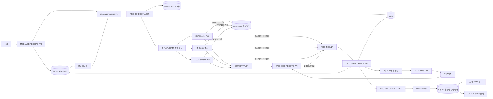

# 요구사항과 전체 설계

기준: 2026-10-06. 합의된 목표 설계를 정리한다. 접수 경로의 ORIGIN 선저장·API 직접 Kafka 발행과 HTTP·TCP 발송 Pod 분리는 이관 중이며, 실제 완료 여부는 [현재 상태](01-현재-구현-상태와-남은-작업.md)를 참고한다. 최신 접수·1차 발송 순서는 [ADR-026](adr/ADR-026-MESSAGE-RECEIVED와-통신사별-HTTP-발송-분리.md), API TPS·Quota는 [ADR-027](adr/ADR-027-접수-API-Redis-TPS와-유형별-월-Quota.md)을 따른다.

## 용어 기준

| 용어 | 의미 |
|---|---|
| 메시징 서비스 | 고객의 메시지를 접수하고 통신사 발송·결과 통지까지 처리하는 서비스 전체 |
| 메시지 | 고객이 발송 요청한 업무 대상. 접수·발송·결과·TPS의 건수 기준 |
| messageCategory | Quota를 나누는 메시지 분류. API 값은 `GENERAL`·`NOTI`·`ADV`·`ALERT`; 각 값의 업무상 정의는 아직 문서화되지 않음 |
| messageType | 발송 형식이 따로 필요해질 때 사용할 이름. 현재 지원 값·API 필드가 없으며 `messageCategory`의 네 값을 중복해서 넣지 않음 |
| messageId | 고객이 메시지에 부여한 API ID. UTF-8 최대 40바이트이며 내부 실행·발송 ID와 구분 |
| sendRequestId | 최초 접수마다 생성하는 하이픈 없는 UUID 32자리의 고정 메시지 ID `R`. ORIGIN·Kafka·STEP·이력의 정확한 조회 키이며 재시도·통신사 이동에도 유지 |
| 업체 전송 sendRequestId | 한 HTTP 호출을 구분하는 `R:통신사:회차` 형식(예: `R:SKT:1`). 업체 ID 최대 40바이트에 맞춰 생성하며, 웹훅의 `clientMsgId`로 동일 값을 돌려받는다. 같은 호출 명령의 재전달에는 유지하고 다음 회차·통신사에는 새로 파생 |
| traceId | 각 외부 인입 요청의 추적 ID. 고객 API 요청과 웹훅 HTTP 요청마다 별도로 생성하고 업무 멱등키로 사용하지 않음 |
| Kafka 레코드 | 메시지 처리 단계를 다른 서비스에 인계하는 기술적 기록. 한 메시지에 여러 기록이 생길 수 있음 |

신규 경로는 `messaging-*` 모듈, `messaging.*` Java 패키지, `/api/v1/messages`, `messageId`·`messageCategory`, `message.*` Kafka 토픽, `message:*` Redis 키를 사용한다. Compose 프로젝트명은 `reliable-messaging-service`, Maven 좌표는 `org.side.project.messaging`이다. 이전 `event.*` 토픽·Redis 키와 구 API 필드를 쓰는 데이터는 새 경로에서 자동 호환되지 않는다. 운영 전환 시 기존 인입을 비우거나 이관하고 CDC 재투영·DynamoDB 발행 복구 인덱스를 점검해야 한다.

## 1. 목표와 범위

핵심은 **외부 업체에 대한 HTTP 1차·TCP/IP 2차 발송**이다. 실제 업체 대신 자체 시뮬레이터를 사용한다. 업체의 결과 조회 API는 없고, 외부 중복 방지를 내부 정확성의 전제로 삼지 않는다. 고객에게 나가는 결과 HTTP 통지는 발송과 별개다.

리전 전체 장애를 제외한 데이터 무손실과 가능한 한 서비스 지속을 목표로 한다. DynamoDB에는 처리 중 원본·선점·멱등·복구에 필요한 정보만 최소 저장한다. 로컬 단일 노드 시험이 다중 AZ 무손실을 입증하지는 않는다. 제품의 조건과 공식 근거는 [저장소 특성](07-저장소별-특성과-데이터-유실-복구-조건.md)에 있다.

전체 최종 성능 목표는 **10,000 TPS**다. 기능·장애 복구·운영 개발 완료 → 설정·튜닝 → 서비스별 Pod 1개 지속 성능 → 전체 확장 시험 순서로 진행한다. 기능 검증은 Java/JUnit 중심, 성능 부하 생성기는 k6다.

## 2. 확정한 업무 규칙

| 상황 | 처리 |
|---|---|
| 최초 접수 | MESSAGE-RECEIVE-API가 ORIGIN `RECEIVED` 저장을 확인한 뒤 202 응답. Kafka 저장·업체 발송·최종 성공은 별개 |
| 최초 Kafka 발행 | MESSAGE-RECEIVE-API가 ORIGIN 저장 직후 직접 Kafka send. ack 실패·응답 불명은 ORIGIN 인덱스 복구 |
| 발송 허가 | 신규 1차 sender는 ORIGIN의 미완료 상태와 Redis 발송 중복 제어를 확인. 완료·취소·만료 실행의 새 발송 금지. 기존 STEP 선점·2차 보호 방식은 이관 과제 |
| 업체 중복 차단 | 업체가 발송 중이거나 성공한 동일 업체 전송 sendRequestId의 중복 발송을 약 2시간 차단하는 것으로 파악. 실패한 호출의 ID는 재사용할 수 있으나, 회차 구분을 위해 다음 호출에는 새 파생 ID를 쓴다. 정확한 보장 시간·기산 시점은 확인 전이며 고객 요청 중복 차단 2시간과 별개 |
| 업체 접수 응답 | 신규 1차 HTTP `200 OK`는 DynamoDB에 기록하고 Kafka 결과를 발행하지 않음. 그 발송의 웹훅이 최종 결과. 명시적 비-200은 웹훅 없이 sender가 실패 코드를 `MSG_RESULT`에 직접 발행 |
| 1차 통신사 실패 코드 | `66001`(자사 통신사 아님)에서만 SKT → KT → LGU+ 중 이미 시도한 곳을 제외한 다음 통신사로 이동. `66002`(TPS 초과)는 실패 판단 1분 후 동일 통신사에 새 회차로 재발송. HTTP 응답 실패와 실패 웹훅에 같은 판단 적용 |
| 1차 단계 실패 코드 | `66002` 허용 회차 소진은 `40001`, SKT·KT·LGU+ 모두 `66001`은 `40002`로 1차 실패 저장. 이후 2차 발송 허용·기한을 확인하고 대상이면 2차 인계, 아니면 최종 실패 |
| 재시도 대상 코드·관찰한 무응답 | 해당 단계 최초 1회 + 최대 3회 재시도(총 최대 4회). `66002`의 각 재발송은 실패 판단 1분 후 |
| 2차 전환 대상 실패 | 최초 요청의 fallbackAllowed가 참일 때만 다른 업체로 TCP 발송 |
| 1차 무응답 재시도 소진 | 대체 허용 시 만료까지 기다리지 않고 2차로 전환 |
| 선점 저장 후 프로세스 종료·결과 미기록 | 운영 확인. lease 만료만으로 자동 재발송하지 않음 |
| 운영 확인 중 만료 | 원래 만료 정책 적용. 운영자가 기한을 중지·연장할 수 없음 |
| 1차 만료 | 최초 인입 +3시간. 대체 허용 시 2차 전환 |
| 2차 만료 | 1차 결과 판단 시각 +4시간. 실제 2차 호출 시작 시각으로 다시 계산하지 않음 |
| 늦은 웹훅 | 업체 재전송 최대 기간은 없음. 웹훅 API 수신 기한과 업무 결과 판단 기한을 구분. 만료·최종 확정 뒤 도착한 결과는 관측만 남기고 업무 결과를 정정하지 않음 |
| 장기 장애 후 복구 | 원래 기한이 지난 작업은 만료 처리. 이미 확정된 성공은 보존 |
| Redis 장애 | 고객 요청 중복 차단을 일시적으로 우회. 인증·ORIGIN 저장·실행별 발송 선점은 유지 |
| 고객 결과 통지 | 같은 고객의 결과를 최대 100건 묶어 HTTP 전송. 건수를 채우느라 오래 기다리지 않음 |
| 고객 결과 재전송 | 최초 전송 + 최대 20회, 총 21회까지. 외부 발송의 재시도 3회와 별개 |

1차 결과 판단 시각은 전환을 결정한 응답·웹훅 수신 시각, 무응답 소진 판단 시각 또는 **원래 1차 만료 시각**으로 고정한다. 재처리·중복 응답·늦은 복구로 연장하지 않는다. 3시간·4시간은 독립 설정하는 시험 기준이며, 이 기준에서 업무상 전체 최대 기한은 인입부터 7시간이다. 아직 기한이 남은 요청까지 장기 장애를 이유로 일괄 만료하는 정책은 확정하지 않았다.

고객에게 최대 만료 시간 내 결과를 제공하는 것이 요구사항이다. 다만 저장소 장기 장애, 복구 조회 지연, 고객 서버 장애가 있으면 실제 전달이 늦어질 수 있다. 장기 장애는 복구 후 원래 기한으로 만료·통지하며, 이를 기한 내 수신 보장을 이미 달성한 것으로 표현하지 않는다.

## 3. 목표 처리 구조

```mermaid
flowchart LR
    C[고객] --> A[MESSAGE-RECEIVE-API]
    A --> O[(ORIGIN RECEIVED)]
    A --> K[message.received.v1]
    O --> B[발행 복구 앱]
    B --> K
    K --> P[PRE-SEND-MANAGER]
    P --> R[(Redis 계약·번호 캐시)]
    P --> S[(STEP)]
    P --> H[통신사별 HTTP 발송 토픽]
    H --> SKT[SKT Sender Pod]
    H --> KT[KT Sender Pod]
    H --> LGU[LGU+ Sender Pod]
    SKT --> C1[통신사 HTTP API]
    KT --> C1
    LGU --> C1
    SKT -->|HTTP 200 기록| D[(DynamoDB 발송 정보)]
    KT -->|HTTP 200 기록| D
    LGU -->|HTTP 200 기록| D
    SKT -->|명시적 비-200 실패| MR
    KT -->|명시적 비-200 실패| MR
    LGU -->|명시적 비-200 실패| MR
    C1 --> W[WEBHOOK-RECEIVE-API]
    W -->|1~100건 웹훅| MR[MSG_RESULT]
    MR --> M[MSG-RESULT-MANAGER]
    M --> S
    M --> O
    M --> F1[2차 TCP 발송 요청]
    F1 --> T1[TCP Sender Pod]
    T1 --> P2[TCP 업체]
    P2 --> W
    M --> F[MSG-RESULT-FINALIZED]
    F --> RW[result-worker]
    RW --> Q[(SQL 이력·통지·정리 예약)]
    Q --> N[고객 HTTP 통지]
    Q --> X[ORIGIN·STEP 정리]
```

신규 접수·통신사별 발송의 정상·실패·복구 순서는 [케이스별 Call Flow](53-신규-메시지-케이스별-Call-Flow.md)에 유지한다. [기존 전체 흐름](04-요청-접수부터-최종-결과까지의-전체-흐름.md)의 단일 HTTP sender 서술은 이관 전 구현 기록이다. 위 도식의 PRE-SEND-MANAGER 이후 경로는 목표 설계로 아직 연결되지 않았다.

| 저장소 | 현재 책임 |
|---|---|
| Kafka | 접수된 실행의 처리 전달과 단계별 내구성 인계·재시도·DLT·최종 결과 전달 |
| DynamoDB ORIGIN | 최초 접수 원장, 실행 ID·원문, 현재 실행 상태, 완료 보호·복구 정보 |
| DynamoDB STEP | 신규 1차의 발송 후 기록·회차·기한·최종 결과. 기존 2차 선점 모델과의 이관 경계는 별도 결정 |
| PostgreSQL | 최종 이력, 고객 통지 묶음·재전송, 정리 예약, DLT 원문·조회 위치·복구 조치와 운영 감사 |
| Redis | 고객 요청·신규 1차 발송 중복 차단, 만료 후보 Sorted Set |

API는 ORIGIN을 조건부 저장한 직후 `message.received.v1`에 직접 발행한다. Kafka 호출 실패·ack 불명확은 ORIGIN 복구 인덱스를 조회하는 별도 복구 앱이 같은 실행으로 재발행한다. PRE-SEND-MANAGER가 계약·발송 정보를 확인하고 전화번호의 통신사를 Redis에서 조회해 통신사별 HTTP 발송 전문을 만든다. 번호 매핑이 없으면 SKT부터 시작한다. 통신사별 Pod가 해당 토픽을 소비해 Redis 발송 중복을 확인하고 업체에 호출한다. **HTTP `200 OK`에서는 발송 시각·응답을 DynamoDB에 갱신하고 Kafka 발행 없이 끝낸다. 이후 웹훅이 그 1차 시도의 최종 결과다.** 명시적 비-200이면 실패 코드가 응답으로 오고 웹훅은 오지 않는다. Sender가 실패 관찰을 DynamoDB에 기록하고 `MSG_RESULT`에 직접 발행한다. 업체의 1~100건 결과 웹훅은 `WEBHOOK-RECEIVE-API`가 `MSG_RESULT`로 발행한다. `MSG-RESULT-MANAGER`가 각 결과의 성공이면 최종 판단 후 `MSG-RESULT-FINALIZED`를 발행하고, 실패이면 통신사 이동·2차 발송 대상을 판단한다. 최종 결과는 STEP에 보존하며, SQL 이력·통지·정리 예약의 commit을 확인한 뒤 해당 실행의 ORIGIN·STEP을 삭제한다. PRE-SEND-MANAGER 이후 신규 결과 경로는 목표 구조이며 아직 구현 전이다. 세부 토픽과 책임은 [ADR-026](adr/ADR-026-MESSAGE-RECEIVED와-통신사별-HTTP-발송-분리.md), 코드 대역은 [54 오류 코드 계약](54-메시징-오류-코드와-결과-인계-계약.md)에 둔다.

## 4. 식별자와 멱등성의 범위

| 식별자 | 의미 |
|---|---|
| 고객 중복키 | 본문 `messageId`와 JWT의 `clientId`, 본문 `recipientNumber`의 조합. Redis에서 관리 |
| sendRequestId (`R`) | MESSAGE-RECEIVE-API가 허용된 새 메시지마다 생성하는 하이픈 없는 UUID 32자리(ASCII 32바이트). ORIGIN·Kafka·STEP·이력의 고정 조회 키. 현행 저장·이벤트 구현의 `executionId`는 같은 값을 담으며 새 계약으로 이관 중 |
| attemptId | 한 실행에서 통신사별 1차 시도 또는 2차 단계를 식별. 같은 통신사 재시도 회차는 `invocation`으로 구분 |
| 업체 전송 sendRequestId | `R:통신사:회차`로 파생한 호출 ID. `R:SKT:1`은 38바이트, `R:KT:1`은 37바이트이며 최대 40 UTF-8 바이트를 검사한다. `HttpSendCommand.request.sendRequestId`에 담아 업체에 전송하고 웹훅 배열 항목의 `clientMsgId`로 받는다. 뒤 두 항목을 분리하면 `R`과 통신사·회차를 얻어 저장 시도를 정확히 조회할 수 있다. 공통 명령 계약에 반영, 생산자·소비자는 구현 전 |
| traceId | 고객 API 인입 및 웹훅 HTTP 인입마다 새로 발급하는 요청 추적 ID. 한 웹훅 요청의 1~100건은 같은 traceId를 공유할 수 있지만 메시지 식별·중복 판단에는 사용하지 않음. 구현 전 |
| messageId | 고객이 본문에 지정하는 메시지 ID. 내부 Kafka 기록 ID와 구분 |

이력 조회는 고정 `R`을 별도 키로 저장해 **동등 비교**한다. `R:SKT:1` 같은 파생 ID는 회차별 발송 이력에 함께 저장하되 `LIKE`·접두사 검색을 기본 조회 경로로 사용하지 않는다. 웹훅은 파생 ID에서 `R`을 추출한 후 해당 메시지·통신사·회차의 저장 기록과 대조한다.

신규 API 본문은 `messageId`(UTF-8 최대 40바이트), `recipientNumber`(정확히 `01012345678` 형식의 11자리), `messageCategory`(`GENERAL`·`NOTI`·`ADV`·`ALERT`), `payload`, `fallbackAllowed`를 받는다. 네 분류의 상세 업무 정의와 `messageType` 값은 아직 정하지 않았고 우선순위도 없다. 접수 API는 PostgreSQL 계약을 조회하지 않고 Redis 운영 정책의 10초 TPS·분류별 월 Quota를 증가·판정한다. JWT는 서명·만료·subject를 검증하며, 향후 계약 속성 조회가 필요해질 때만 CDC로 갱신한 Redis를 먼저 읽고 누락 시 PostgreSQL을 조회한다. [ADR-027](adr/ADR-027-접수-API-Redis-TPS와-유형별-월-Quota.md).

Redis의 고객 중복키는 처리 중 새 실행을 차단한다. 최종 성공은 성공 시각부터 2시간 유지하고, 그 외 최종 결과는 SQL 이력 정리 시 해당 실행의 키를 제거한다. 이전 실행이 새 실행의 키를 지우지 않도록 고정 `R`(현행 코드의 `executionId`)을 비교한다. 신규 1차 sender의 발송 중복도 Redis에서 제어한다. Redis 데이터가 유실되면 같은 명령의 재호출 가능성이 남으며, 업체의 동일 발송 ID 중복 처리를 신뢰하는 범위와 복구 절차를 검증해야 한다. [이전 STEP 선점 정책](adr/ADR-022-처리-중-DynamoDB-선점과-완료-후-Redis-중복-차단.md)은 구현 이력으로 보존한다.

업무 deadline과 성공 후 중복 차단 2시간은 별개다. 현재 구현의 완료 TTL 기본값은 최종화 +24시간으로, 신규 정책으로 이관해야 한다. Redis 일정은 현재 기본 1초마다 확인하고, 일부 일정 유실도 찾기 위해 ORIGIN·STEP 복구 인덱스를 기본 10분마다 조회한다. 신규 발행 복구의 조회 주기·지연 목표는 부하 시험으로 정한다. DynamoDB TTL 삭제 알림으로 업무 만료나 최초 발행을 처리하지 않는다.

## 5. 유지해야 할 경계

- Kafka 입력은 업무 처리 또는 내구성 있는 후속 인계 뒤에 완료한다. DLT/재시도 발행 실패를 원본 처리 성공으로 간주하지 않는다.
- 최초 Kafka 발행의 ack가 불명확하면 같은 고정 `R`로 재시도한다. Kafka 소비자가 기존 레코드를 읽으면 후속 처리할 수 있으며, 신규 1차 업체 발송은 ORIGIN 상태 확인과 Redis 중복 제어 뒤에만 허용한다.
- DB와 Kafka, 외부 HTTP/TCP는 단일 트랜잭션이 아니다. 같은 Kafka 레코드 재전달과 고정된 회차·실행 ID로 복구한다.
- 무응답 재시도나 결과 불명 1차의 만료 후 대체 발송에는 외부 중복 가능성이 남는다. 내부 선점만으로 외부 exactly-once를 보장하지 않는다.
- 고객 HTTP 응답 유실 시 같은 묶음이 다시 도착할 수 있다. 묶음 ID·결과 eventId를 유지하고 고객도 중복을 제거해야 한다.
- SQL commit 전 원본을 지우지 않는다. SQL 저장 이후 고객 통지와 DDB 정리는 독립 진행한다.
- DLT의 ORIGIN 없음은 미발송 증거가 아니다. 복구 도구는 기존 실행을 재개하거나, 활성화된 SQL 이력 보존 범위 안에서 발송 보류 원본을 조건부 복원하고 이력을 다시 대조한다. 운영 재검토도 같은 조건과 원래 기한을 유지한다. [복구 조건](50-DLT-원장-대조와-기존-실행-복구.md).

기존 구현의 정상 1차 성공 DDB 사용량은 **5회 API 호출·7항목 변경(삭제 포함)**이다. 신규 구조는 API의 ORIGIN 선저장·직접 Kafka 발행과 복구 조회가 포함되므로 이 수치를 성능 예상치로 재사용하지 않는다. 최초 발행 ack 후 ORIGIN 갱신은 없다. 조건 검사·읽기·GSI·과금까지 포함한 사용량은 구현 후 다시 측정한다. [기존 쓰기 내역](36-원본과-단계-테이블-분리와-경로별-쓰기-내역.md).

## 6. 추가 결정이 필요한 시점

현재 개발을 진행하기 위해 이미 확정한 정책을 다시 논의할 필요는 없다. 고객 장애 시 결과 제공 방식·재전송 소진 후 수동 조치, 보관 기간·복원 범위, 운영 보안·복제 배치·성능 SLO는 해당 기능이나 배포 준비 단계에서 정한다. 미확정값을 구현 기본값과 혼동하지 않는다. [남은 작업과 결정 시점](01-현재-구현-상태와-남은-작업.md).
