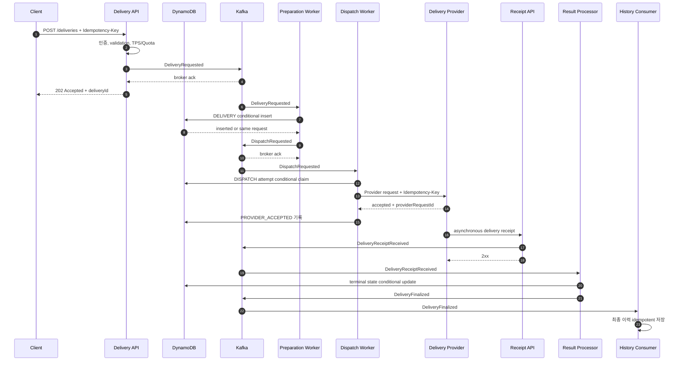
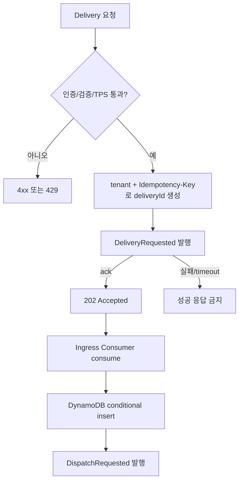
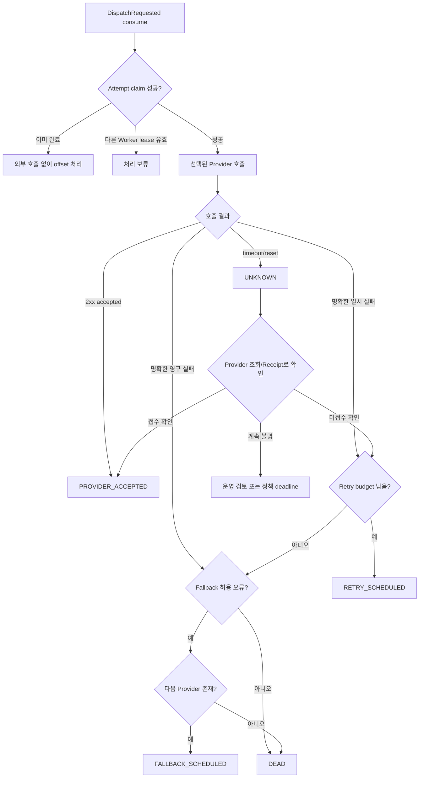
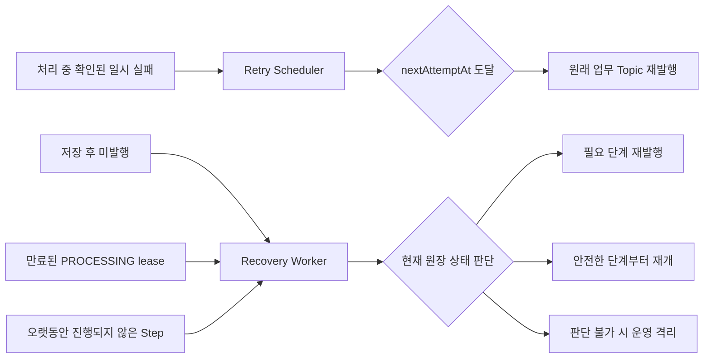
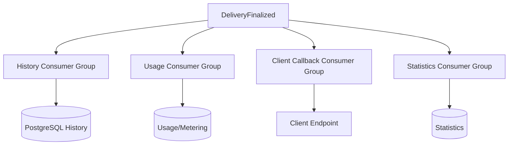

# 전체 End-to-End 처리 흐름

이 문서는 한 Delivery가 API에 접수된 뒤 외부 Provider를 거쳐 최종 상태가 확정될 때까지의 정상 흐름과 예외 흐름을 연결해서 보여줍니다.

## 1. 전체 구조

```mermaid
flowchart LR
    Client[Client] --> API[Delivery API]
    API --> Requested[delivery.requested.v1]

    Requested --> Prepare[Ingress / Preparation Worker]
    Prepare --> Origin[(DELIVERY_STATE)]
    Prepare --> DispatchRequested[delivery.dispatch-requested.v1]

    DispatchRequested --> Router[Provider Router]
    Router --> Sender[Dispatch Worker]
    Sender --> Primary[Primary Provider]
    Sender -. fallback .-> Secondary[Fallback Provider]

    Primary --> ReceiptAPI[Receipt API]
    Secondary --> ReceiptAPI
    ReceiptAPI --> ReceiptTopic[delivery.receipt-received.v1]

    ReceiptTopic --> Result[Result Processor]
    Result --> Finalized[delivery.finalized.v1]

    Finalized --> History[History Consumer]
    Finalized --> Usage[Usage Consumer]
    Finalized --> Callback[Client Callback Consumer]
    Finalized --> Statistics[Statistics Consumer]

    Origin -. stale attempt .-> Recovery[Recovery Worker]
    Recovery -. republish .-> DispatchRequested
    Sender -. retryable failure .-> Retry[Retry Scheduler]
    Retry -. due .-> DispatchRequested
```



## 2. 주요 식별자

```text
deliveryId
 ├─ eventId: DeliveryRequested
 ├─ eventId: DispatchRequested
 ├─ attemptId: Primary Provider attempt 1
 ├─ attemptId: Primary Provider retry 2
 ├─ attemptId: Fallback Provider attempt 3
 ├─ eventId: DeliveryReceiptReceived
 └─ eventId: DeliveryFinalized
```

| 식별자 | 생명주기 | 용도 |
|---|---|---|
| `deliveryId` | 접수부터 최종화까지 동일 | Delivery 조회와 상태 관리 |
| `eventId` | Kafka event를 발행할 때마다 생성 | Consumer dedupe |
| `attemptId` | Provider 호출 시도마다 생성 | 외부 호출 이력과 결과 연결 |
| `idempotencyKey` | 같은 논리적 Provider 전달에서 안정적으로 유지 | Provider 부수 효과 중복 방지 |
| `correlationId` | 전체 흐름에서 유지 | 로그와 trace 연결 |
| `causationId` | 새 event를 만든 직전 event | event 인과관계 추적 |

## 3. 정상 처리 Sequence



API의 `202 Accepted`는 Provider 전달 완료를 의미하지 않습니다. `DeliveryRequested`가 Kafka에 저장되어 비동기 처리를 시작할 수 있다는 의미입니다. DynamoDB projection은 아직 만들어지지 않았을 수 있습니다.

## 4. 접수와 Kafka 발행 사이



API는 발행 ack 전에 응답하지 않습니다. ack 후 응답 전 프로세스가 종료되거나 Client가 응답을 받지 못하면 같은 요청이 재전송될 수 있으므로 안정적인 ID와 downstream 멱등성이 필요합니다.

## 5. Dispatch, Retry, Fallback 판단



`UNKNOWN`에서 곧바로 Fallback Provider를 호출하지 않습니다. Primary Provider가 이미 처리했을 가능성이 있기 때문입니다.

## 6. Provider별 Attempt 예시

```text
Delivery D-100

1. Primary / attempt A-1 / HTTP 503
   → 명확한 일시 실패
   → 10초 뒤 Retry

2. Primary / attempt A-2 / HTTP 503
   → Primary retry budget 소진
   → Fallback 허용

3. Secondary / attempt A-3 / HTTP 202
   → PROVIDER_ACCEPTED

4. Secondary Receipt / DELIVERED
   → DeliveryFinalized
```

각 attempt는 Provider, 시작/종료 시각, 오류 분류, idempotency key, provider request ID와 다음 action을 저장합니다.

## 7. HTTP 응답과 Receipt 순서 역전

Provider의 Receipt가 HTTP 응답보다 먼저 올 수 있습니다.

```mermaid
sequenceDiagram
    autonumber
    participant S as Dispatch Worker
    participant P as Provider
    participant W as Receipt API
    participant K as Kafka
    participant R as Result Processor
    participant D as State Store

    S->>P: dispatch request
    P->>W: DELIVERED receipt
    W->>K: DeliveryReceiptReceived
    K->>R: receipt consume
    R->>D: state = DELIVERED
    P-->>S: HTTP 202 accepted
    S->>D: PROVIDER_ACCEPTED conditional update
    D-->>S: ignored; terminal state already exists
```

상태에는 우선순위와 허용 전이를 둡니다. `DELIVERED` 같은 terminal state가 기록된 뒤 늦게 온 `PROVIDER_ACCEPTED`가 상태를 되돌릴 수 없습니다.

## 8. Retry와 Recovery의 진입점



- Retry는 실행 결과가 확인된 실패에서 시작합니다.
- Recovery는 정상 flow에서 빠진 Delivery를 원장에서 찾습니다.
- 두 경로 모두 중복 event를 만들 수 있으므로 conditional update와 dedupe가 필요합니다.

## 9. Topic과 상태 전이

| Topic | Producer | Consumer | 대표 상태 변화 |
|---|---|---|---|
| `delivery.requested.v1` | Delivery API, Recovery Worker | Preparation Worker | `ACCEPTED → PREPARING` |
| `delivery.dispatch-requested.v1` | Preparation Worker, Retry Scheduler | Dispatch Worker | `PREPARED → DISPATCHING` |
| `delivery.receipt-received.v1` | Receipt API | Result Processor | `PROVIDER_ACCEPTED → DELIVERED/FAILED` |
| `delivery.finalized.v1` | Result Processor | History, Usage, Callback, Statistics | terminal state 후속 처리 |
| `delivery.retry-scheduled.v1` | 실패한 Worker | Retry Scheduler | `RETRY_SCHEDULED` |
| `delivery.recovery-requested.v1` | Recovery Worker | 해당 단계 Worker | `RECOVERY_REQUIRED → 처리 단계` |

Topic 이름과 상태는 ADR에서 확정하며, 하나의 Kafka event가 상태 변경과 다음 event 발행을 함께 요구하면 crash point를 명시하고 중복 발행에도 안전하게 만듭니다.

## 10. 최종 상태 이후 Fan-out



각 기능은 별도 Consumer Group과 독립 offset을 사용합니다. History 저장 장애로 backlog가 생겨도 Usage와 Client Callback은 계속 진행할 수 있습니다.

## 11. 한 Delivery의 보존식

운영과 부하 테스트에서는 다음 관계를 확인합니다.

```text
accepted deliveries
= terminal deliveries
+ known in-flight deliveries
+ retry/recovery scheduled deliveries
+ unknown deliveries
+ quarantined/dead deliveries
```

어느 항목에도 속하지 않는 `deliveryId`가 있으면 유실 후보입니다. Kafka record 수만 비교하지 않고 `deliveryId` 기준 논리적 건수와 Provider의 실제 부수 효과 건수를 함께 비교합니다.
