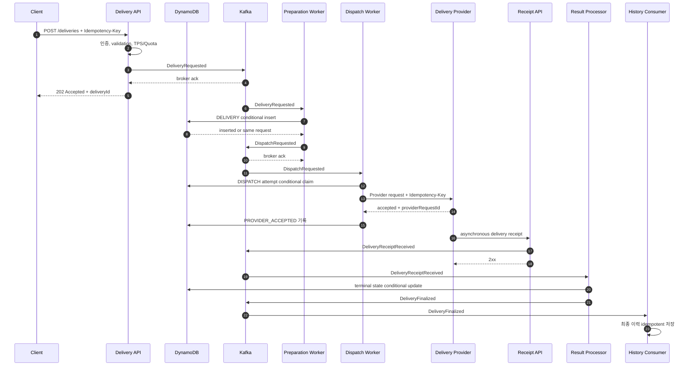
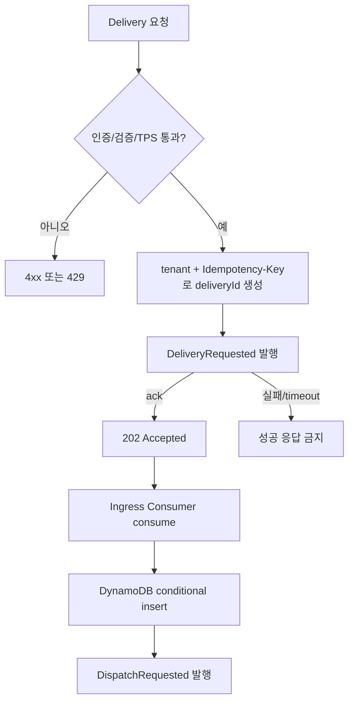
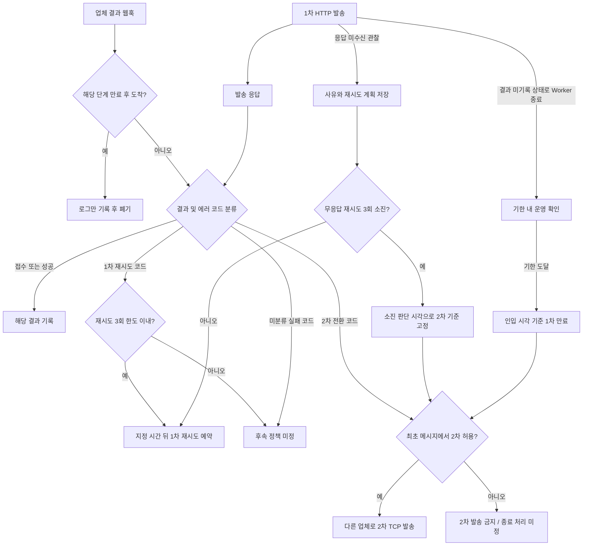
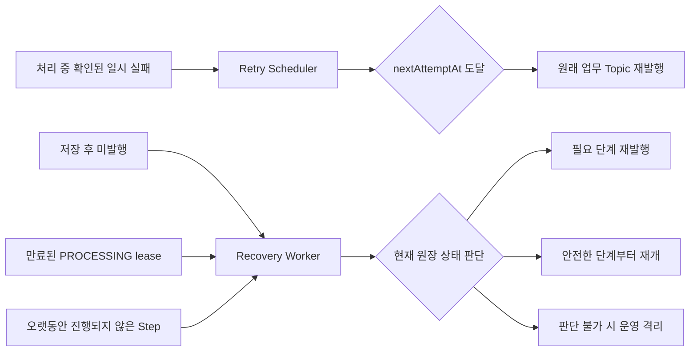
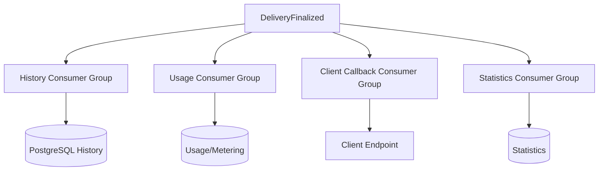

# 요청 접수부터 최종 결과까지의 전체 흐름

> 최신 물리 테이블은 `ORIGIN`·`STEP`이다. 기존 `delivery_state`가 있는 환경은 [테이블 분리·이관 절차](36-원본과-단계-테이블-분리와-경로별-쓰기-내역.md)를 먼저 따른다.

> 2026-09-25 v2 적용: ORIGIN/STEP, Kafka 고정 회차 재시도, STEP 최종 이벤트와 SQL 이후 삭제, Redis 완료 TTL을 구현했다. 아래 이전 저장 구조는 v1 기준선이다. 현재 단계별 경계·장애 대응은 [최신 구현·검증](35-원본과-단계-최소-저장-및-Redis-완료-중복-차단.md)을 우선한다.

이 문서는 한 Delivery가 API에 접수된 뒤 외부 Provider를 거쳐 최종 상태가 확정될 때까지의 정상 흐름과 예외 흐름을 연결해서 보여줍니다.

## 1. 전체 구조

```mermaid
flowchart LR
    Client[Client] --> API[Delivery API]
    API --> Requested[delivery.requested.v1]

    Requested --> Prepare[Ingress / Preparation Worker]
    Prepare --> Origin[(DELIVERY_STATE)]
    Prepare --> DispatchRequested[delivery.dispatch-requested.v1]

    DispatchRequested --> Router[Provider Router]
    Router --> Sender[Dispatch Worker]
    Sender --> Primary[Primary Provider]
    Sender -. fallback .-> Secondary[Fallback Provider]

    Primary --> ReceiptAPI[Receipt API]
    Secondary --> ReceiptAPI
    ReceiptAPI --> ReceiptTopic[delivery.receipt-received.v1]

    ReceiptTopic --> Result[Result Processor]
    Result --> Finalized[delivery.finalized.v1]

    Finalized --> History[History Consumer]
    Finalized --> Usage[Usage Consumer]
    Finalized --> Callback[Client Callback Consumer]
    Finalized --> Statistics[Statistics Consumer]

    Origin -. stale attempt .-> Recovery[Recovery Worker]
    Recovery -. republish .-> DispatchRequested
    Sender -. retryable failure .-> Retry[Retry Scheduler]
    Retry -. due .-> DispatchRequested
```



## 2. 주요 식별자

```text
deliveryId
 ├─ eventId: DeliveryRequested
 ├─ eventId: DispatchRequested
 ├─ attemptId: Primary Provider attempt 1
 ├─ attemptId: Primary Provider retry 2
 ├─ attemptId: Fallback Provider attempt 3
 ├─ eventId: DeliveryReceiptReceived
 └─ eventId: DeliveryFinalized
```

| 식별자 | 생명주기 | 용도 |
|---|---|---|
| `deliveryId` | 접수부터 최종화까지 동일 | Delivery 조회와 상태 관리 |
| `eventId` | Kafka event를 발행할 때마다 생성 | Consumer dedupe |
| `attemptId` | Provider 호출 시도마다 생성 | 외부 호출 이력과 결과 연결 |
| `idempotencyKey` | 같은 논리적 Provider 전달에서 안정적으로 유지 | Provider 부수 효과 중복 방지 |
| `correlationId` | 전체 흐름에서 유지 | 로그와 trace 연결 |
| `causationId` | 새 event를 만든 직전 event | event 인과관계 추적 |

## 3. 정상 처리 Sequence



API의 `202 Accepted`는 Provider 전달 완료를 의미하지 않습니다. `DeliveryRequested`가 Kafka에 저장되어 비동기 처리를 시작할 수 있다는 의미입니다. DynamoDB projection은 아직 만들어지지 않았을 수 있습니다.

## 4. 접수와 Kafka 발행 사이



API는 발행 ack 전에 응답하지 않습니다. ack 후 응답 전 프로세스가 종료되거나 Client가 응답을 받지 못하면 같은 요청이 재전송될 수 있으므로 안정적인 ID와 downstream 멱등성이 필요합니다.

## 5. Dispatch, Retry, Fallback 판단

아래는 [Q1에서 확정한 업무 규칙](08-함께-결정할-설계-사항.md#q1-확정-내용과-남은-세부-정책)을 반영한 목표 흐름입니다. 실제 업체별 코드 의미와 동시 실행 제어는 추가 설계가 필요합니다.



응답과 웹훅이 중복되거나 역순으로 도착해도 같은 재시도 예약이나 2차 발송이 중복 실행되지 않아야 합니다. 2차 TCP 응답은 접수 확인이며 최종 결과는 HTTP 웹훅으로 판단합니다. 운영 확인도 만료 기한을 연장하지 않으며, 고객에게 최대 만료 시간 내 결과를 제공해야 합니다. 테스트 기준은 1차 3시간·2차 4시간으로 전체 최대 7시간이며 두 기간을 독립 설정합니다. 결과 전달 계약은 Q4에서 정리합니다.

## 6. Provider별 Attempt 예시

다음 코드는 설명용 가상 코드이며 실제 업체의 계약을 뜻하지 않습니다.

```text
Delivery D-100 / 최초 메시지에서 2차 발송 허용

1. Primary / attempt A-1 / 재시도 대상으로 설정한 코드 E_RETRY
   → 해당 코드의 예시 지연 시간인 10초 뒤 1차 재시도

2. Primary / attempt A-2 / 2차 전환 대상으로 설정한 코드 E_FALLBACK
   → 최초 메시지의 2차 허용 설정 확인
   → 다른 업체로 2차 발송

3. Secondary / attempt A-3 / TCP 수신·접수 확인 응답
   → PROVIDER_ACCEPTED

4. Secondary HTTP 결과 웹훅 / 전달 성공
   → 결과 기록 / 전체 완료 기준은 Q4에서 확정
```

각 attempt는 Provider, 시작/종료 시각, 오류 분류, idempotency key, provider request ID와 다음 action을 저장합니다.

## 7. HTTP 응답과 Receipt 순서 역전

Provider의 Receipt가 HTTP 응답보다 먼저 올 수 있습니다.

```mermaid
sequenceDiagram
    autonumber
    participant S as Dispatch Worker
    participant P as Provider
    participant W as Receipt API
    participant K as Kafka
    participant R as Result Processor
    participant D as State Store

    S->>P: dispatch request
    P->>W: DELIVERED receipt
    W->>K: DeliveryReceiptReceived
    K->>R: receipt consume
    R->>D: state = DELIVERED
    P-->>S: HTTP 202 accepted
    S->>D: PROVIDER_ACCEPTED conditional update
    D-->>S: ignored; terminal state already exists
```

상태에는 우선순위와 허용 전이를 둡니다. `DELIVERED` 같은 terminal state가 기록된 뒤 늦게 온 `PROVIDER_ACCEPTED`가 상태를 되돌릴 수 없습니다.

## 8. Retry와 Recovery의 진입점



- Retry는 실행 결과가 확인된 실패에서 시작합니다.
- Recovery는 정상 flow에서 빠진 Delivery를 원장에서 찾습니다.
- 두 경로 모두 중복 event를 만들 수 있으므로 conditional update와 dedupe가 필요합니다.

## 9. Topic과 상태 전이

| Topic | Producer | Consumer | 대표 상태 변화 |
|---|---|---|---|
| `delivery.requested.v1` | Delivery API, Recovery Worker | Preparation Worker | `ACCEPTED → PREPARING` |
| `delivery.dispatch-requested.v1` | Preparation Worker, Retry Scheduler | Dispatch Worker | `PREPARED → DISPATCHING` |
| `delivery.receipt-received.v1` | Receipt API | Result Processor | `PROVIDER_ACCEPTED → DELIVERED/FAILED` |
| `delivery.finalized.v1` | Result Processor | History, Usage, Callback, Statistics | terminal state 후속 처리 |
| `delivery.retry-scheduled.v1` | 실패한 Worker | Retry Scheduler | `RETRY_SCHEDULED` |
| `delivery.recovery-requested.v1` | Recovery Worker | 해당 단계 Worker | `RECOVERY_REQUIRED → 처리 단계` |

Topic 이름과 상태는 ADR에서 확정하며, 하나의 Kafka event가 상태 변경과 다음 event 발행을 함께 요구하면 crash point를 명시하고 중복 발행에도 안전하게 만듭니다.

## 10. 최종 상태 이후 Fan-out



각 기능은 별도 Consumer Group과 독립 offset을 사용합니다. History 저장 장애로 backlog가 생겨도 Usage와 Client Callback은 계속 진행할 수 있습니다.

## 11. 한 Delivery의 보존식

운영과 부하 테스트에서는 다음 관계를 확인합니다.

```text
accepted deliveries
= terminal deliveries
+ known in-flight deliveries
+ retry/recovery scheduled deliveries
+ unknown deliveries
+ quarantined/dead deliveries
```

어느 항목에도 속하지 않는 `deliveryId`가 있으면 유실 후보입니다. Kafka record 수만 비교하지 않고 `deliveryId` 기준 논리적 건수와 Provider의 실제 부수 효과 건수를 함께 비교합니다.
