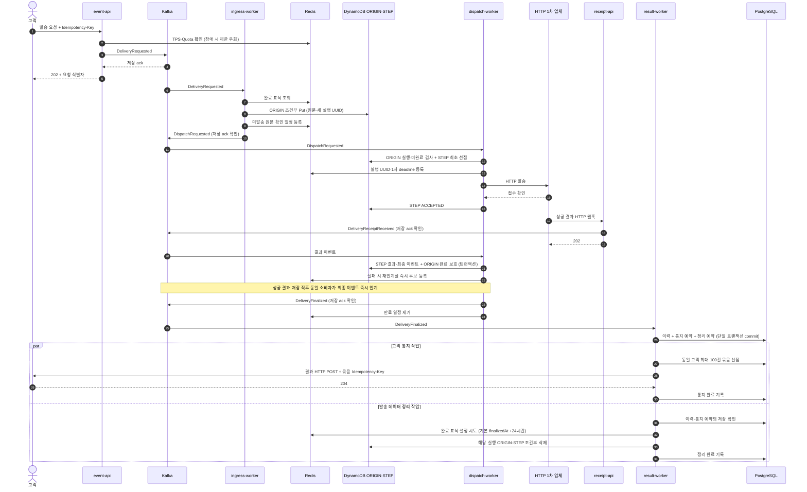
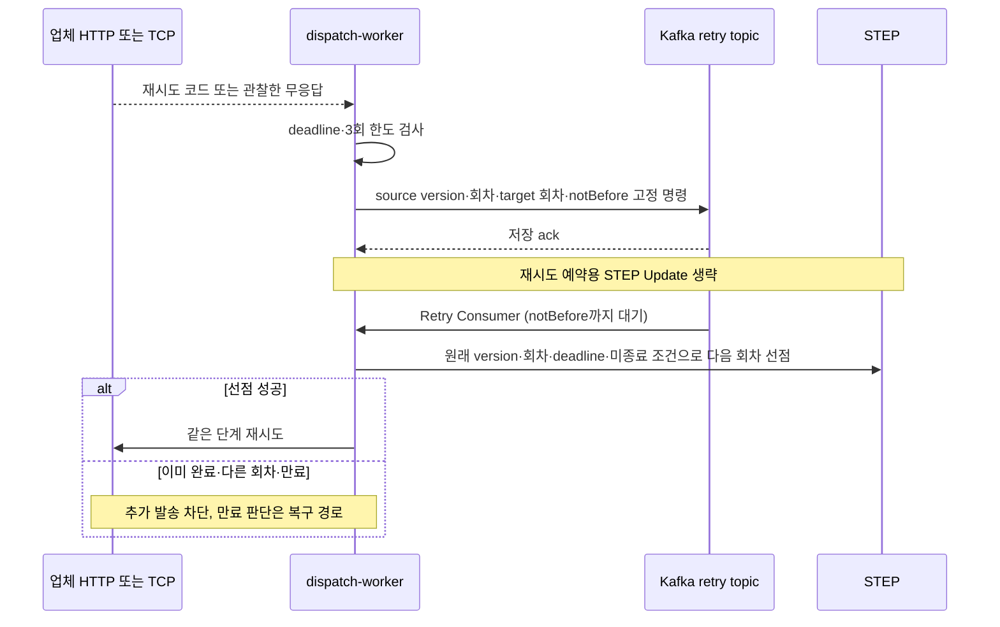
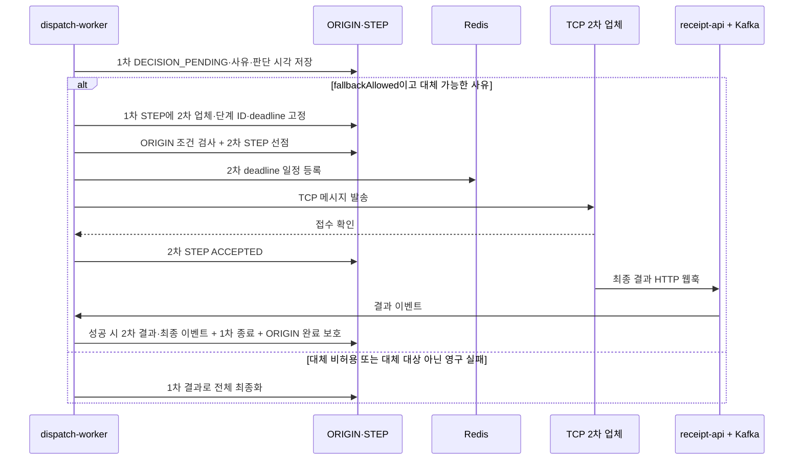
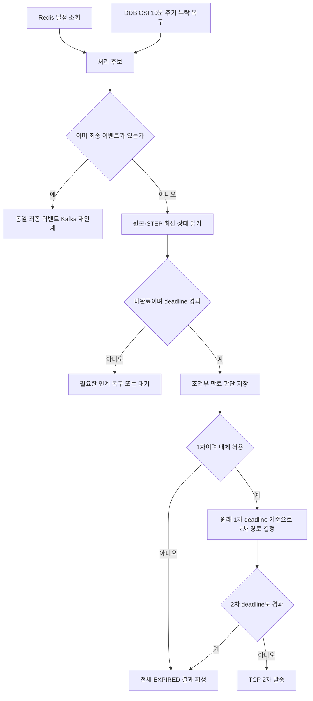

# 요청 접수부터 최종 결과까지의 전체 호출 흐름

기준: 2026-09-25 신규 v2 코드. 정상 경로와 재시도·대체 발송·만료·복구를 한 요청 기준으로 설명한다. 기존 v1 호환 경로는 [이전 구현 문서](29-주기-만료와-요청-최종화-및-Kafka-인계.md)를 참고한다. 물리 테이블은 `ORIGIN`, `STEP`이며 [이관 절차](36-원본과-단계-테이블-분리와-경로별-쓰기-내역.md)를 따른다.

## 1. 참여자와 저장소

| 참여자 | 역할 |
|---|---|
| 고객 → event-api | 인증·형식 검증·TPS/Quota 확인, Kafka 저장 확인 뒤 접수 응답 |
| delivery-ingress-worker | 완료 Redis 확인, ORIGIN 조건부 저장, 발송 이벤트 인계 |
| dispatch-worker | HTTP 1차·TCP 2차 선점/발송, 재시도·업체 결과 처리, 만료·최종화 |
| 외부 업체 / external-api-simulator | 접수 응답과 별도 HTTP 결과 웹훅. TCP 응답도 접수 확인 |
| receipt-api | 업체 인증·형식 검증, Kafka 저장 확인 뒤 웹훅 접수 응답 |
| delivery-result-worker | PostgreSQL 이력·통지·정리 예약 저장, 고객 HTTP 통지, DDB 정리 |
| Redis | TPS/Quota, 만료 후보 일정, 완료 후 추가 중복 차단 |
| ORIGIN | 고객 요청별 활성 원문·실행 UUID·현재 구현의 완료 보호 |
| STEP | 실행별 단계 선점·설정·회차·deadline·결과·최종 이벤트 |
| PostgreSQL | 최종 이력, 고객 통지 상태와 묶음/재전송, 정리 예약 |

## 2. 정상 1차 성공 Call Flow

- API의 202는 Kafka 접수 확인이다. 업체 접수·최종 성공·고객 결과 수신은 별도 단계다.
- ORIGIN 완료 Update는 **현재 구현**이다. 이를 STEP 조건으로 대체하는 최소화는 검토안이며 아직 적용하지 않았다.
- 최종 이벤트는 terminal STEP에 보존한다. 별도 FINAL 항목이나 Kafka ack 이후 DDB Update를 만들지 않는다. SQL 인계 전 종료하면 같은 결과를 다시 발행할 수 있다.
- v2 성공 웹훅은 저장 직후 같은 결과를 Kafka에 발행하고 broker ack 뒤에 웹훅 Kafka 입력 처리를 마친다. 발행 실패 시 입력을 재처리하며 STEP에서 원래 결과를 반환하므로 결과 시각을 다시 만들거나 DDB를 다시 갱신하지 않는다. Redis 일정·DDB 복구는 독립적인 재인계 경로로 남는다. 만료·실패의 최종화는 기존 Lifecycle 경로다. [즉시 인계와 검증](39-성공-결과의-즉시-Kafka-인계와-복구-검증.md).
- 고객 통지와 발송 데이터 정리는 SQL commit 이후 독립 진행한다. 고객 204를 기다려야만 ORIGIN·STEP을 지우는 구조가 아니다. 통지 재시도에 필요한 데이터는 SQL에 있다.
- 정리는 기본 4개 작업자가 각 SQL lease로 다른 결과를 처리한다. 작업자마다 한 건씩 선점·정리·완료하고 tick당 최대 20건을 처리한다. SQL 선점 token과 DDB 실행·버전 조건은 유지한다. [동시 정리와 검증](40-완료-데이터-정리의-동시-처리와-성능-검증.md).
- 정상 DDB 쓰기는 **5회 API 호출·7항목 변경**이다: ORIGIN Put 1 → STEP 선점 1 → 접수 Update 1 → 성공 확정 2 → 삭제 2. 조건 검사·읽기·인덱스 비용은 별도다. [세부 합산](36-원본과-단계-테이블-분리와-경로별-쓰기-내역.md).

## 3. 식별자와 중복 요청

| 값 | 의미 |
|---|---|
| requestKey | tenantId + ClientMsgId(Idempotency-Key)로 만든 안정적인 요청 키. API 응답의 deliveryId는 호환상 이 값 |
| 실행 deliveryId | ORIGIN 신규 선점 시 생성하는 UUID. 업체 호출·웹훅·SQL 이력의 실행 구분 |
| attemptId | 실행·업체·단계로 구분하는 단계 ID. 같은 단계 재시도마다 새 항목을 만들지 않음 |
| retryCount / invocation / version | 최대 3회 재시도와 호출 회차·조건부 갱신을 구분 |
| result eventId | 같은 실행의 최종 이벤트 식별자. Kafka 중복 발행도 SQL에서 동일 결과로 수렴 |

활성 중복 요청은 기존 ORIGIN의 원문·실행·최초 인입 시각을 재사용한다. 내용이 다르면 충돌로 격리한다. 완료 Redis 표식이 있으면 같은 내용의 재발송을 차단한다. SQL 저장 후 DDB가 정리되고 Redis 표식도 없으면 새 실행을 허용한다. 이전 실행의 늦은 작업은 새 실행을 갱신하지 못한다.

## 4. 실패 응답·실패 웹훅과 재시도

실패 웹훅도 receipt-api → Kafka → dispatch-worker를 거쳐 같은 판단으로 연결된다. 각 단계는 최초 1회 + 재시도 최대 3회다. 고정 명령을 재소비해도 회차를 임의로 더 올리지 않는다. 재시도 시간 때문에 deadline을 연장하지 않는다.

외부 호출과 DB 저장은 원자적이지 않다. 무응답 재시도는 업체가 이미 처리한 경우 외부 중복 가능성이 있다. 선점 후 종료되어 결과를 기록하지 못한 경우는 운영 확인 대상이며 lease 만료만으로 무조건 재발송하지 않는다. 운영 확인 중에도 업무 만료는 적용한다.

## 5. TCP 2차 대체 발송

대체 사유는 `FALLBACK_REQUIRED`, `PRIMARY_EXPIRED`, `RETRY_EXHAUSTED_NO_RESPONSE`다. 모든 실패나 모든 재시도 소진이 대체 발송으로 이어지지는 않는다. 2차도 재시도·미수신 만료를 적용하며 세 번째 업체로 넘어가지 않는다. 최종화 후 Kafka → SQL → 고객 통지·정리는 정상 흐름과 같다.

## 6. 만료와 Redis 누락 복구

| 항목 | 기준 |
|---|---|
| 1차 deadline | 최초 인입 +3시간 |
| 2차 deadline | 1차 결과 판단 시각 +4시간 |
| Redis 정상 후보 조회 | Sorted Set, 기본 1초 |
| DDB 누락 복구 | ORIGIN·STEP GSI, 시작 직후 1회 이후 기본 10분 |
| 최종 판정 | STEP 상태·version·deadline을 조건부 확인 |

Redis 일부 일정만 유실될 수도 있어, Redis가 비어 있을 때만 DDB를 조회하지 않는다. DDB TTL 삭제 이벤트는 복구 수단으로 사용하지 않는다. 10분은 조회 간격이며 페이지 적체·장애까지 포함한 복구 완료 상한이 아니다. 1차 만료를 늦게 처리해도 2차 기준은 처리 시각이 아니라 원래 1차 deadline이다. 장기 장애 뒤 양쪽 기한이 지났으면 외부 발송 없이 만료 결과를 만든다.

만료 후 웹훅은 로그/관측만 남기고 업무 상태에 반영하지 않는다. 먼저 확정된 성공을 만료로 덮어쓰지 않도록 상태·버전 조건으로 경합을 막는다. [Redis·DDB 역할 및 공식 근거](35-원본과-단계-최소-저장-및-Redis-완료-중복-차단.md).

## 7. 고객 결과 HTTP 실패·중복

같은 고객의 준비된 결과를 최대 100건으로 묶고, 건수를 채우기 위해 오래 대기하지 않는다. HTTP 204가 묶음 전체 ack이며 그 외 응답·무응답은 SQL에 다음 재시도를 기록한다. 최초 + 최대 20회 재전송, 총 21회다. 소진하면 EXHAUSTED로 남겨 운영 확인한다.

고객이 처리한 뒤 응답만 유실되면 같은 묶음이 다시 도착할 수 있다. 같은 묶음 ID와 결과 이벤트 ID를 유지하므로 고객도 중복 처리를 막아야 한다. 우리 SQL 선점은 동시 발송·회차 혼선을 제어하지만 고객의 외부 효과까지 exactly-once로 만들지는 못한다. [묶음·응답·소진 계약](31-고객-HTTP-묶음-통지와-재전송-복구.md).

## 8. 토픽과 장애 경계

| 토픽 | 생산 → 소비 |
|---|---|
| delivery.requested.v1 | event-api → ingress-worker |
| delivery.dispatch-requested.v1 | ingress-worker → dispatch-worker |
| delivery.receipt-received.v1 | receipt-api → dispatch-worker 결과 소비자 |
| delivery.retry.v1 | dispatch-worker → 별도 재시도 소비자 |
| delivery.finalized.v1 | dispatch-worker → result-worker |

| 멈춘 위치 | 남는 근거와 재개 |
|---|---|
| API Kafka ack 뒤 응답 전 | 고객 재요청 가능. 같은 requestKey·진행 중 원문 비교로 제어 |
| ORIGIN 저장 뒤 Dispatch 발행 전 | Kafka 입력 재전달 또는 ORIGIN 복구 인덱스 |
| STEP 선점 뒤 외부 결과 저장 전 | STEP 보존, 운영 확인·원래 기한 만료 |
| 최종 STEP 저장 뒤 Kafka 인계 전 | 불변 최종 이벤트·GSI로 재발행 |
| SQL commit 전 | Kafka offset 미완료, 동일 이벤트 재소비 |
| SQL commit 뒤 DDB 삭제 전 | SQL 정리 예약 재처리 |
| DDB 삭제 뒤 정리 DONE 전 | 같은 실행의 삭제 여부 확인, 새 실행 원본 보존 |
| Redis 일정 소실 | 10분 주기 DDB 복구, 원래 deadline 유지 |

## 9. 검증과 미구현 경계

실제 코드 근거는 `DeliveryRepository`, `DispatchAttemptRepository`, `ReceiptResultRepository`, `LifecycleService/Repository/Scheduler`, `FinalizedStore`, `NotificationService/Repository`, `DeliveryCompactor`다. 구간별 검증과 쓰기 횟수는 [35번](35-원본과-단계-최소-저장-및-Redis-완료-중복-차단.md)·[36번](36-원본과-단계-테이블-분리와-경로별-쓰기-내역.md)을 참고한다.

전체 v2 경로의 격리 실행 도구·케이스별 전수 대조·실행 결과는 [37번 문서](37-전체-호출-흐름의-격리-실행과-전수-대조.md)에 구분한다.

이 문서는 현재 코드의 호출 순서를 설명한다. 운영 배포·다중 AZ 무손실·고 TPS 전체 흐름의 검증 완료를 뜻하지 않는다. 주기 만료, 고객 통지, 정리는 각각 설정으로 활성화해야 한다. 별도 과금·통계 Consumer나 운영 조회/수동 조치 API는 이 Call Flow에 구현된 기능으로 포함하지 않는다.
