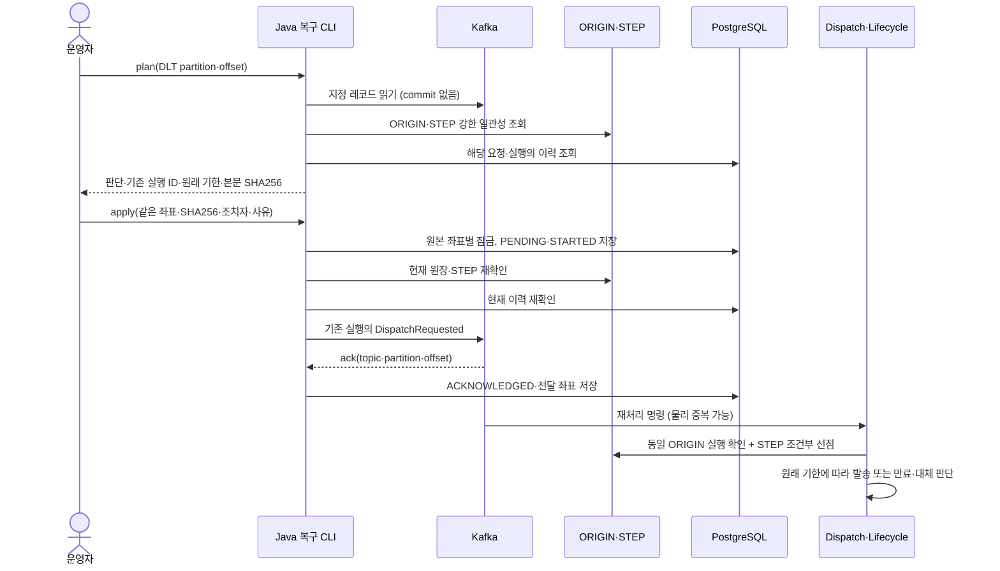

# DLT 원장 대조와 기존 실행 복구

2026-09-26. [읽기 전용 분류](49-DLT-조회와-재처리-대상-분류.md)에 이어, **원문 보존·인계·복구 재개와 보류 조회·감사 재검토**를 구현했다. SQL에 원문·조회 위치·보류 사유·조치·Kafka ack를 남긴다. 초기 원본 복구는 이력 보존 범위를 명시적으로 활성화한 경우에만 허용한다.

## 1. 처리 흐름과 재접수를 하지 않는 이유



DLT 원문을 접수 토픽에 그대로 넣으면, SQL 이력 저장과 ORIGIN 삭제가 완료된 뒤 새 실행을 만드는 경합이 생긴다. 고객의 신규 API 재접수는 Redis 완료 TTL 유실 시 다시 허용하는 정책이지만, 운영자가 오래된 DLT를 처리하는 행위를 신규 접수로 바꾸면 안 된다.

따라서 현재 ORIGIN의 실행 ID를 가져와 `delivery.dispatch-requested.v1`로 보낸다. requestKey·원래 occurredAt·payload·대체 발송 설정은 유지하고 eventId는 기존 실행의 DispatchRequested ID다. 마지막 대조 직후 ORIGIN이 삭제되거나 다른 실행으로 교체돼도, 실제 발송 선점의 기존 DynamoDB 트랜잭션 조건이 이전 명령을 차단한다.

**공식 근거:** DynamoDB 트랜잭션은 여러 항목의 조건 검사와 변경을 하나의 성공/실패 단위로 처리한다. 이 구현은 ORIGIN의 실행 ID·완료 여부 확인과 STEP 선점을 함께 수행하는 기존 조건을 재사용한다. SQL·Kafka까지 같은 트랜잭션이 된다는 뜻은 아니다. [DynamoDB 트랜잭션 API](https://docs.aws.amazon.com/amazondynamodb/latest/developerguide/transaction-apis.html).

## 2. 허용·보류 기준

| 판단 | 처리 |
|---|---|
| RESUME_EXISTING | 유효한 v2 원문, ORIGIN 내용·원래 시각 일치, 해당 실행 SQL 이력 없음, STEP 없음. 기존 실행으로 인계 가능 |
| EXPIRE_EXISTING | 위 조건을 만족하지만 1차 기한 경과. 원래 시각을 그대로 넘겨 발송 worker가 만료·대체 판단 |
| RESTORE_ORIGIN | ORIGIN·요청 이력이 없고 활성화된 이력 보존 범위 안의 요청. 발송 보류 상태로 조건부 복원 후 SQL 재대조 |
| NO_ORIGIN_UNCONFIRMED | ORIGIN·이력 없음만으로는 미발송 증거가 아님. 복구 비활성화 또는 보존 범위 밖이면 보류 |
| RECOVERY_HELD | 다른 복구가 예약했거나, 예약 후 이력 보존 조건이 충족되지 않음. 발송 보류 |
| HISTORY_FOUND | 현재 실행의 SQL 이력이 있거나, ORIGIN 없이 해당 요청의 과거 이력이 있음. 보류 |
| ORIGIN_MISMATCH | tenant·본문·실행 eventId·원래 시각 등이 다름. 이후 API 재시도의 다른 occurredAt도 보류 |
| COMPLETION_RECORDED | ORIGIN에 완료 표시가 있음. 보류 |
| STEP_ALREADY_TRACKED | 기존 STEP 존재. 현재 처리·재시도·운영 확인·Lifecycle 복구 경로에 맡김 |
| INVALID_DLT | 형식 오류, 원본 좌표 오류, 멱등 충돌, 미지원 버전 등. 발행하지 않음 |

SQL 또는 DynamoDB 조회가 실패하면 상태를 모르는 채 진행하지 않는다. `plan`은 판독 시점의 결과이며 승인 토큰이 아니다. `apply`는 현재 상태를 다시 판독하고, SQL 시도 기록을 남긴 뒤에도 한 번 더 대조한다.

1차 만료는 **원래 인입 시각 + 3시간**이다. 만료된 1차 HTTP를 호출하지 않는다. 대체 허용 요청의 2차 처리는 기존 규칙을 따른다. 만료로 1차 결과가 정해지는 경우 1차 deadline을 기준으로 2차 4시간을 계산하므로 오래 격리됐다고 기한을 다시 늘리지 않는다. CLI의 `DLT_PRIMARY_TTL`은 실행 중인 dispatch 설정과 같아야 한다. 실제 발송 여부의 마지막 판단은 worker의 기한 검사가 담당한다.

### 최초 ORIGIN 저장 전 실패를 복원하는 조건

`V5__dlt_history_coverage.sql`은 `dlt_history_coverage` 한 행에 이력 보존 시작 시각(`complete_since`)과 복구 허용 여부를 둔다. 기본값은 **비활성화**다. 이것은 DB가 과거 이력의 완전성을 자동 증명한 값이 아니라, 운영자가 그 시각 이후 요청의 이력이 누락·삭제되지 않았음을 확인하고 유지해야 하는 계약이다. 해당 요청 키의 과거 이력이 하나라도 있으면 신규 복원을 보류한다.

복구 순서는 다음과 같다.

1. SQL에 복구 작업·STARTED를 commit한다. 원본 좌표·요청 키·본문 해시로 재시도해도 같은 복구 실행 ID를 계산한다. 요청 키·원래 인입 시각·대체 허용 설정은 유지한다.
2. ORIGIN이 없다는 조건으로 `dlt_recovery_hold`가 있는 원본을 저장한다. 이때 Lifecycle GSI 속성을 넣지 않는다. ingress는 인계를 보류하고 dispatch는 기존 STEP 선점 트랜잭션의 조건으로 발송을 차단한다.
3. **예약 이후 SQL 주 DB의 새 조회로** 이력을 재확인한다. 정상 정리는 이력 commit 후 ORIGIN을 지우므로, 예약 직전 완료·정리된 실행의 이력도 확인할 수 있다. 완료 이력이 발견되면 자신이 예약한 보류 원본만 조건부 삭제하고 발송하지 않는다.
4. 이력 없음·보존 범위·예약 소유자가 유효하면 보류를 제거하고 Lifecycle GSI를 설정한다. 이후 기존 dispatch 명령을 발행하고 SQL에 Kafka ack를 남긴다.

예약 직후 SQL 장애·프로세스 종료가 나면 보류가 남아 같은 작업으로 다시 대조한다. 활성화 후 Kafka 인계 전에 종료되면 ORIGIN의 Lifecycle 조회가 복구할 수 있다. 그 사이 STEP이 생성되면 CLI는 기존 worker의 처리에 맡긴다. 보류 원본은 Lifecycle 자동 만료 대상이 아니므로 **저장된 복구 체크포인트가 있는 PENDING 작업은 자동 재개 worker로, 나머지는 수동으로 재개한다**.

**공식 근거와 설계 판단:** PostgreSQL Read Committed의 각 SELECT는 조회 시작 전 commit된 데이터를 읽는다. 따라서 예약 이후 주 DB의 새 스냅샷으로 확인해야 하며, 지연 복제본이나 오래된 트랜잭션 스냅샷을 사용하면 이 근거가 성립하지 않는다. DynamoDB 조건부 예약·발송 선점과 기존 SQL commit→ORIGIN 삭제 순서를 조합한 설계이며, 저장소 간 원자적 트랜잭션을 주장하지 않는다. [PostgreSQL 격리 수준](https://www.postgresql.org/docs/17/transaction-iso.html), [DynamoDB 트랜잭션](https://docs.aws.amazon.com/amazondynamodb/latest/developerguide/transaction-apis.html).

## 3. 왜 PostgreSQL에 조치 기록을 남기는가

기존 이력 DB를 사용해 정상 처리에 DynamoDB 쓰기를 늘리지 않으면서, 운영 요청과 Kafka 인계의 불확실성을 보존한다. result worker의 Flyway `V4__dlt_recovery_handoff.sql`이 다음 테이블과 이력 조회 인덱스를 만든다.

| 저장소 | 내용·목적 |
|---|---|
| dlt_recovery_operation | 클러스터 별칭 + **DLT header의 원본** topic/partition/offset으로 유일한 작업. 본문 SHA256, 기존 실행 ID, 동일 재시도용 command JSON, 대상 토픽, PENDING/HELD/ACKNOWLEDGED, ack 좌표 |
| dlt_recovery_attempt | 실제 시도별 조치자·사유·시작/완료 시각과 STARTED/STATE_CHANGED/UNCONFIRMED/ACKNOWLEDGED |
| delivery_history_request_key | tenantId와 result_json의 requestKey로 이력을 대조하는 인덱스. 기존 이력 행을 추가 복사하지 않음 |

처음에는 operation PENDING을 commit하고, 각 시도 시작 정보도 Kafka 호출 전에 commit한다. 동일 원본 작업에 PostgreSQL 세션 advisory lock을 사용해 운영자 동시 실행을 직렬화한다. 잠금 획득 실패는 BUSY다. 정상 종료 시 해제하고 세션 종료 시에도 해제되며, 조치 상태는 SQL에 계속 남는다. 서로 다른 클러스터에 같은 별칭을 쓰거나 동일 클러스터의 별칭·SQL schema를 작업마다 바꾸지 않는다.

**공식 근거:** `ON CONFLICT`는 유일성 충돌 시 삽입 대신 정해진 처리를 할 수 있게 한다. 세션 advisory lock은 트랜잭션 rollback만으로 풀리지 않으므로 명시 해제 또는 세션 종료가 필요하다. 둘을 조합해 작업 유일성과 동시 실행 방지를 각각 담당시켰다. [PostgreSQL INSERT](https://www.postgresql.org/docs/17/sql-insert.html), [PostgreSQL advisory lock](https://www.postgresql.org/docs/17/explicit-locking.html#ADVISORY-LOCKS).

Kafka ack를 받고 SQL 기록까지 성공해야 ACKNOWLEDGED다. 이미 ACKNOWLEDGED인 동일 작업은 다시 발행하지 않는다. Kafka 응답 미확인 시 PENDING/UNCONFIRMED로 두며 다음 시도에 같은 실행·command를 사용한다. 전송 뒤 프로세스가 종료돼 STARTED만 남거나 SQL 기록 응답을 잃은 경우도 최종 성공으로 단정하지 않는다. SQL이 이미 ACKNOWLEDGED를 commit했다면 이후 오류 처리로 PENDING으로 되돌리지 않는다.

Kafka producer idempotence만으로 재실행된 CLI 사이의 중복까지 막을 수 없으므로, 동일 command의 물리적 중복을 허용하고 기존 STEP 선점으로 외부 발송을 보호한다. [KafkaProducer 공식 문서](https://kafka.apache.org/42/javadoc/org/apache/kafka/clients/producer/KafkaProducer.html)의 send 결과와 idempotence 범위를 근거로 한 설계다. **ACKNOWLEDGED는 고객 최종 결과 완료가 아닌 Kafka 인계 완료**다.

대상 1건의 `plan`은 ORIGIN GetItem 1회, 조건을 만족하면 STEP Query 1회, SQL 이력 조회 1회다. 기존 실행의 `apply`는 최초 판독과 발행 전 재대조로 보통 DynamoDB 읽기 4회, CLI 쓰기 0회다. **초기 원본 복원 경로에만 조건부 Put 1회와 활성화 Update 1회**가 추가되고, 재대조 실패 시 자신의 보류 원본 Delete가 발생할 수 있다. 이후 worker는 기존 업무 쓰기를 수행한다. 정상 1차 성공 경로의 **5회 호출·7항목 변경**은 그대로다. SQL 운영 기록·이력 인덱스·복구 시 대조 조회 비용은 별도다.

## 4. 로컬 PoC 실행

JDK 21로 빌드한 JAR와 **V8까지 반영된** result worker SQL schema가 필요하다. 외부 실행 도구는 **Bash**이고 조회·판단·JDBC·Kafka 전송은 모두 Java다. 로컬 Kafka/DynamoDB/PostgreSQL 주소만 허용한다.

초기 복구를 켜려면 모든 ingress·dispatch 인스턴스에 보류 조건을 이해하는 버전을 적용하고, SQL 주 DB 연결 및 이력 보존을 확인한 뒤 다음을 실행한다. 기존 실행의 재개에는 활성화가 필요 없다.

```sql
SELECT * FROM delivery_results.dlt_history_coverage;
UPDATE delivery_results.dlt_history_coverage
SET origin_restore_enabled = true WHERE singleton;
```

`complete_since`는 마이그레이션 시각으로 시작한다. 오래된 DLT를 처리하려고 임의로 과거로 돌리지 않는다. 이력 삭제·PITR·DB 교체 등으로 보존 조건이 깨질 때는 수동 CLI와 자동 재개 프로세스를 모두 중단하고 비활성화한 뒤, 이력이 연속 보존되는 범위를 다시 정해야 한다. 플래그 변경은 진행 중인 활성화를 원자적으로 취소하는 기능이 아니다.

```sh
export JAVA_HOME=/path/to/jdk21
export DLT_KAFKA_BOOTSTRAP_SERVERS=localhost:9092
export DLT_CLUSTER_ALIAS=local-dev
export DLT_DYNAMODB_ENDPOINT=http://localhost:8000
export DLT_DB_URL=jdbc:postgresql://localhost:5432/delivery
export DLT_DB_USER=delivery
export DLT_DB_PASSWORD=delivery  # 로컬 개발 계정
export DLT_DB_SCHEMA=delivery_results
export DLT_PRIMARY_TTL=PT3H
export DLT_SOURCE_TOPIC=delivery.requested.v1

bash scripts/recover-dlt.sh plan delivery.requested.dlt.v1 0 42
# plan 결과의 valueSha256과 판단·기존 실행 ID를 확인한 뒤
bash scripts/recover-dlt.sh apply delivery.requested.dlt.v1 0 42 \
  '<valueSha256>' local-operator '후속 Kafka 복구 후 기존 실행 재개'
```

인수의 topic/partition/offset은 **조회할 DLT 좌표**이며 작업 유일성에 쓰는 header 원본 좌표와 구별한다. 보존 기간이 지난 offset을 다음 레코드로 대체하지 않는다. 표준 출력은 JSON, 로그·오류는 표준 오류이며 plan 출력에는 payload가 없다. apply 종료 코드는 0=SQL까지 인계 기록 완료, 3=보류/동시 실행/미확인, 1=예외, 2=인수 오류다. plan은 보류 판단도 정상 판독이면 0을 반환하므로 반드시 decision을 확인한다.

다시 실행할 때 같은 DLT 좌표로 plan/apply를 수행한다. 현재 이력 또는 STEP이 생겼다면 보류 결과를 읽고 기존 worker의 진행 상태를 확인한다. DLT 레코드 삭제와 업무 consumer offset commit은 수행하지 않는다. SQL command JSON에는 원문 내용이 포함되므로 기존 이력 DB와 함께 접근·보존 정책을 적용해야 한다. 조치자 인수는 **로컬 기록용 문자열**이며 인증된 운영자 신원을 검증하는 기능은 아직 없다.

## 5. 검증과 남은 범위

Java/JUnit으로 실제 PostgreSQL·DynamoDB Local·Kafka를 연결해 다음을 검증한다. 환경 실행·종료는 Bash + Docker Compose가 맡는다.

최신 실행 결과: **전체 356개 통과, 실패·오류·미실행 0개**. 기존 348개에 운영 조회·감사 재검토 통합 8개를 추가했다. [검증 결과 JSON](검증-결과/2026-09-26-DLT-운영-조회와-감사-재검토-356개-통합-검증.json)에 도구·실행 폴더·소스 지문·정리 결과를 남겼다.

- 원래 시각·실행 ID 보존, 만료 분류, 원장 없음·이력 있음·원장 불일치·완료 표시·기존 STEP 보류, SQL 조회 실패 시 중단.
- 실제 Kafka 인계와 SQL ack/조치 기록, 동일 작업 재실행 시 추가 발행 없음.
- 실제 Kafka 전송 뒤 timeout 예외를 주입해 응답 유실을 모델링하고, 동일 command 재인계와 UNCONFIRMED 이력 보존 확인.
- 운영자 동시 실행 BUSY, 계획 후 원장 삭제 시 발행 차단, 같은 원본 좌표의 command 변조 차단.
- dispatch 경계에서 중복 command의 업체 호출 1회, 만료 command의 업체 호출 0회·원래 기한 결과, ORIGIN 삭제/교체 후 STEP 생성 차단.
- 정확한 Kafka offset 읽기, 삭제된 offset 거절, 기존 읽기 전용 조회의 그룹 offset 유지.
- 복구 기본 비활성화·보존 시작 경계, 초기 원본 복원과 실제 Kafka/SQL 인계, 동일 작업 중복 억제, 만료된 원래 시각·설정 유지.
- 예약 후 SQL 오류 주입 시 보류 원본 유지와 동일 실행 재개, 예약 후 완료 이력 발견 시 자신의 보류 원본만 삭제, 정상 접수 선점 시 원본 보존.
- 보류 중 ingress·dispatch·Lifecycle의 외부 발송 차단, 보류 해제 후 중복 명령의 업체 호출 1회, 복구 비활성화 후 예약 상태 유지.
- STARTED commit 후 종료를 Error 주입으로 모델링한 자동 재개, SQL 체크포인트만으로 원래 만료 시각 유지, 중단된 ORIGIN 보류 해제, 응답 유실 후 동일 command 재인계.
- 완료 이력·실행 변경 시 HELD와 발송 없음, 최소 경과 시간·조회 범위·상한·구형 작업 제외, 수동 잠금 경합·오래된 선택 결과 차단, 원문 변조 거부. 실제 SIGKILL 시험과 구분한다.
- 미등록 정상·중복·malformed DLT의 보존·분류와 기존 Kafka group offset 유지, 원문/커서 트랜잭션 rollback과 오래된 조회 결과의 중복 보존 방지.
- Kafka 원문 삭제 후 SQL NEW 복구·원래 만료 시각 유지, 보존 전 retention 공백 중단, SQL 이력 조회 오류 후 재개, 완료 이력 보류, 커서 라우팅 변경 거부와 동시 분류 잠금.
- 보류 목록 페이지·메타데이터만 조회, 연결된 복구 이력 조회, 원문 만료 후 감사 재검토, 동일 조치 중복 차단, 오래되거나 정밀도가 다른 버전 거부, 동시 조치 1건만 접수, 클러스터 범위 제한.
- 실제 SQL trigger로 감사 INSERT 실패를 주입해 HELD→NEW 변경과 감사가 함께 rollback되는지 확인. 재검토도 이력 보존 조건과 원래 기한을 우회하지 않음.

실제 SIGKILL·SQL commit 응답 유실을 포함한 모든 종료 지점을 이 시험이 검증한 것은 아니다. 성능/TPS 시험도 아니며, 성능 부하는 개발 완료 후 **k6**로 진행한다.

보류 메타데이터·사유 조회와 감사 재검토는 로컬 CLI로 구현했다. 다음 운영 범위는 **결과 불명·고객 통지 소진·정리 보류의 조회·조치와 경보 연결**이다. 이력 보존 범위 밖의 요청은 여전히 보류하며, 실제 운영 인증·권한도 남아 있다. 현재 복구 도구와 Lifecycle만으로 모든 DLT의 고객 결과 기한 보장이 완료됐다고 보지 않는다.

## 6. 중단된 조치의 자동 재개

`V6__dlt_recovery_checkpoint.sql`은 복구 원장에 `checkpoint_json`을 추가한다. 새 CLI `apply`는 승인된 command와 정확한 원문 key/value/header·DLT 좌표·분류 정보를 최초 PENDING 저장과 함께 commit한다. 자동 재개는 이 SQL 원문을 사용하므로 DLT offset이 보관 기간을 지나도 이미 등록된 작업을 이어갈 수 있다. 기존 행은 원문을 추정해 채우지 않으며 체크포인트가 없으면 수동 처리 대상으로 남긴다.

```sh
# 위 로컬 환경 변수 설정 후, 최대 10건·최근 변경 후 30초가 지난 작업을 한 번 처리
bash scripts/recover-dlt.sh resume-once 10 30
# 같은 조건으로 계속 실행. 각 처리 묶음이 끝난 뒤 30초 대기
bash scripts/recover-dlt.sh resume 10 30
```

자동 재개 프로세스는 명시적으로 실행해야 하며 ingress 시작만으로 켜지지 않는다. 건수는 1~100, 대기·최소 경과 시간은 1~3,600초다. 클러스터 별칭·대상 토픽이 일치하는 `PENDING`만 오래된 변경 순서로 읽고 한 건씩 처리한다. SQL 조회 실패도 다음 주기까지 대기한다. 업무 발송 재시도 3회와 운영 복구 재개 횟수는 별개다.

- 수동 apply와 같은 SQL advisory lock을 사용한다. 잠금 뒤에도 선택 당시 상태·변경 시각을 대조하므로 다른 조치가 처리한 오래된 조회 결과로 즉시 다시 발행하지 않는다.
- SQL에 저장된 동일 command와 현재 계획을 **ORIGIN 예약·활성화 전에** 비교한다. 실행 ID가 바뀌면 새 세대를 만들지 않고 HELD로 남긴다. 재개 후에도 원래 인입 시각·만료·대체 설정을 유지한다.
- SQL 이력이나 STEP이 생겼거나 보존 조건이 깨졌으면 HELD로 남기고 자동 재시도에서 제외한다. 이는 운영 확인 대상이며 최종 처리 성공 표시가 아니다. ACKNOWLEDGED도 자동 대상에서 제외한다.
- SQL·Kafka 일시 오류는 PENDING/UNCONFIRMED로 남아 다음 주기에 재시도한다. STARTED만 남은 종료도 같은 경로다. 기존 시도 기록은 보존하고 새 시도에 `dlt-auto-resumer`라는 로컬 조치자 이름을 남긴다.
- 출력은 선택 수·작업 ID·결과 상태이며 원문은 출력하지 않는다. 체크포인트는 원문과 header를 포함하므로 SQL 조치 원장에 동일한 접근·보존 통제를 적용한다. 손상된 체크포인트·설정 불일치의 반복 UNCONFIRMED/SOURCE_MISMATCH는 운영 확인 대상이다.

`resume-once`는 처리 대상이 없거나 모두 인계 완료/이미 완료/다른 조치로 변경된 경우 0, 보류·잠금 경합·미확인은 3, 조회·설정 예외는 1이다. 원본 DLT 삭제나 업무 consumer offset commit은 수행하지 않는다. 아직 apply하지 않은 DLT는 아래 `intake` 경로로 등록한다. 운영 인증·경보는 후속 작업이다.

정상 발송 경로에 SQL 또는 DynamoDB 쓰기를 추가하지 않는다. 추가 비용은 운영 복구 원문의 SQL 저장 공간, 주기 SQL 조회·시도 기록, 기존 원장 대조와 필요 시 원본 복원 쓰기다.

## 7. 미등록 DLT 인계·보류와 보관 공백 확인

`V7__dlt_intake.sql`은 `dlt_intake_cursor`와 `dlt_intake_record`를 만든다. Kafka 업무 consumer group과 별개인 **클러스터 별칭·DLT 토픽·partition별 SQL 조회 위치**를 사용한다. 처음 시작할 offset은 운영자가 명시하며, 재시작 이후에는 저장된 위치를 사용한다. 재실행 인수로 위치를 건너뛰거나 되돌리지 않는다. 같은 커서의 원본·대상 토픽 설정을 바꾸면 거부한다.

```sh
# DLT partition 0, 최초 offset 0, 한 번에 최대 10건, 주기 30초
bash scripts/recover-dlt.sh intake-once delivery.requested.dlt.v1 0 0 10 30
# 계속 조회·분류하며 기존 PENDING 복구도 매 주기 함께 재개
bash scripts/recover-dlt.sh intake delivery.requested.dlt.v1 0 0 10 30
```

현재는 지정 partition 하나씩 명시적으로 실행한다. 모든 partition 자동 발견·배포나 운영 인증을 제공하는 서비스는 아니다. 실행 자체가 해당 범위의 적격 요청을 복구하도록 허용하는 작업이며, 시작 전 초기 복구의 보존 조건과 라우팅 설정을 확인한다. `resume`와 마찬가지로 1~100건·1~3,600초를 허용하고 매 주기 처리 종료 후 대기한다.

| 순서 | 내구성 경계 |
|---|---|
| Kafka 조회 | 시작·끝 offset을 확인하고 한 페이지를 읽음. 보관 범위 밖이면 위치를 자동 보정하지 않음 |
| SQL 보존 | raw key/value/header·DLT 좌표를 NEW로 저장하고 cursor를 **동일 SQL 트랜잭션**에서 이동. 실패 시 둘 다 rollback |
| 분류·인계 | NEW 원문으로 ORIGIN·STEP·이력을 대조. 적격 건만 기존 복구 원장에 체크포인트를 저장하고 발송·만료 경로에 인계 |
| 상태 기록 | REGISTERED=복구 원장에 책임 인계, HELD=사유와 원문 보존, NEW=분류/인계 미확인으로 다음 주기 재시도 |

원문 보존 후 프로세스가 종료되거나 Kafka 원문이 만료돼도 SQL NEW부터 다시 처리한다. SQL 이력 조회 실패는 “이력 없음”으로 바꾸지 않고 NEW로 남긴다. 조회 위치 경합은 조건 대조, 같은 보존 레코드의 분류 경합은 SQL 잠금으로 막는다. 서로 다른 DLT offset이 같은 원본을 가리키면 기존 복구 작업 유일성과 STEP 조건부 선점을 재사용한다. 정상 발송 경로의 DB 쓰기는 늘지 않는다.

매 주기 JSON에는 Kafka 시작·스냅샷 끝·다음 offset, 새 보존 건수, 조치 결과, SQL 미분류/보류 건수와 가장 오래된 보류 저장 시각을 출력한다. 끝−다음 offset은 미조회 **offset 범위**이며 정확한 메시지 수나 Kafka retention 잔여 시간이 아니다. HELD에는 완료 이력 발견처럼 재발송할 필요가 없는 건도 포함되므로 건수만으로 고객 실패를 판단하지 않는다. 아직 Grafana 패널·외부 경보에 연결하지 않았다.

`RETENTION_GAP`(조회 위치가 Kafka 시작보다 앞섬), `OFFSET_AFTER_END`(끝보다 뒤임)는 커서를 보존하고 종료 코드 3으로 중단한다. 이미 SQL에 보존한 NEW는 먼저 처리할 수 있지만 **보존 전 삭제된 원문을 복원했다고 주장하지 않는다**. 운영자는 백업·접수 이력을 대조해야 하며 offset을 임의 초기화해 문제를 숨기지 않는다. 같은 이름의 Kafka 토픽을 재생성해 기존 커서·클러스터 별칭을 재사용하지 않는다. 토픽 재생성 UUID 자동 검증은 아직 없다.

`intake-once`의 0은 이번 조회·SQL 인계가 완료되고 미분류·보류가 없다는 뜻이다. REGISTERED에는 Kafka 응답 미확인으로 PENDING인 복구도 포함되므로 고객 최종 완료나 Kafka 전체 ack의 의미가 아니다. 미분류·보류·보관 공백·복구 미확인은 3, 예외는 1이다. 지속 실행은 보관 공백에서 종료하고, 일시 조회 오류는 다음 주기까지 대기한다.

보류 원문은 SQL에서 삭제하지 않는다. 이력 삭제·PITR 때는 `intake`를 포함한 모든 복구 프로세스를 중단한다. 보류 상태 조회와 재검토는 아래 CLI를 사용하며, 원문 열람 UI/API·장기 보관 정책·용량·경보·권한 검증은 다음 운영 작업에서 연결한다.

## 8. 보류 조회와 감사 가능한 재검토

`operate-dlt.sh`는 **PostgreSQL만 연결하는 Java 운영 CLI**다. 위 환경 변수 중 `DLT_DB_URL/USER/PASSWORD/SCHEMA`, `DLT_CLUSTER_ALIAS`만 사용한다. 조회에 Kafka·DynamoDB·업체 연결은 필요 없다. 현재 로컬 DB 접속 권한을 가진 개발·운영자가 사용하는 PoC이며, actor 문자열이 인증된 사용자나 역할 검증을 대신하지 않는다.

```sh
# 최초 페이지: afterOffset=-1, 최대 100건
bash scripts/operate-dlt.sh held delivery.requested.dlt.v1 0 -1 20
# 다음 페이지는 출력된 nextAfterOffset을 사용
bash scripts/operate-dlt.sh status '<intakeId>'
# 최신 status의 record.updatedAt과 이번 조치에 고유한 UUID를 사용
bash scripts/operate-dlt.sh recheck '<intakeId>' '<updatedAt>' '<actionId UUID>' \
  local-operator '보류 원인 해소 후 재검토'
```

`held`는 클러스터·토픽·partition으로 범위를 제한하고 offset 순으로 페이지를 읽는다. `hasMore=false`면 해당 조회 시점의 끝이다. 동시 조치로 보류 목록이 바뀔 수 있으므로 전체 목록이 하나의 고정 스냅샷인 것은 아니다. `status`는 한 조회 스냅샷에서 intake 상태·보류 사유·조회 cursor·연결된 복구 상태와 최근 복구 시도/운영 조치를 각각 최대 20개 반환한다. 원문 key/value/header나 command/checkpoint JSON은 출력하지 않는다. 클러스터가 다르거나 없는 ID의 status는 null이며 종료 코드 3이다.

재검토는 다음 조건을 지킨다.

1. 현재 상태가 HELD이고 `updatedAt`이 운영자가 읽은 값과 일치해야 한다. 다른 조치가 먼저 처리했거나 오래된 화면이면 `STALE_OR_NOT_HELD`로 거절한다.
2. HELD→NEW 변경과 `dlt_intake_action`의 actionId·조치자·사유·이전 버전 저장을 한 SQL 트랜잭션으로 commit한다. 감사 저장에 실패하면 상태 변경도 rollback한다.
3. 같은 actionId·입력을 반복하면 `ALREADY_QUEUED`다. 이미 처리돼 다시 HELD가 된 경우에도 동일 조치로 또 NEW로 만들지 않는다. 같은 ID에 다른 입력은 `ACTION_CONFLICT`, 동시 동일 조치 잠금 경합은 `BUSY`다.
4. `intake` worker가 NEW 원문을 다시 대조한다. 원문·실행·기한·이력 보존 조건을 수정하거나 우회하지 않는다. 보류 원인이 그대로면 다시 HELD, 완료 이력이 있으면 외부 발송 없이 보류한다. Kafka 원문이 만료돼도 SQL 원문을 사용한다.

`QUEUED`와 `ALREADY_QUEUED`는 재검토 요청의 저장 결과이며 업체 발송·Kafka 인계·고객 결과 완료가 아니다. intake 프로세스가 실행돼 있어야 이후 처리가 진행된다. 응답 유실 시 새 actionId를 만들지 말고 **같은 ID와 원래 인수**로 재시도한다. 새 조치를 의도할 때는 현재 상태를 다시 조회하고 새 ID를 사용한다.

조회/접수 성공은 종료 코드 0, 대상 없음·상태/버전/조치 충돌은 3, 예외는 1, 사용법 오류는 2다. 재검토 중 SQL 응답 미확인도 성공으로 단정하지 않는다. 이 기능은 DLT 보류에만 적용하며 결과 불명 강제 확정이나 고객 통지 재전송 예산 초기화 기능을 제공하지 않는다. 정상 경로의 SQL/DynamoDB 쓰기는 변하지 않는다.
