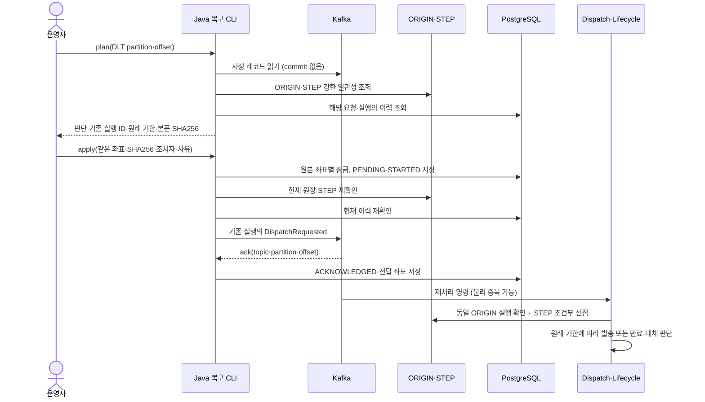

# DLT 원장 대조와 기존 실행 복구

2026-09-25. [읽기 전용 분류](49-DLT-조회와-재처리-대상-분류.md)에 이어, **ORIGIN에 남아 있는 실행을 대조하고 기존 실행 ID로 재처리하는 Java CLI**를 추가했다. SQL에 인계 요청·시도·Kafka ack를 남긴다. ORIGIN이 없는 요청의 신규 복원과 자동 DLT 소비는 이번 범위에 포함하지 않는다.

## 1. 처리 흐름과 재접수를 하지 않는 이유



DLT 원문을 접수 토픽에 그대로 넣으면, SQL 이력 저장과 ORIGIN 삭제가 완료된 뒤 새 실행을 만드는 경합이 생긴다. 고객의 신규 API 재접수는 Redis 완료 TTL 유실 시 다시 허용하는 정책이지만, 운영자가 오래된 DLT를 처리하는 행위를 신규 접수로 바꾸면 안 된다.

따라서 현재 ORIGIN의 실행 ID를 가져와 `delivery.dispatch-requested.v1`로 보낸다. requestKey·원래 occurredAt·payload·대체 발송 설정은 유지하고 eventId는 기존 실행의 DispatchRequested ID다. 마지막 대조 직후 ORIGIN이 삭제되거나 다른 실행으로 교체돼도, 실제 발송 선점의 기존 DynamoDB 트랜잭션 조건이 이전 명령을 차단한다.

**공식 근거:** DynamoDB 트랜잭션은 여러 항목의 조건 검사와 변경을 하나의 성공/실패 단위로 처리한다. 이 구현은 ORIGIN의 실행 ID·완료 여부 확인과 STEP 선점을 함께 수행하는 기존 조건을 재사용한다. SQL·Kafka까지 같은 트랜잭션이 된다는 뜻은 아니다. [DynamoDB 트랜잭션 API](https://docs.aws.amazon.com/amazondynamodb/latest/developerguide/transaction-apis.html).

## 2. 허용·보류 기준

| 판단 | 처리 |
|---|---|
| RESUME_EXISTING | 유효한 v2 원문, ORIGIN 내용·원래 시각 일치, 해당 실행 SQL 이력 없음, STEP 없음. 기존 실행으로 인계 가능 |
| EXPIRE_EXISTING | 위 조건을 만족하지만 1차 기한 경과. 원래 시각을 그대로 넘겨 발송 worker가 만료·대체 판단 |
| NO_ORIGIN_UNCONFIRMED | ORIGIN도 이력도 없음. 미발송 증거가 아니므로 새 ORIGIN을 만들지 않고 보류 |
| HISTORY_FOUND | 현재 실행의 SQL 이력이 있거나, ORIGIN 없이 해당 요청의 과거 이력이 있음. 보류 |
| ORIGIN_MISMATCH | tenant·본문·실행 eventId·원래 시각 등이 다름. 이후 API 재시도의 다른 occurredAt도 보류 |
| COMPLETION_RECORDED | ORIGIN에 완료 표시가 있음. 보류 |
| STEP_ALREADY_TRACKED | 기존 STEP 존재. 현재 처리·재시도·운영 확인·Lifecycle 복구 경로에 맡김 |
| INVALID_DLT | 형식 오류, 원본 좌표 오류, 멱등 충돌, 미지원 버전 등. 발행하지 않음 |

SQL 또는 DynamoDB 조회가 실패하면 상태를 모르는 채 진행하지 않는다. `plan`은 판독 시점의 결과이며 승인 토큰이 아니다. `apply`는 현재 상태를 다시 판독하고, SQL 시도 기록을 남긴 뒤에도 한 번 더 대조한다.

1차 만료는 **원래 인입 시각 + 3시간**이다. 만료된 1차 HTTP를 호출하지 않는다. 대체 허용 요청의 2차 처리는 기존 규칙을 따른다. 만료로 1차 결과가 정해지는 경우 1차 deadline을 기준으로 2차 4시간을 계산하므로 오래 격리됐다고 기한을 다시 늘리지 않는다. CLI의 `DLT_PRIMARY_TTL`은 실행 중인 dispatch 설정과 같아야 한다. 실제 발송 여부의 마지막 판단은 worker의 기한 검사가 담당한다.

## 3. 왜 PostgreSQL에 조치 기록을 남기는가

기존 이력 DB를 사용해 정상 처리에 DynamoDB 쓰기를 늘리지 않으면서, 운영 요청과 Kafka 인계의 불확실성을 보존한다. result worker의 Flyway `V4__dlt_recovery_handoff.sql`이 다음 테이블과 이력 조회 인덱스를 만든다.

| 저장소 | 내용·목적 |
|---|---|
| dlt_recovery_operation | 클러스터 별칭 + **DLT header의 원본** topic/partition/offset으로 유일한 작업. 본문 SHA256, 기존 실행 ID, 동일 재시도용 command JSON, 대상 토픽, PENDING/HELD/ACKNOWLEDGED, ack 좌표 |
| dlt_recovery_attempt | 실제 시도별 조치자·사유·시작/완료 시각과 STARTED/STATE_CHANGED/UNCONFIRMED/ACKNOWLEDGED |
| delivery_history_request_key | tenantId와 result_json의 requestKey로 이력을 대조하는 인덱스. 기존 이력 행을 추가 복사하지 않음 |

처음에는 operation PENDING을 commit하고, 각 시도 시작 정보도 Kafka 호출 전에 commit한다. 동일 원본 작업에 PostgreSQL 세션 advisory lock을 사용해 운영자 동시 실행을 직렬화한다. 잠금 획득 실패는 BUSY다. 정상 종료 시 해제하고 세션 종료 시에도 해제되며, 조치 상태는 SQL에 계속 남는다. 서로 다른 클러스터에 같은 별칭을 쓰거나 동일 클러스터의 별칭·SQL schema를 작업마다 바꾸지 않는다.

**공식 근거:** `ON CONFLICT`는 유일성 충돌 시 삽입 대신 정해진 처리를 할 수 있게 한다. 세션 advisory lock은 트랜잭션 rollback만으로 풀리지 않으므로 명시 해제 또는 세션 종료가 필요하다. 둘을 조합해 작업 유일성과 동시 실행 방지를 각각 담당시켰다. [PostgreSQL INSERT](https://www.postgresql.org/docs/17/sql-insert.html), [PostgreSQL advisory lock](https://www.postgresql.org/docs/17/explicit-locking.html#ADVISORY-LOCKS).

Kafka ack를 받고 SQL 기록까지 성공해야 ACKNOWLEDGED다. 이미 ACKNOWLEDGED인 동일 작업은 다시 발행하지 않는다. Kafka 응답 미확인 시 PENDING/UNCONFIRMED로 두며 다음 시도에 같은 실행·command를 사용한다. 전송 뒤 프로세스가 종료돼 STARTED만 남거나 SQL 기록 응답을 잃은 경우도 최종 성공으로 단정하지 않는다. SQL이 이미 ACKNOWLEDGED를 commit했다면 이후 오류 처리로 PENDING으로 되돌리지 않는다.

Kafka producer idempotence만으로 재실행된 CLI 사이의 중복까지 막을 수 없으므로, 동일 command의 물리적 중복을 허용하고 기존 STEP 선점으로 외부 발송을 보호한다. [KafkaProducer 공식 문서](https://kafka.apache.org/42/javadoc/org/apache/kafka/clients/producer/KafkaProducer.html)의 send 결과와 idempotence 범위를 근거로 한 설계다. **ACKNOWLEDGED는 고객 최종 결과 완료가 아닌 Kafka 인계 완료**다.

대상 1건의 `plan`은 ORIGIN GetItem 1회, 조건을 만족하면 STEP Query 1회, SQL 이력 조회 1회다. `apply`는 최초 판독과 발행 전 재대조를 하므로 보통 DynamoDB 읽기 4회다. DLT CLI 자체의 DynamoDB 쓰기는 0회이며, worker가 재개한 이후에는 기존 업무 쓰기만 수행한다. 기존 정상 1차 성공 경로의 **5회 호출·7항목 변경**은 그대로다. SQL 운영 기록 비용과 새 이력 인덱스 유지 비용은 추가된다.

## 4. 로컬 PoC 실행

JDK 21로 빌드한 JAR와 V4까지 반영된 result worker SQL schema가 필요하다. 외부 실행 도구는 **Bash**이고 조회·판단·JDBC·Kafka 전송은 모두 Java다. 로컬 Kafka/DynamoDB/PostgreSQL 주소만 허용한다.

```sh
export JAVA_HOME=/path/to/jdk21
export DLT_KAFKA_BOOTSTRAP_SERVERS=localhost:9092
export DLT_CLUSTER_ALIAS=local-dev
export DLT_DYNAMODB_ENDPOINT=http://localhost:8000
export DLT_DB_URL=jdbc:postgresql://localhost:5432/delivery
export DLT_DB_USER=delivery
export DLT_DB_PASSWORD=delivery  # 로컬 개발 계정
export DLT_DB_SCHEMA=delivery_results
export DLT_PRIMARY_TTL=PT3H
export DLT_SOURCE_TOPIC=delivery.requested.v1

bash scripts/recover-dlt.sh plan delivery.requested.dlt.v1 0 42
# plan 결과의 valueSha256과 판단·기존 실행 ID를 확인한 뒤
bash scripts/recover-dlt.sh apply delivery.requested.dlt.v1 0 42 \
  '<valueSha256>' local-operator '후속 Kafka 복구 후 기존 실행 재개'
```

인수의 topic/partition/offset은 **조회할 DLT 좌표**이며 작업 유일성에 쓰는 header 원본 좌표와 구별한다. 보존 기간이 지난 offset을 다음 레코드로 대체하지 않는다. 표준 출력은 JSON, 로그·오류는 표준 오류이며 plan 출력에는 payload가 없다. apply 종료 코드는 0=SQL까지 인계 기록 완료, 3=보류/동시 실행/미확인, 1=예외, 2=인수 오류다. plan은 보류 판단도 정상 판독이면 0을 반환하므로 반드시 decision을 확인한다.

다시 실행할 때 같은 DLT 좌표로 plan/apply를 수행한다. 현재 이력 또는 STEP이 생겼다면 보류 결과를 읽고 기존 worker의 진행 상태를 확인한다. DLT 레코드 삭제와 업무 consumer offset commit은 수행하지 않는다. SQL command JSON에는 원문 내용이 포함되므로 기존 이력 DB와 함께 접근·보존 정책을 적용해야 한다. 조치자 인수는 **로컬 기록용 문자열**이며 인증된 운영자 신원을 검증하는 기능은 아직 없다.

## 5. 검증과 남은 범위

Java/JUnit으로 실제 PostgreSQL·DynamoDB Local·Kafka를 연결해 다음을 검증한다. 환경 실행·종료는 Bash + Docker Compose가 맡는다.

실행 결과: **전체 324개 통과, 실패·오류·미실행 0개**. 신규 DLT 저장소 통합 10개와 dispatch 경계 4개를 포함한다. [검증 결과 JSON](검증-결과/2026-09-25-DLT-기존-실행-복구와-324개-통합-검증.json)에 도구·실행 폴더·소스 지문·정리 결과를 남겼다.

- 원래 시각·실행 ID 보존, 만료 분류, 원장 없음·이력 있음·원장 불일치·완료 표시·기존 STEP 보류, SQL 조회 실패 시 중단.
- 실제 Kafka 인계와 SQL ack/조치 기록, 동일 작업 재실행 시 추가 발행 없음.
- 실제 Kafka 전송 뒤 timeout 예외를 주입해 응답 유실을 모델링하고, 동일 command 재인계와 UNCONFIRMED 이력 보존 확인.
- 운영자 동시 실행 BUSY, 계획 후 원장 삭제 시 발행 차단, 같은 원본 좌표의 command 변조 차단.
- dispatch 경계에서 중복 command의 업체 호출 1회, 만료 command의 업체 호출 0회·원래 기한 결과, ORIGIN 삭제/교체 후 STEP 생성 차단.
- 정확한 Kafka offset 읽기, 삭제된 offset 거절, 기존 읽기 전용 조회의 그룹 offset 유지.

실제 SIGKILL·SQL commit 응답 유실을 포함한 모든 종료 지점을 이 시험이 검증한 것은 아니다. 성능/TPS 시험도 아니며, 성능 부하는 개발 완료 후 **k6**로 진행한다.

다음 DLT 범위는 **ORIGIN 저장 전 실패한 요청의 내구성 있는 복원·만료 인계**다. ORIGIN/이력 없음만으로 신규 발송하지 않으면서 초기 실패와 완료 후 정리를 구분할 근거가 필요하다. 또한 SQL PENDING/STARTED의 자동 재개 worker, 실제 운영 인증·권한·감사, 보존 기간 감시가 남아 있다. 현재 수동 CLI와 기존 Lifecycle만으로 모든 DLT의 고객 결과 기한 보장이 완료됐다고 보지 않는다.
