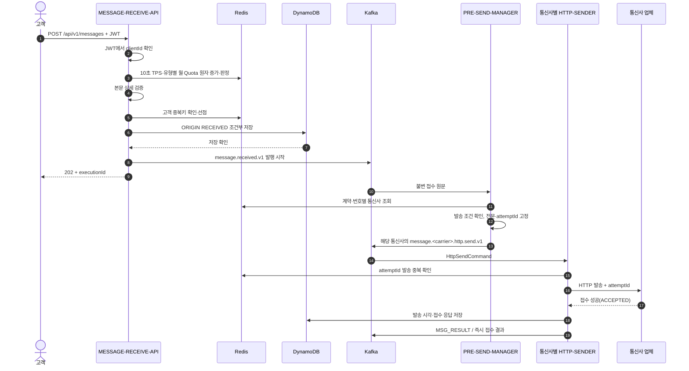
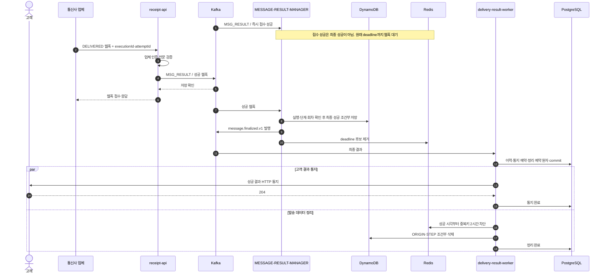
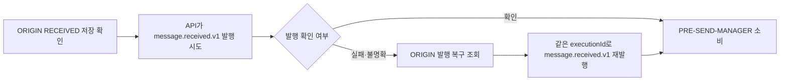
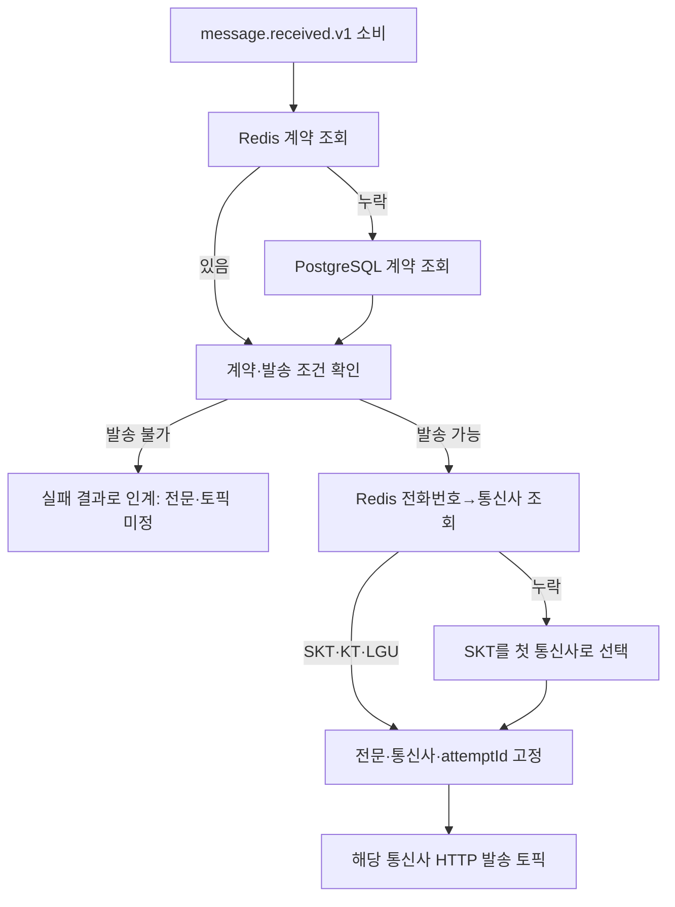
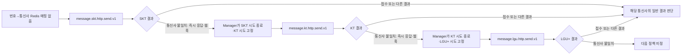
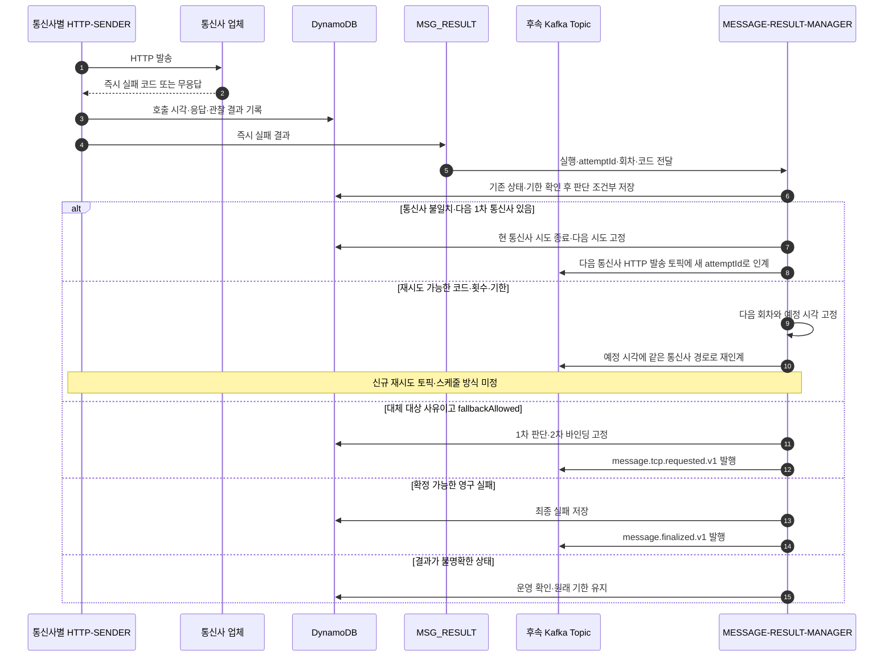
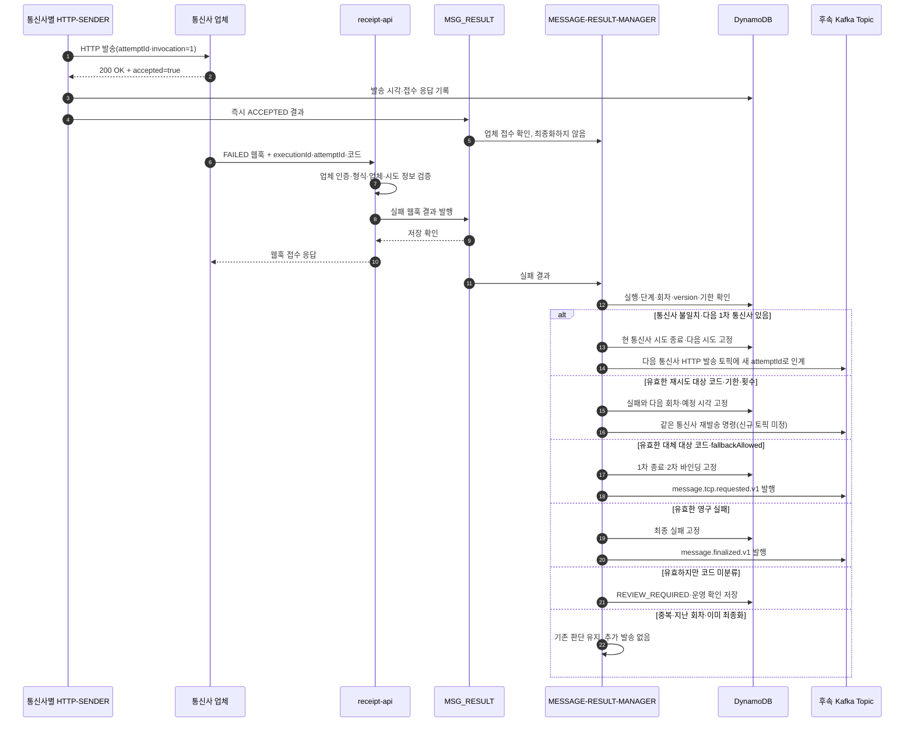
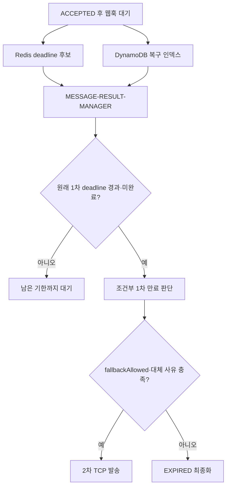
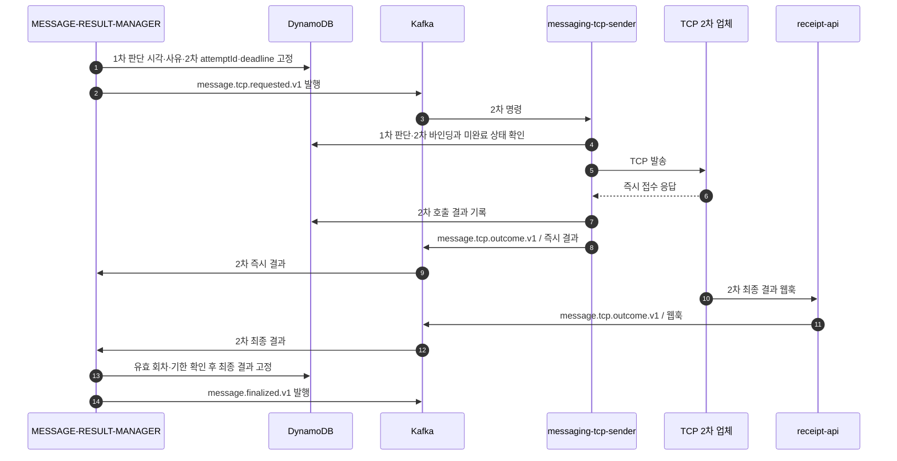
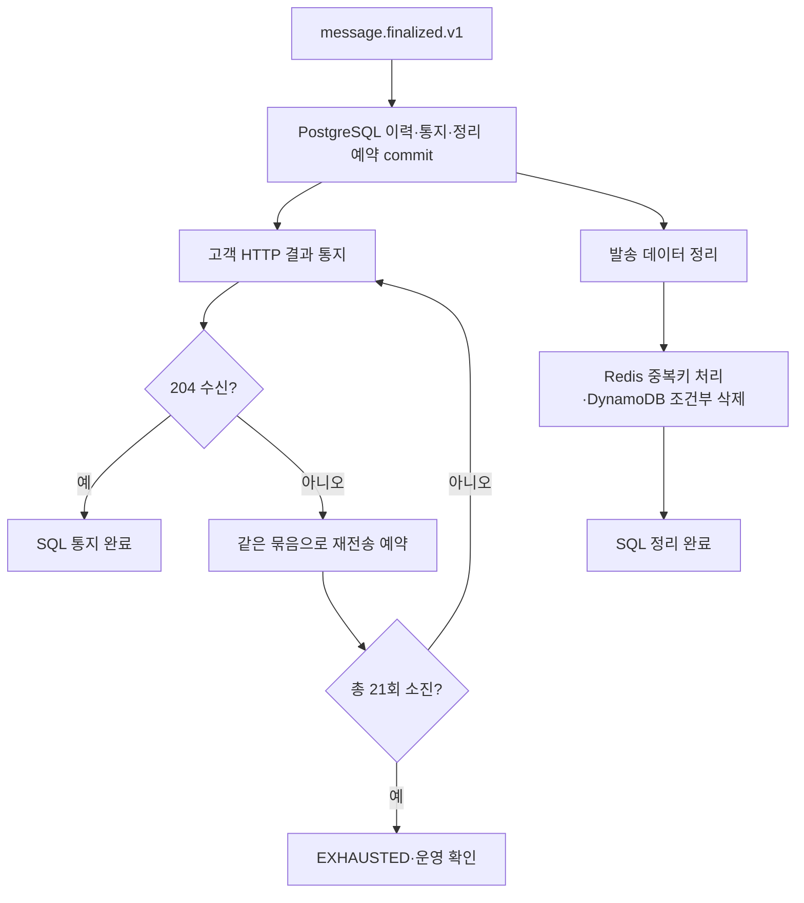

# 메시지 접수부터 최종 결과까지: 케이스별 Call Flow

기준: 2026-10-04. **신규 `/api/v1/messages` 경로의 목표 설계**를 한곳에서 읽기 위한 문서다. 정상 흐름과 실패·복구 분기를 함께 그린다. 현재 구현은 API 접수·ORIGIN 저장·`message.received.v1` 발행, 공통 전문·통신사별 토픽, CDC 캐시 준비와 PRE-SEND-MANAGER 모듈의 참조 조회 코드까지다. `PRE-SEND-MANAGER`의 Kafka 소비·전문 생성, 통신사별 sender, `MSG_RESULT` 생산·소비, 신규 결과 판단 경로는 아직 연결되지 않았다. 이관 전 `delivery.*` 및 `message.http.requested.v1` 구현·검증을 신규 경로의 완료로 읽지 않는다. 구현 상태는 [01 현재 상태](01-현재-구현-상태와-남은-작업.md), 결정 근거는 [ADR-026](adr/ADR-026-MESSAGE-RECEIVED와-통신사별-HTTP-발송-분리.md)·[ADR-027](adr/ADR-027-접수-API-Redis-TPS와-유형별-월-Quota.md)을 따른다.

## 읽는 순서와 경계

| 케이스 | 위치 | 최종 결과 |
|---|---|---|
| 1차 정상 성공 | [1](#1-1차-정상-성공) | 성공 웹훅 → 최종 성공 → 고객 통지·정리 |
| 접수 거절·중복·최초 발행 불명확 | [2](#2-접수-거절중복최초-발행-불명확) | API 응답 또는 ORIGIN 기준 복구 |
| 계약·통신사 조회 분기 | [3](#3-pre-send-manager의-계약통신사-조회) | 발송 명령 또는 보류·실패 |
| 번호 매핑 누락·통신사 이동 | [3.1](#31-번호-매핑-누락과-통신사-이동) | SKT → KT → LGU+의 1차 HTTP 경로 |
| 업체 즉시 응답 실패 | [4](#4-업체의-즉시-응답이-실패) | 통신사 이동·재시도·2차 전환·최종 실패·운영 확인 |
| 접수 성공 후 실패 웹훅 | [5](#5-접수-성공-후-실패-웹훅) | 웹훅 코드에 따른 통신사 이동 또는 일반 실패 판단 |
| 웹훅 미수신·1차 만료 | [6](#6-웹훅-미수신과-1차-만료) | 2차 전환 또는 만료 |
| 2차 TCP 발송 | [7](#7-2차-tcp-발송) | 성공·재시도·최종 실패·만료 |
| 고객 통지 실패·정리 | [8](#8-최종-결과-이후-고객-통지와-정리) | SQL 기준 독립 재개 |
| 중간 종료·저장소 장애 | [9](#9-중간-종료와-저장소-장애) | 저장된 원본·판단 기준 재개 |

현재 확정한 새 경로의 토픽은 `message.received.v1`(API → PRE-SEND-MANAGER), `message.skt.http.send.v1`·`message.kt.http.send.v1`·`message.lgu.http.send.v1`(Manager → 통신사별 sender), `MSG_RESULT`(1차 즉시 응답·웹훅 → MESSAGE-RESULT-MANAGER)다. 최종 결과 토픽은 기존 목표의 `message.finalized.v1`을 사용한다. **2차 발송은 아직 기존 목표명** `message.tcp.requested.v1`/`messaging-tcp-sender`로 표기한다. 제안된 `message.tcp.send.v1` 이름은 확정되지 않았다. 1차 재시도 토픽·명령 방식과 2차 결과를 `MSG_RESULT`에 합칠지도 미정이다.

메시지 처리용 Kafka 레코드의 key는 `executionId`를 사용한다. 고객 ID는 API의 `messageId`다. CDC 참조 데이터 토픽은 별개다. `attemptId`는 1차 HTTP의 통신사별 시도를 식별하고, 동일 통신사 재시도 회차(`invocation`)·버전은 별도로 구분한다. Sender에 전달할 개별 호출 명령의 ID는 `sendRequestId`다. 같은 명령의 재전달에는 고정하고 새 재시도 회차·다음 통신사에는 새로 발급한다. 공통 `HttpSendCommand`에 필드를 추가했으며 실제 Manager 생산·Sender 소비는 아직 구현 전이다. 다른 토픽 사이의 도착 순서는 보장되지 않으므로 최종 판단은 DynamoDB의 조건부 상태 전이로 수렴시킨다.

## 1. 1차 정상 성공

전제: JWT·TPS·Quota 통과, 새 고객 메시지, 계약과 전화번호→통신사 값이 Redis에 있음, 업체가 즉시 접수하고 나중에 `DELIVERED` 웹훅을 보냄, 고객이 최종 통지에 204로 응답함. PostgreSQL → CDC → Redis 투영은 요청 밖에서 먼저 진행된 참조 데이터 갱신이다.

`202`는 ORIGIN 영속 접수 확인이다. Kafka ack, 업체 접수, 최종 성공을 기다리지 않는다. 업체의 `ACCEPTED`도 최종 성공이 아니므로 결과 기한까지 웹훅을 기다린다.

고객 통지와 발송 데이터 정리는 SQL commit 후 독립 작업이다. 고객 204를 기다려야만 ORIGIN·STEP을 지우는 순서가 아니다.

## 2. 접수 거절·중복·최초 발행 불명확

정상 접수 순서는 `JWT → Redis TPS·분류별 월 Quota 증가·판정 → 본문 상세 검증 → 고객 중복 확인 → ORIGIN 저장 → Kafka send 시작 → 202`다. API는 계약 PostgreSQL을 조회하지 않는다. `messageCategory`를 확인할 수 있는 잘못된 본문과 고객 중복 요청도 사용량에 포함된다.

| 발생 지점 | 흐름 | 고객 응답·후속 |
|---|---|---|
| JWT 거절 또는 `messageCategory` 누락 | 사용량 증가 전 중단 | 접수하지 않음 |
| TPS·월 Quota 초과 | Redis에서 증가와 판정이 한 번에 이뤄짐 | 429, ORIGIN·Kafka 없음. 초과분도 사용량에 포함 |
| 정책 키 누락·형식 오류 | 접수 제어 정책을 판정할 수 없음 | 503, ORIGIN·Kafka 없음 |
| Redis 사용량 검사 연결 실패·타임아웃 | 제한 검사를 우회하는 가용성 정책 | 이후 검증·접수 계속. 이 기간 사용량 누락 가능 |
| 본문 상세 검증 실패 | 사용량 증가 후 중단 | 400, 중복 선점·ORIGIN·Kafka 없음 |
| 동일 고객 중복키 재요청 | Redis 실행 ID로 ORIGIN을 대조 | 같은 실행을 202로 반환·재발행할 수 있음. 원본과 충돌하면 409, 저장 확인 전이면 503 |
| 새 ORIGIN Put의 결과 불명확 | 동일 `executionId`로 강한 일관성 조회 | 같은 원본이 확인되면 202, 확인 불가하면 503. Redis 중복키를 성급히 해제하지 않음 |
| ORIGIN 저장 뒤 Kafka 발행 실패·ack 불명확 | API는 ORIGIN 접수 기준으로 202. 발행 복구 앱이 같은 원문·ID로 재발행 | Kafka 기록 중복 가능, 새 실행을 만들지 않음 |

## 3. PRE-SEND-MANAGER의 계약·통신사 조회

계약 원본과 번호 매핑 원본은 PostgreSQL이며 CDC가 Redis를 갱신한다. **계약 캐시 누락은 PostgreSQL 조회, 번호→통신사 캐시 누락은 SKT 첫 발송**으로 처리한다. 번호 매핑 누락 때문에 접수를 거절하거나 통신사 찾기를 위해 PostgreSQL을 인라인 조회하지 않는다. 한 번 발행한 *통신사 시도*의 전문·`attemptId`는 Kafka 재전달 중 바꾸지 않는다. 현재 계약 테이블에 발송 전문 생성에 필요한 모든 정보가 있는 것도 아니므로 계약·설정 스키마는 추가 설계가 필요하다.

### 3.1 번호 매핑 누락과 통신사 이동

SKT의 즉시 응답 또는 나중의 웹훅이 "우리 통신사 아님"이면 `MSG_RESULT`를 받은 `MESSAGE-RESULT-MANAGER`가 해당 통신사 시도를 조건부로 닫고 **같은 실행의 새로운 KT 시도**를 인계한다. KT에서도 같은 결과면 LGU+로 이동한다. 이 세 통신사는 모두 **1차 HTTP 단계 안의 경로**이며, 2차 TCP 발송이나 동일 통신사의 재시도 회차가 아니다.

실행 `executionId`와 고객 `messageId`는 그대로 두고 통신사 시도마다 별도 `attemptId`를 사용한다. 같은 발송 명령의 Kafka 재전달은 같은 `attemptId`·`sendRequestId`로 중복 제어하지만, 다음 통신사로 이동할 때는 새 ID를 부여한다. 먼저 온 즉시 응답과 뒤따른 웹훅이 모두 불일치여도 이동은 한 번만 저장·발행한다. 이전 통신사의 늦은 결과가 새 통신사 시도나 최종 결과를 덮지 않도록 회차·통신사·상태를 조건부로 확인한다.

업체별 실제 불일치 코드를 공통 결과로 정규화하는 계약, 다음 통신사 명령을 누가 어떤 원본에서 생성할지, 매핑이 *있는* 번호에서 불일치가 왔을 때의 탐색 순서, LGU+도 불일치일 때의 최종 정책은 아직 결정되지 않았다. 발견한 통신사를 PostgreSQL 원본에 반영할지도 별도 결정이다.

## 4. 업체의 즉시 응답이 실패

HTTP-SENDER는 업체 호출의 즉시 거절·재시도 코드·무응답을 관찰하고 발송 시각과 결과를 DynamoDB에 기록한 뒤 `MSG_RESULT`에 인계한다. **sender가 재시도·2차 전환·최종 실패를 독자적으로 결정하지 않는다.**

"우리 통신사 아님"으로 정규화한 즉시 실패는 [3.1의 통신사 이동](#31-번호-매핑-누락과-통신사-이동)에 따른다. 이전 정책의 다른 코드 예시는 `RETRY_1S`·`RETRY_10S`(최초 1회 + 최대 3회), `FALLBACK`(대체 대상), `REJECTED`(영구 거절)이다. 무응답은 실제 업체 처리 여부가 불명확할 수 있다. `HTTP_ERROR`·형식 오류 같은 결과를 자동 재시도로 단정하지 않는다. 새 `MSG_RESULT` 결과 전문과 코드별 분류는 구현 전에 확정해야 한다. 대체 대상이어도 `fallbackAllowed=false`이면 TCP를 호출하지 않는다.

## 5. 접수 성공 후 실패 웹훅

업체의 HTTP `200 OK`와 유효한 `accepted=true` 응답은 **요청 접수 확인**이다. 최종 수신 성공으로 고객에게 통지하지 않는다. 이후 업체가 `FAILED` 웹훅을 보내면 그 웹훅의 업무 코드가 해당 호출 회차의 실패 원인이다. 실패 결과의 출처는 sender가 아니라 인증된 `receipt-api`다.

`FAILED` 웹훅의 코드가 "우리 통신사 아님"으로 정규화되면 [3.1의 통신사 이동](#31-번호-매핑-누락과-통신사-이동)에 따른다. 이전 경로의 다른 코드별 기준은 `FAILED + RETRY_1S/RETRY_10S`면 원래 1차 deadline과 최대 3회 범위에서 같은 통신사 재시도, `FAILED + FALLBACK`이면 `fallbackAllowed=true`일 때만 TCP 2차 전환, `FAILED + REJECTED`면 최종 실패다. 코드가 없거나 미지의 코드면 재시도·전환을 추측하지 않고 운영 확인 대상으로 남긴다. 신규 `MSG_RESULT` 전문과 실제 업체별 코드표는 아직 확정되지 않았다. 유효한 실패는 최종 결과가 되거나 통신사 이동·재시도·2차로 이어지고, 그 전에는 고객에게 최종 결과를 통지하지 않는다.

웹훅이 즉시 응답의 Kafka 결과보다 먼저 도착하거나 중복·늦게 와도 이미 확정한 판단을 덮지 않는다. sender의 늦은 `ACCEPTED` 기록도 웹훅 실패·재시도 판단을 되돌려서는 안 된다. 재시도 회차를 웹훅과 함께 돌려받아 이전 회차의 늦은 실패를 구분해야 한다.

**재시도 멱등키는 추가 결정이 필요하다.** 현재 이전 `messaging-http-sender`는 HTTP `Idempotency-Key`에 고정 `attemptId`를 쓰며 시뮬레이터는 같은 키의 두 번째 접수 성공을 중복으로 처리한다. 이를 신규 경로에 그대로 적용하면 실패 웹훅 뒤 `invocation=2`를 보내도 새 발송 효과가 없을 수 있다. 논리적 `attemptId`는 유지하되 새 회차에 새 `sendRequestId`를 부여하고, *같은 회차의 Kafka 재전달*은 같은 ID를 재사용한다. 이 ID를 업체 멱등키·웹훅 상관 ID로 사용할 수 있는지는 업체 계약과 함께 확정해야 한다.

## 6. 웹훅 미수신과 1차 만료

즉시 `ACCEPTED` 뒤 웹훅이 오지 않으면 접수 성공만으로 최종 성공을 만들지 않는다. 이전 목표의 1차 deadline은 **최초 인입 +3시간**이며, Redis는 빠른 만료 후보 일정이고 DynamoDB는 최종 판단·복구의 기준이다. deadline은 `ACCEPTED` 시점에 새로 시작하지 않는다. Redis 후보를 언제 등록할지는 신규 경로에서 미정이며, `ACCEPTED` 결과를 소비한 뒤에만 등록하는 방식은 사전 처리·발송 전에 멈춘 실행을 놓칠 수 있다.

Redis 일정이 유실돼도 DynamoDB 조회로 누락을 찾는다. 늦게 온 웹훅은 관측만 남기고 이미 확정한 만료·2차 전환·최종 결과를 바꾸지 않는다. 2차 전환을 늦게 처리해도 2차 deadline을 임의로 연장하지 않는다.

## 7. 2차 TCP 발송

2차는 모든 1차 실패의 기본 경로가 아니다. 기존 목표의 대체 사유는 `FALLBACK_REQUIRED`, `PRIMARY_EXPIRED`, `RETRY_EXHAUSTED_NO_RESPONSE`이며 최초 요청의 `fallbackAllowed`가 참이어야 한다. 현재 목표 이름은 `message.tcp.requested.v1` → `messaging-tcp-sender`다. 2차 결과 토픽은 기존 목표의 `message.tcp.outcome.v1`을 표기하며, `MSG_RESULT`로 통합할지는 아직 결정되지 않았다.

2차도 코드별 최대 3회 재시도와 웹훅 대기를 적용한다. 기존 목표의 2차 deadline은 **1차 결과 판단 시각 +4시간**이고, 실패·만료 뒤 세 번째 업체로 넘어가지 않는다. 2차 결과가 성공이든 실패든 최종 결과 확정 이후에는 [8번](#8-최종-결과-이후-고객-통지와-정리)으로 합류한다. 이 다이어그램은 이전 DDB 선점 모델을 포함한 목표 기록이며, 신규 1차의 Redis 중복 제어와 2차 발송 보호를 어떻게 맞출지는 구현 전에 확정해야 한다.

## 8. 최종 결과 이후 고객 통지와 정리

`MESSAGE-RESULT-MANAGER`가 최종 결과를 DynamoDB에 고정한 뒤 `message.finalized.v1`로 인계한다. `delivery-result-worker`는 PostgreSQL에 **최종 이력·고객 통지 예약·정리 예약을 단일 트랜잭션**으로 저장한다. SQL commit 전에는 ORIGIN·STEP을 삭제하지 않는다.

| 케이스 | 후속 흐름 |
|---|---|
| 고객이 결과 HTTP 통지에 204 응답 | 동일 고객 최대 100건 묶음의 통지 완료를 SQL에 기록 |
| 고객 응답이 204가 아니거나 무응답 | 같은 묶음 ID·결과 ID로 SQL 예약에 따라 재전송. 최초 + 최대 20회, 총 21회. 소진하면 운영 확인 대상으로 보존 |
| 고객에게 이미 처리됐지만 204만 유실 | 같은 묶음이 다시 도착할 수 있으므로 고객도 묶음 ID로 중복 제거 |
| 고객 통지와 무관한 정리 | SQL 이력·예약 저장을 확인하고 ORIGIN·STEP을 조건부 삭제. 성공은 Redis 고객 중복키를 성공 시각부터 2시간 차단, 실패·만료는 해당 실행의 키를 제거 |
| SQL 저장 실패 | DynamoDB의 불변 최종 결과를 유지하고 SQL 인계를 재시도. 정리 작업은 시작하지 않음 |

정리와 고객 통지는 SQL commit 이후 병렬로 진행한다. 고객 통지 21회 한도와 업체 발송 단계별 최대 3회 재시도는 서로 다른 정책이다.

## 9. 중간 종료와 저장소 장애

| 중단 위치 | 재개 근거와 지켜야 할 경계 |
|---|---|
| ORIGIN 저장 직후 API 종료·최초 Kafka ack 불명확 | 발행 복구 앱이 ORIGIN의 동일 원문·`executionId`로 `message.received.v1` 재발행. Kafka 중복 가능 |
| PRE-SEND-MANAGER의 통신사 토픽 발행 ack 불명확 | 같은 통신사·전문·`attemptId`로 재인계. 업체 호출 중복은 sender의 Redis 제어와 업체의 `attemptId` 처리 범위에 의존 |
| Redis 발송 중복 정보 유실 | 내부 중복 제어가 약해진다. 동일 `attemptId`를 업체에 전달하지만 업체 중복 처리 계약과 실제 보장은 별도 확인 필요 |
| 업체 호출 뒤 sender의 DynamoDB 결과 기록 전 종료 | 업체 효과가 불명확하다. 무조건 새 호출하지 않고 저장 조회·운영 확인·원래 deadline 정책이 필요. 신규 복구 절차 미정 |
| DynamoDB 결과 기록 뒤 `MSG_RESULT` 발행 실패 | 저장된 관찰 결과를 같은 ID로 재발행해야 한다. 신규 sender의 복구 구현·인덱스는 미정 |
| `MSG_RESULT` 소비 후 Manager 판단 저장·후속 Kafka 발행 사이 종료 | DynamoDB에 고정한 판단·명령을 같은 ID로 재발행. 먼저 저장되지 않았다면 원본 결과를 재처리 |
| 웹훅의 Kafka 저장 실패·ack 불명확 | `receipt-api`가 성공 접수로 확정하지 않고 동일 웹훅 재전달을 수용. 중복 결과는 Manager가 조건부 상태로 수렴 |
| Redis deadline 일정 유실 | DynamoDB 복구 인덱스로 만료 후보 재발견. Redis 비어 있음 여부에만 의존하지 않음 |
| 최종 DDB 저장 뒤 `message.finalized.v1` 발행 실패 | DDB의 불변 최종 결과로 같은 최종 결과 레코드 재인계 |
| PostgreSQL commit 뒤 고객 통지·DDB 정리 전 종료 | SQL의 통지·정리 예약으로 각각 재개. 고객 통지 완료와 정리는 독립 |

이 표의 *목표 복구 경계*와 *현재 코드에서 검증된 복구*는 다르다. 신규 sender·Manager·`MSG_RESULT` 경로의 장애 주입 시험은 아직 수행하지 않았다.

## 구현 전에 확정할 인터페이스

- `MSG_RESULT`의 통합 전문: 즉시 응답과 웹훅의 구별, 통신사·단계·`attemptId`·`invocation`·`sendRequestId`·업체 코드·발생 시각·중복 식별자.
- Manager가 회차별 `sendRequestId`를 생성하고 신규 Sender가 이를 중복 제어에 사용하도록 연결한 뒤 업체 멱등키·웹훅 회신 계약을 확정. 공통 명령 타입의 필드는 추가됐지만 생산·소비 경로는 아직 없다. 기존 `Idempotency-Key: attemptId`를 그대로 쓰면 실패 웹훅 뒤의 새 발송이 업체 중복 처리에 막힐 수 있다.
- 신규 1차 deadline의 Redis 후보 등록 시점과 재시도 명령의 통신사별 라우팅·지연 예약 방식. 기존 단일 sender용 `message.http.retry.v1`을 그대로 신규 경로로 읽지 않는다.
- 매핑이 있는 번호의 통신사 불일치 시 탐색 순서, 세 통신사가 모두 불일치일 때의 처리, 확인된 통신사의 PostgreSQL 반영 여부. 매핑이 없을 때는 SKT → KT → LGU+ 순서로 1차 HTTP 발송한다.
- 통신사 불일치의 업체별 코드 정규화, 중복·늦은 즉시 결과와 웹훅에 대한 단일 이동 판단, 다음 통신사 명령의 저장 원본·발행 주체.
- 계약상 발송 불가 결과의 인계 전문·토픽, 계약·발송 설정 스키마.
- sender Redis 선점 TTL·진행 중 중복 처리·DynamoDB 기록 실패 복구, 업체별 동일 `attemptId` 보장 범위.
- 2차 토픽·Pod 최종 이름과 2차 즉시 응답·웹훅의 `MSG_RESULT` 통합 여부.

이전 경로의 상세 시험·장애 근거는 [기존 전체 흐름](04-요청-접수부터-최종-결과까지의-전체-흐름.md), [저장소 장애](09-저장소-장애-시-중단-범위와-복구-절차.md), [계약·번호 CDC](52-계약과-번호-통신사-CDC-캐시.md)에 보존한다. 신규 경로 구현이 진행되면 이 문서의 목표·미정·완료 표시를 갱신한다.
