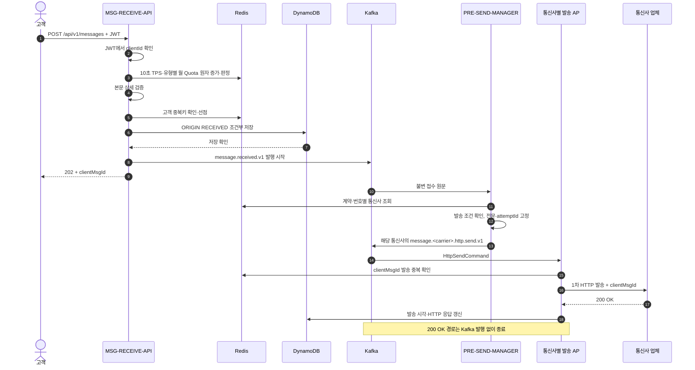
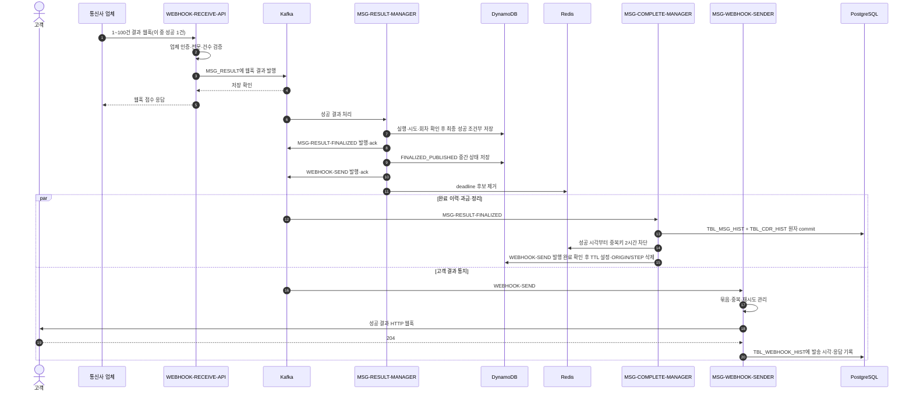
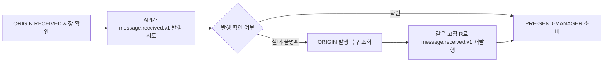
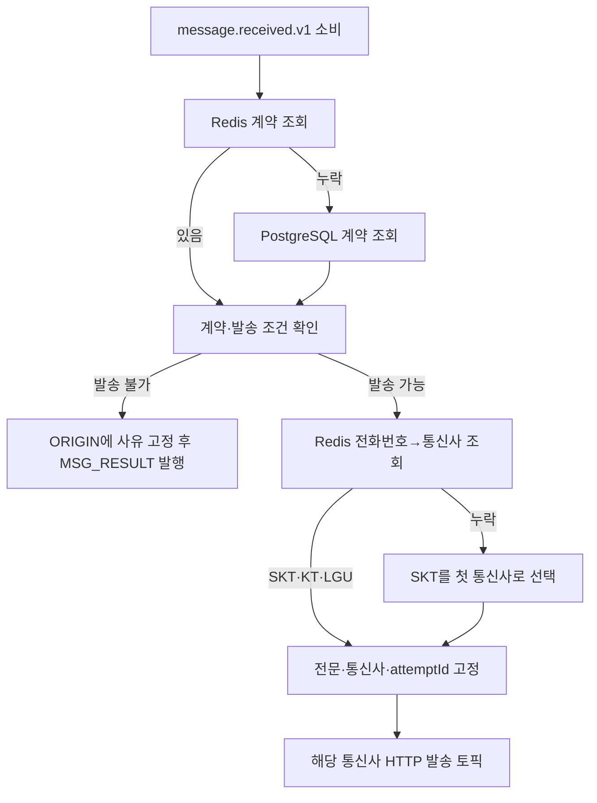
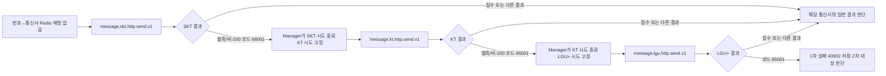
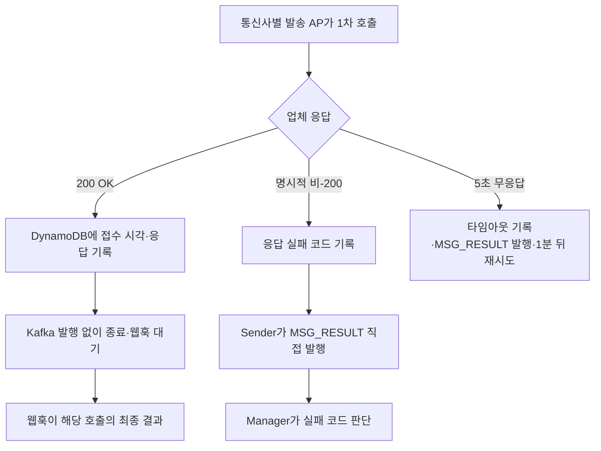
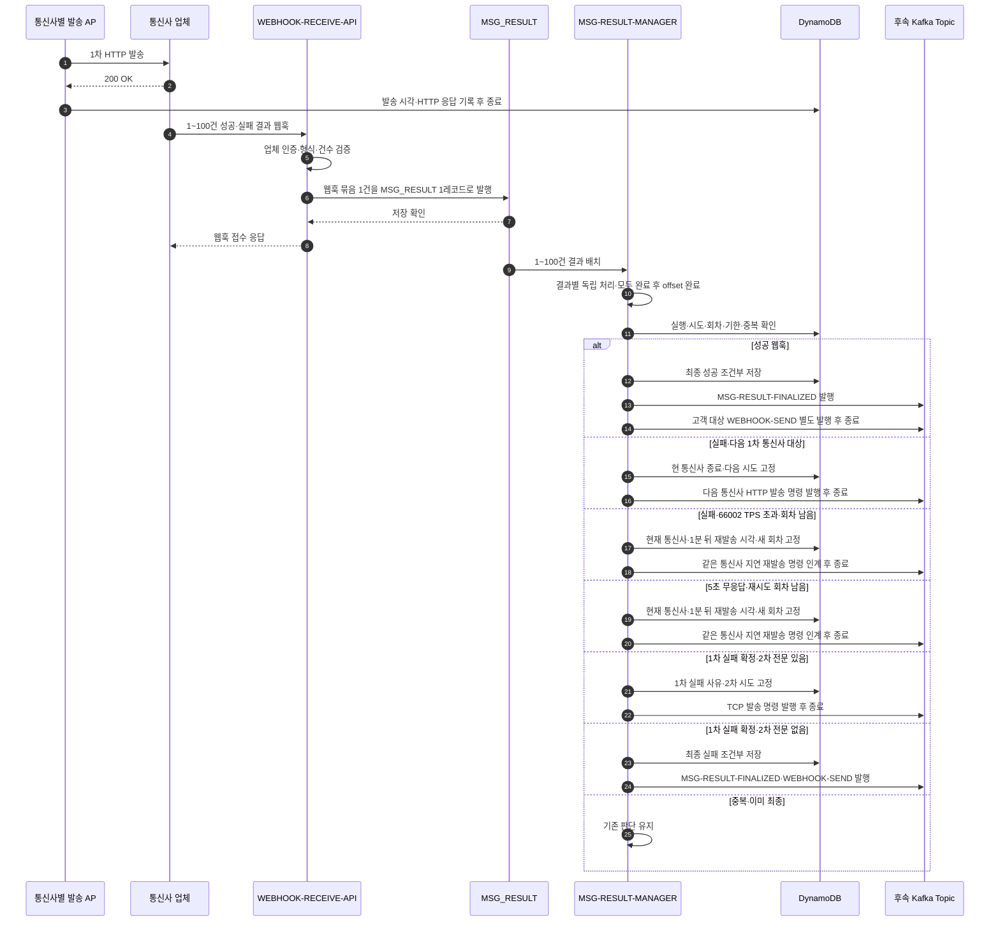
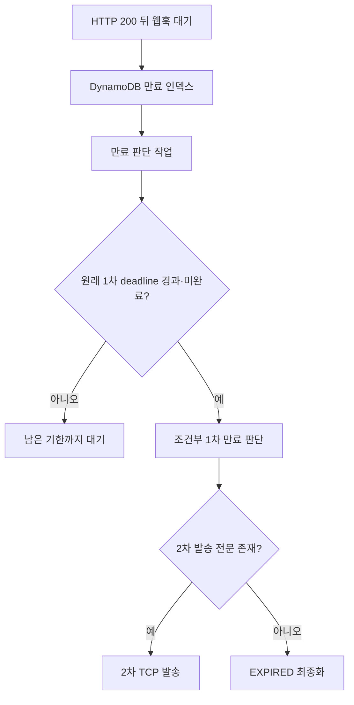
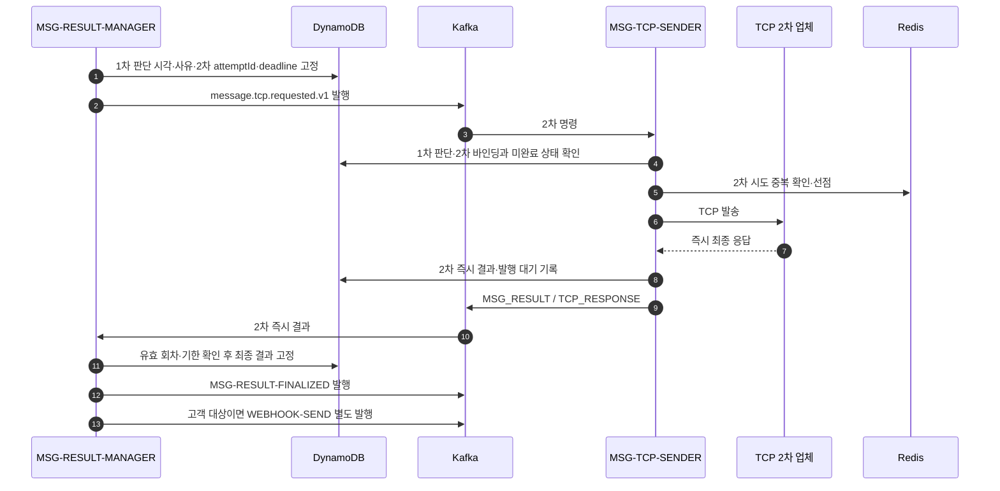
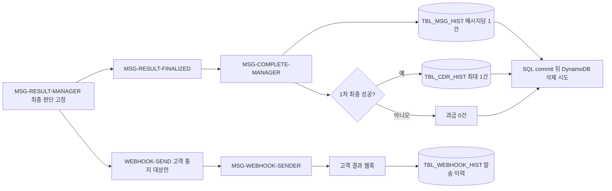

# 메시지 접수부터 최종 결과까지: 케이스별 Call Flow

기준: 2026-10-08. `/api/v1/messages`의 정상·실패·복구 경로다. 현재 구현 범위는 [현재 상태](01-현재-구현-상태와-남은-작업.md), 오류 코드와 결과 전문은 [오류 코드 계약](54-메시징-오류-코드와-결과-인계-계약.md)을 따른다.

## 읽는 순서와 경계

| 케이스 | 위치 | 최종 결과 |
|---|---|---|
| 1차 정상 성공 | [1](#1-1차-정상-성공) | 성공 웹훅 → 최종 성공 → 고객 통지·정리 |
| 접수 거절·중복·최초 발행 불명확 | [2](#2-접수-거절중복최초-발행-불명확) | API 응답 또는 ORIGIN 기준 복구 |
| 계약·통신사 조회 분기 | [3](#3-pre-send-manager의-계약통신사-조회) | 발송 명령 또는 보류·실패 |
| 번호 매핑 누락·통신사 이동 | [3.1](#31-번호-매핑-누락과-통신사-이동) | SKT → KT → LGU+의 1차 HTTP 경로 |
| 업체 즉시 응답 실패 | [4](#4-업체의-즉시-응답이-실패) | Sender가 `MSG_RESULT`에 직접 인계. 200 성공 경로와 구분 |
| 1~100건 웹훅과 실패 분기 | [5](#5-웹훅-묶음과-실패-분기) | 성공 최종화, 실패 시 1차 이동·2차 판단 |
| 결과 판단 AP의 전체 책임 | [5.1](#51-msg-result-manager의-처리-경계와-후속-연결) | 입력 검증·조건부 판단·후속 발행·완료 인계 |
| 웹훅 미수신·1차 만료 | [6](#6-웹훅-미수신과-1차-만료) | 2차 전환 또는 만료 |
| 2차 TCP 발송 | [7](#7-2차-tcp-발송) | 같은 호출의 즉시 응답·최종 결과·미정인 무응답 처리 |
| 고객 통지 실패·정리 | [8](#8-최종-결과-이후-고객-통지와-정리) | 별도 웹훅 토픽과 완료 이력·과금·DDB 정리 |
| 완료 관리자 상세 처리 | [8.1](#81-msg-complete-manager의-처리-로직) | 메시지당 이력 1건·1차 성공 과금 최대 1건 |
| 중간 종료·저장소 장애 | [9](#9-중간-종료와-저장소-장애) | 저장된 원본·판단 기준 재개 |

현재 확정한 새 경로의 토픽은 `message.received.v1`(API → PRE-SEND-MANAGER), `message.skt.http.send.v1`·`message.kt.http.send.v1`·`message.lgu.http.send.v1`(Manager → 통신사별 sender), `MSG_RESULT`(발송 전 실패·1차 웹훅·명시적 HTTP 실패·5초 타임아웃·2차 TCP 즉시 응답 → MSG-RESULT-MANAGER), `MSG-RESULT-FINALIZED`(완료 관리자 인계), `WEBHOOK-SEND`(결과 관리자 → 고객 웹훅 sender)다. 1차 HTTP `200 OK`에서는 sender가 Kafka 결과를 발행하지 않는다. 명시적 비-200과 5초 무응답은 sender가 출처를 구분해 `MSG_RESULT`에 직접 발행한다. 오류 코드 대역과 결과 전문은 [54 오류 코드 계약](54-메시징-오류-코드와-결과-인계-계약.md)을 따른다. 2차 발송 AP는 `MSG-TCP-SENDER`, 현재 발송 명령 토픽은 `message.tcp.requested.v1`이다. 2차 TCP는 즉시 응답을 최종 결과로 보고 `MSG_RESULT`에 `source=TCP_RESPONSE`로 인계한다.

단일 메시지 처리용 Kafka 레코드의 key는 최초 접수에서 발급한 고정 `clientMsgId`다. 고객 ID는 API의 `messageId`이며 UTF-8 최대 40바이트다. `clientMsgId`는 하이픈 없는 UUID 32자리로 만들고 API 202 응답, ORIGIN·Kafka·STEP, 업체 발송 요청·웹훅, 이력·과금에 같은 값을 사용한다. `attemptId`는 내부 통신사 시도, `invocation`은 같은 통신사의 재시도 회차를 구분하며 업체 ID에 붙이지 않는다. 업체 웹훅에는 `clientMsgId`만 돌아온다. 고객 API 요청과 웹훅 HTTP 요청은 인입마다 별도의 `traceId`를 발급해 추적하고 메시지 키로 사용하지 않는다. 한 웹훅 HTTP 요청의 1~100개 결과는 `MSG_RESULT`의 Kafka 1레코드에 담고 배치 key에는 `traceId`를 사용한다. 단일 메시지 명령·HTTP 응답 실패 레코드는 `clientMsgId` key를 사용한다. 웹훅 배치 안의 개별 메시지에 대한 Kafka 파티션 순서와 토픽 간 도착 순서는 보장되지 않으므로 DynamoDB 조건부 상태 전이가 필요하다.

발송·결과 경로의 AP 표기는 다음과 같다. 이는 **논리 AP/Deployment 이름**이며 Maven 모듈명이나 물리 Kafka 토픽명을 일괄 변경한 뜻은 아니다.

| 단계 | AP 이름 | 구현 상태 |
|---|---|---|
| 고객 접수 | `MSG-RECEIVE-API` | `messaging-api`에 신규 접수 경로 구현, 기본 활성화. `MESSAGING_ADMISSION_ENABLED=false`로 중지 가능 |
| 1차 발송 준비 | `PRE-SEND-MANAGER` | 참조 조회·명령 또는 발송 불가 결과를 ORIGIN에 고정하고 Kafka 인계 구현 |
| 1차 HTTP 발송 | `MSG-SKT-SENDER`, `MSG-KT-SENDER`, `MSG-LGU-SENDER` | 공통 `messaging-carrier-http-sender` 실행 JAR을 통신사별 URL·토픽·소비 그룹으로 분리. 명령 소비·Redis/STEP 선점·HTTP 호출·결과 기록과 실패 인계 구현 |
| 웹훅 접수 | `WEBHOOK-RECEIVE-API` | 독립 `messaging-webhook-receive-api`에 인증·1~100건 검증·`MSG_RESULT` 단일 레코드 발행 구현 |
| 결과 판단 | `MSG-RESULT-MANAGER` | 혼합 `MSG_RESULT` 소비·source/key 검사·메시지별 STEP inbox 보존·HTTP 실패의 후속 발송 판단 연결. 웹훅 실패의 통신사 이동·동일 통신사 재시도 연결. 웹훅 성공·발송 전 실패·1차 소진의 ORIGIN 결정 고정. 최종/2차 토픽 발행 기본 활성 |
| 2차 TCP 발송 | `MSG-TCP-SENDER` | 임시 TCP 규격 발송·결과 보존·MSG_RESULT 인계 구현, 기본 활성 |
| 1차 성공 과금·메시지 발송 이력·DynamoDB 정리 | `MSG-COMPLETE-MANAGER` | 독립 `messaging-complete-manager`가 1·2차 최종 SQL 이력을 저장하고 1차 성공만 과금 대상으로 기록. SQL 정리 대기열이 고객 웹훅 발행 완료를 확인한 뒤 DynamoDB에 TTL을 설정하고 ORIGIN·STEP을 삭제 |
| 고객 결과 웹훅 발송 | `MSG-WEBHOOK-SENDER` | `WEBHOOK-SEND` 소비·SQL 대기열 보존 기본 활성. 고객별 URL이 있으면 최대 100건 묶음으로 HTTP 발송하고 이력을 기록 |

`messaging-publication-recovery-app`·`messaging-reference-cache`는 각각 최초 Kafka 발행 복구와 CDC 캐시 투영을 돕는 별도 AP다. 1·2차 최종 결과는 `MSG-COMPLETE-MANAGER`의 SQL 이력과 `MSG-WEBHOOK-SENDER`의 고객 통지로 연결된다.

신규 `messaging-carrier-http-sender`는 같은 JAR을 통신사별 Pod에서 실행한다. `MSG_HTTP_CARRIER`·`MSG_HTTP_BASE_URL`·해당 명령 토픽·고유 소비 그룹을 기동 때 확인해 자기 통신사 명령만 소비한다. 각 명령이 ORIGIN에 고정된 원문과 같을 때만 STEP을 `PENDING`으로 예약하고, Redis의 통신사·시도·회차 키를 선점한 실행만 STEP을 `SENDING`으로 전이한다. Redis 키가 유실돼도 이미 `SENDING`인 호출은 자동 재발송하지 않는다. 공통 요청 경로의 현재 기본값은 `/api/v1/messages`이며 Pod 설정으로 바꿀 수 있다. 비-200 응답은 `{status: "4xx", error: {code: "4xxxx", message: "..."}}`의 문자열 코드를 원본으로 보존한다. 불일치·TPS 원본 코드 매핑은 Pod 기동 필수 설정이고, 그 외 6만 대역이 아닌 코드는 임시 공통 실패 `66999`로 정규화한다.

| Pod의 `MSG_HTTP_CARRIER` | 소비 토픽 | 소비 그룹 | URL 설정 |
|---|---|---|---|
| `SKT` | `message.skt.http.send.v1` | `messaging-skt-http-sender` | SKT 전용 `MSG_HTTP_BASE_URL` |
| `KT` | `message.kt.http.send.v1` | `messaging-kt-http-sender` | KT 전용 `MSG_HTTP_BASE_URL` |
| `LGU` | `message.lgu.http.send.v1` | `messaging-lgu-http-sender` | LGU+ 전용 `MSG_HTTP_BASE_URL` |

로컬 실행 스크립트는 통신사 값으로 토픽·그룹을 자동 설정한다. 실제 업체의 두 원본 코드에 대한 `MSG_HTTP_NOT_OUR_CARRIER_CODES`·`MSG_HTTP_TPS_EXCEEDED_CODES`도 필수이며, 같은 컴퓨터에서 3개 인스턴스를 띄우려면 HTTP·관리 포트를 각각 지정한다.

HTTP `200 OK`면 발송 시각·응답을 STEP에 기록하고 Kafka 결과 없이 종료한다. 비-200과 5초 무응답은 STEP에 관찰을 먼저 고정한 뒤 `MSG_RESULT`에 각각 `HTTP_RESPONSE`·`HTTP_TIMEOUT`으로 발행한다. Kafka ack가 불명확하면 같은 `resultId`를 재발행하고 업체를 다시 호출하지 않는다. `SENDING`에서 프로세스가 끝나 관찰이 없으면 30초 후 타임아웃으로 고정해 복구한다. 실제 업체 접수 여부가 불명확하므로 이후 1분 재발송과 늦은 웹훅의 경합은 결과 Manager가 판단해야 한다. Redis 선점 TTL의 현재 기본값은 30초이며, 업체의 약 2시간 ID 중복 차단 보장 시간과 혼동하지 않는다.

## 1. 1차 정상 성공

전제: JWT·TPS·Quota 통과, 새 고객 메시지, 계약과 전화번호→통신사 값이 Redis에 있음, 업체가 1차 발송에 HTTP `200 OK`를 반환하고 나중에 성공 웹훅을 보냄, 고객이 최종 통지에 204로 응답함. PostgreSQL → CDC → Redis 투영은 요청 밖에서 먼저 진행된 참조 데이터 갱신이다.

`202`는 ORIGIN 영속 접수 확인이다. Kafka ack, 업체 접수, 최종 성공을 기다리지 않는다. 업체의 `200 OK`는 발송 요청에 대한 HTTP 응답일 뿐 고객 메시지의 최종 성공은 아니다. sender는 DynamoDB 기록을 마치면 이 호출을 끝내고 웹훅을 기다린다.

두 Kafka 토픽 사이와 두 소비 AP 사이의 처리 순서는 보장되지 않는다. 고객 결과 웹훅이 SQL 과금·이력 commit보다 먼저 발송될 수 있으며, 고객 `204`를 기다려야만 ORIGIN·STEP을 지우는 순서는 아니다. 업체 웹훅 HTTP 요청 1건(결과 1~100건)을 `MSG_RESULT` Kafka 레코드 1개로 발행한다. Manager는 배치 안의 **각 메시지 결과를 독립적으로** 판단한다.

## 2. 접수 거절·중복·최초 발행 불명확

정상 접수 순서는 `JWT → Redis TPS·분류별 월 Quota 증가·판정 → 본문 상세 검증 → 고객 중복 확인 → ORIGIN 저장 → Kafka send 시작 → 202`다. API는 계약 PostgreSQL을 조회하지 않는다. `messageCategory`를 확인할 수 있는 잘못된 본문과 고객 중복 요청도 사용량에 포함된다.

| 발생 지점 | 흐름 | 고객 응답·후속 |
|---|---|---|
| JWT 거절 또는 `messageCategory` 누락 | 사용량 증가 전 중단 | 접수하지 않음 |
| TPS·월 Quota 초과 | Redis에서 증가와 판정이 한 번에 이뤄짐 | 429, ORIGIN·Kafka 없음. 초과분도 사용량에 포함 |
| 정책 키 누락·형식 오류 | 접수 제어 정책을 판정할 수 없음 | 503, ORIGIN·Kafka 없음 |
| Redis 사용량 검사 연결 실패·타임아웃 | 제한 검사를 우회하는 가용성 정책 | 이후 검증·접수 계속. 이 기간 사용량 누락 가능 |
| 본문 상세 검증 실패 | 사용량 증가 후 중단 | 400, 중복 선점·ORIGIN·Kafka 없음 |
| 동일 고객 중복키 재요청 | Redis 실행 ID로 ORIGIN을 대조 | 같은 실행을 202로 반환·재발행할 수 있음. 원본과 충돌하면 409, 저장 확인 전이면 503 |
| 새 ORIGIN Put의 결과 불명확 | 동일 `clientMsgId`로 강한 일관성 조회 | 같은 원본이 확인되면 202, 확인 불가하면 503. Redis 중복키를 성급히 해제하지 않음 |
| ORIGIN 저장 뒤 Kafka 발행 실패·ack 불명확 | API는 ORIGIN 접수 기준으로 202. 발행 복구 앱이 같은 원문·ID로 재발행 | Kafka 기록 중복 가능, 새 실행을 만들지 않음 |

## 3. PRE-SEND-MANAGER의 계약·통신사 조회

계약 원본과 번호 매핑 원본은 PostgreSQL이며 CDC가 Redis를 갱신한다. **계약 캐시 누락은 PostgreSQL 조회, 번호→통신사 캐시 누락은 SKT 첫 발송**으로 처리한다. 번호 매핑 누락 때문에 접수를 거절하거나 통신사 찾기를 위해 PostgreSQL을 인라인 조회하지 않는다. `messaging-pre-send-manager`에는 ORIGIN 원문과 접수 레코드가 일치할 때 첫 통신사를 조건부로 저장하고, 재전달에서는 그 값을 우선 재사용하는 코드가 있다. 이 저장은 경로 고정이며 발송 중복 선점은 아니다. 한 번 발행한 *통신사 시도*의 전문·`attemptId`는 Kafka 재전달 중 바꾸지 않는다. 현재 계약 테이블에 발송 전문 생성에 필요한 모든 정보가 있는 것도 아니므로 계약·설정 스키마는 추가 설계가 필요하다.

`messaging-pre-send-manager`는 `message.received.v1`을 소비해 계약의 존재·활성 여부, 1차 기한, ORIGIN의 활성 여부를 확인한다. 정상 건의 `HttpSendCommand`는 같은 `clientMsgId`·통신사에 대해 결정적인 `attemptId`, 최초 인입 +3시간 기한과 원본 발송 payload를 사용한다. 명령 또는 발송 불가 사유(`CONTRACT_MISSING`·`CONTRACT_DISABLED`·`PRIMARY_EXPIRED`)를 ORIGIN의 `pre_send_dispatch`에 조건부로 고정한 후 해당 통신사 토픽 또는 `MSG_RESULT`에 발행한다. 발송 불가 레코드는 `source=PRE_SEND`, 고정 `clientMsgId`·`resultId`, 사유와 관찰 시각을 담는다. Kafka 저장 확인 뒤 접수 offset을 완료하며 발행 실패·ack 불명 때는 고정된 내용을 다시 발행한다. 이미 끝난 ORIGIN은 새 명령을 발행하지 않는다. 현 계약 테이블에 없는 발송 설정 필드는 규격 확정 뒤 추가해야 한다. 발송 불가 사유가 계약 누락·비활성·1차 기한 만료 중 무엇이든 ORIGIN에 `secondarySendPayload`가 있으면 2차 TCP로 인계하고, 없으면 최종 실패로 처리한다. 최종 고객 오류 코드는 별도로 배정해야 한다.

현재 소비 오류는 무제한 재시도하여 offset을 건너뛰지 않는다. 영구 불량 레코드가 있으면 해당 파티션이 멈추므로 격리·DLT 및 운영 재처리 경로가 필요하다. Kafka 발행 ack가 불명확해 같은 명령이 중복될 수 있으므로 통신사별 Sender는 고정 `attemptId`·회차와 저장 상태를 기준으로 중복 발송을 막아야 한다.

### 3.1 번호 매핑 누락과 통신사 이동

SKT에 보낸 결과의 오류 코드가 `66001`(자사 통신사 아님)이면 `MSG-RESULT-MANAGER`가 해당 통신사 시도를 조건부로 닫고 **같은 실행의 새로운 KT 시도**를 인계한다. KT에서도 `66001`이면 LGU+로 이동한다. `66001`은 명시적 비-200 응답이나 200 뒤 실패 웹훅 어느 쪽에서 받아도 같은 의미이며, **이 코드에서만 타 통신사로 이동한다.** 탐색 순서는 항상 SKT → KT → LGU+이고 이미 시도한 통신사는 제외한다. Redis 매핑으로 KT에 먼저 보낸 뒤 `66001`이면 남은 SKT → LGU+ 순서다. 세 통신사는 모두 1차 HTTP 단계 안의 경로로, 2차 TCP 발송이나 동일 통신사의 재시도 회차가 아니다.

고정 `clientMsgId`와 고객 `messageId`는 그대로 두고 통신사 시도마다 별도 `attemptId`를 사용한다. 같은 발송 명령의 Kafka 재전달은 저장된 시도·상태로 중복 제어한다. 다음 통신사나 재시도 회차에서도 업체에는 동일한 `clientMsgId`를 보낸다. 중복 웹훅이 와도 이미 적용한 결과에서 재이동하지 않도록 조건부 상태 전이를 쓴다. 이전 시도의 늦은 중복 웹훅과 현재 시도의 웹훅이 같은 ID로 도착하면 확실한 회차 구분은 불가능하다.

업체별 원본 코드는 `66001`로 정규화한다. 세 통신사가 모두 불일치하면 `MSG-RESULT-MANAGER`가 1차 단계 실패 코드 `40002`(`NO_MATCHING_CARRIER`)를 조건부 저장하고 2차 발송 여부를 판단한다. 이는 1차 단계의 실패이며 전체 메시지의 즉시 최종 실패가 아니다. 다음 통신사 명령을 누가 어떤 원본에서 생성할지와 발견한 통신사를 PostgreSQL 원본에 반영할지는 별도 결정이다.

## 4. 업체의 즉시 응답이 실패

1차 업체 응답은 **HTTP `200 OK` → DynamoDB 갱신 → 웹훅 대기**, **명시적 비-200 → 실패 코드·시도 기록 → sender가 `MSG_RESULT` 발행**, **5초 무응답 → 타임아웃·시도 기록 → sender가 `MSG_RESULT` 발행 → 1분 후 같은 통신사 재발송 예약**으로 나뉜다. 무응답은 업체 접수 여부가 불명확해 명시적 비-200과 구분한다. 같은 `clientMsgId`의 업체 중복 차단과 늦은 웹훅 경합 위험은 유지된다.

| 즉시 관찰 | 확정된 처리 | 남은 판단 |
|---|---|---|
| HTTP `200 OK` | 발송 시각·HTTP 응답을 DynamoDB에 갱신하고 종료. Kafka 발행 없음. 이후 해당 발송의 최종 결과는 웹훅 | 웹훅 미수신 시 만료 판단 |
| 명시적 비-200 | 응답 실패 코드·시도 정보를 DynamoDB에 기록하고 sender가 `MSG_RESULT`에 `source=HTTP_RESPONSE`로 직접 발행. 이 발송의 웹훅은 오지 않음 | 업체 원본 코드를 6만 대역 코드로 바꾸는 매핑표 |
| 5초 무응답 | sender가 `source=HTTP_TIMEOUT`으로 `MSG_RESULT`에 발행하고 Manager가 1분 뒤 동일 통신사·동일 `clientMsgId` 재발송 예약. 최초 1회+재시도 최대 3회 소진 시 `40003` 1차 실패 | 업체가 실제 접수했을 가능성과 늦은 웹훅 경합 |

비-200 실패 코드도 웹훅 실패 코드처럼 Manager가 분류한다. `66001`이면 다음 미시도 통신사, `66002`이면 실패 판단 1분 뒤 동일 통신사에 새 회차로 재발송한다. 각각 소진하면 `40002`·`40001`로 1차 실패를 저장한다. 그 외 6만 대역 실패는 즉시 1차 실패로 저장한다. 타임아웃은 업체 코드 없이 별도 `HTTP_TIMEOUT` 결과로 처리하며 1분 뒤 최대 3회 재발송하고 소진하면 `40003`으로 닫는다. 후속 명령은 최초 인입 +3시간의 남은 시간으로 잘라내지 않는다. 예를 들어 인입 후 2시간 59분 30초에 `66002`를 받으면 3시간 30초에 재시도를 시도하되, 그 전에 만료가 ORIGIN에 확정됐다면 새 발송은 차단한다. 후속 명령 승인·발송 선점은 현재 실행 상태를 조건부로 검사한다. 모든 1차 실패는 `secondarySendPayload`가 있으면 2차 TCP로 인계하고 없으면 최종 실패와 고객 웹훅으로 인계한다. `MSG_RESULT` 발행 실패·ack 불명은 DynamoDB의 동일 `resultId`·발행 대기 상태에서 복구하며 발행 실패만으로 업체를 다시 호출하지 않는다.

공통 `PrimaryHttpFailureDecision`은 `66001`·`66002`·다른 6만 대역 실패와 5초 무응답에 대한 다음 통신사·회차·1차 실패 코드를 계산한다. 이는 순수 판단이며 활성 상태·중복 결과를 확인하고 DynamoDB에 고정·Kafka에 발행하는 책임은 결과 Manager가 수행한다. 기한 경과 자체는 후속 발송 거절 조건이 아니고, 만료 상태로의 조건부 전이가 먼저 확정됐는지가 기준이다. 신규 ORIGIN에는 인입 +3시간의 고정 deadline과 조회용 만료 시각을 함께 저장한다. `MSG-RESULT-MANAGER`는 16개 버킷의 `message_primary_expiry_v1` GSI에서 기한 도래 후보를 찾는다. 기한 이전에 STEP inbox에 저장된 미처리 결과가 있으면 그 판단을 기다리고 조회용 시각만 10초 늦춘다. PRE-SEND 판단이 저장되지 않았더라도 만료가 ORIGIN의 조건부 전이를 먼저 확정하면 최종 실패 또는 2차 발송 대상으로 인계한다. 기존 ORIGIN v4 항목은 새 GSI 속성이 없을 수 있다. 새 GSI가 ACTIVE인 상태에서 `MSG_RESULT_EXPIRY_BACKFILL_ENABLED=true`를 한 Pod에 일시 설정하면 `MSG-RESULT-MANAGER`가 ORIGIN을 페이지별로 스캔해 활성 v4 메시지만 조건부 보강한다. 스캔은 읽기 비용이 있으므로 `MSG_RESULT_EXPIRY_BACKFILL_PAGE_SIZE`와 `MSG_RESULT_EXPIRY_BACKFILL_POLL_MS`로 속도를 제한하고 완료 로그를 확인한 뒤 비활성화한다. 재시작하면 처음부터 다시 검사하지만 이미 보강된 항목은 건너뛴다.

## 5. 웹훅 묶음과 실패 분기

업체의 HTTP `200 OK`는 최종 수신 성공이 아니다. 업체는 이후 한 번의 웹훅 요청에 **1~100건의 메시지 결과**를 담아 보낼 수 있다. 배열의 각 항목은 발송 요청과 동일한 `clientMsgId`와 `status`를 담는다. `status=success`에는 `error`가 없고 `status=fail`에는 5자리 숫자 `code`와 `message`를 담은 `error`가 반드시 있다. 같은 요청 안에서 `clientMsgId`는 중복되지 않는다. `WEBHOOK-RECEIVE-API`는 업체 인증과 형식·1~100건·수신 크기를 확인하고 **묶음 전체를 `MSG_RESULT` 1레코드로 발행**한다. Kafka 저장 확인 후 접수 응답을 반환하며, 각 메시지의 성공·실패 판단과 DynamoDB 조회는 하지 않는다. Kafka 저장 실패·ack 불명확이면 실패 응답을 주고 업체가 같은 묶음을 재전송한다. Manager는 배치를 풀어 각 결과를 독립 처리하고, 모두 내구성 있게 처리된 후에만 Kafka offset을 완료한다. 한 항목에서 일시 장애가 나면 배치가 재전달되므로 이미 처리한 항목은 저장 상태로 멱등 처리한다. Kafka 배치 기록은 재전달 때 유지되지만 업체가 HTTP 요청 자체를 재전송하면 새 `traceId`가 붙으므로 `traceId`로 결과 중복을 판정하지 않는다.

**Kafka 기록 단위는 웹훅 요청 1건, 업무 처리 단위는 배열 항목 1건**이다. `MSG-RESULT-MANAGER` 한 AP에서 최대 100건을 메시지별 STEP `RESULT_INBOX`에 조건부 저장한다. 전 항목 보존이 끝나면 배치 offset을 완료하고, 업무 판단·후속 발행은 각 항목의 `PENDING` 상태와 인덱스로 복구한다. 현재 inbox 기록은 순차 처리이며 제한된 병렬 처리와 100건 부하 시험은 운영 전 남은 작업이다. 추가 배치 분리 AP나 항목별 재발행 토픽은 현재 경로에 두지 않는다. 다른 배치가 같은 `clientMsgId`를 동시에 처리할 수 있으므로 Kafka 순서에 기대지 않는다. 영구적으로 잘못된 항목의 격리 경로도 필요하다.

현재 인입 API는 `POST /api/v1/message-webhooks/{skt|kt|lgu}`이며 통신사별 독립 Bearer 비밀값을 요구한다. 비밀값이 비어 있으면 해당 경로는 인증에 실패한다. 요청 본문은 결과 객체의 JSON 배열이고 최대 256 KiB까지 받는다. 이 크기는 현재 구현 제한이며 업체 규격과 실제 100건 payload를 확인한 뒤 조정할 수 있다. `202`는 Kafka 저장 확인만 뜻한다.

`FAILED` 웹훅이나 명시적 비-200의 코드가 `66001`이면 [3.1의 통신사 이동](#31-번호-매핑-누락과-통신사-이동)을, `66002`이면 실패 판단 1분 뒤 동일 통신사 재시도를 적용한다. 각 경로가 소진되면 각각 `40002`·`40001`로 1차 실패를 확정한다. 다른 6만 대역 코드는 1차 실패로 닫는다. 5초 무응답은 1분 뒤 같은 통신사에 재발송하고 최대 3회 재시도 소진 시 `40003`으로 닫는다. 그다음 `secondarySendPayload` 존재 여부로 2차 TCP 또는 최종 실패·고객 웹훅을 선택한다.

**웹훅은 해당 1차 발송 호출의 최종 결과다.** 실패 웹훅 뒤 새 통신사 호출이나 재시도가 이어질 수 있으므로 전체 메시지의 최종 결과와는 구분한다. 웹훅이 sender의 DynamoDB `200 OK` 기록보다 먼저 도착하면 늦은 200 기록은 발송 메타데이터만 보충한다. Manager는 `clientMsgId`로 실행을 찾고 현재 대기 중인 시도에 결과를 조건부 반영한다. 이미 처리한 결과의 재전달은 무시한다. 단, 업체 웹훅에는 시도 ID가 없으므로 다음 발송의 200 이후 이전 실패 웹훅이 다시 오면 두 회차를 확실히 구별할 수 없다. 이 경우 이전 결과가 현재 시도에 잘못 반영될 위험이 남는다.

**늦은 중복 웹훅 정책 보류:** SKT 1회차가 HTTP `200 OK` 뒤 `66002` 실패 웹훅을 보냈고, 이를 처리해 같은 `clientMsgId`로 SKT 2회차를 발송해 `200 OK`를 받았다고 가정한다. 이때 1회차 실패 웹훅의 중복본이 2회차 결과보다 먼저 오면 현재 시도도 실패한 것으로 오인해 재시도 횟수를 잘못 소진할 수 있다. `66001` 뒤 다른 통신사로 이동한 경우에도 이전 통신사의 중복 웹훅을 새 통신사 결과로 오인할 수 있다. 업체가 웹훅에 시도 식별자를 주지 않으므로 `clientMsgId`만으로 두 결과를 확정적으로 구분할 수 없다. 처리 정책은 추후 결정하며, 그전에는 이 경합이 해결됐다고 간주하지 않는다. 명시적 HTTP 비-200은 해당 호출의 웹훅이 오지 않아 이 사례에 해당하지 않는다.

**업체 멱등키는 고정 `clientMsgId`다.** 업체는 발송 중·성공한 같은 ID의 중복 발송을 약 2시간 차단하고, 실패한 호출에는 같은 ID를 다시 사용할 수 있다고 파악했다. 따라서 `66002` 재시도나 실패 웹훅 뒤 새 시도에서도 같은 `clientMsgId`를 보낸다. 내부 `attemptId`와 `invocation`은 시도 기록·중복 제어에만 쓰며 업체 전문에 덧붙이지 않는다. 같은 ID가 업체 중복 차단에 남아 있는 성공·결과 불명 상태에서는 새 업체 호출을 만들지 않는다. 보장 시간·기산 시점과 만료 뒤 재전달 방지는 별도 확인이 필요하다.

### 5.1 MSG-RESULT-MANAGER의 처리 경계와 후속 연결

`MSG-RESULT-MANAGER`는 **발송 결과를 메시지별 다음 상태와 다음 명령으로 바꾸는 AP**다. 입력은 `WEBHOOK-RECEIVE-API`가 `MSG_RESULT`에 넣은 1~100건 웹훅 배치, 통신사별 sender가 직접 넣은 명시적 비-200·5초 무응답 단건, `MSG-TCP-SENDER`가 넣은 TCP 즉시 응답 단건이다. HTTP `200 OK`만 받은 시점에는 Manager 입력이 없다. 결과가 오지 않은 실행은 별도 만료 판단 작업이 DynamoDB 기준으로 찾아 Manager와 같은 조건부 판단 경계로 인계한다. TCP 응답은 Manager가 송신 관찰과 대조해 2차 최종 판단을 고정하고 `MSG-RESULT-FINALIZED`·`WEBHOOK-SEND`로 인계한다. TCP Sender 소비는 기본 활성이다. 실제 업체 연동 전 TCP 규격 검증이 필요하다.

현재 입력 코덱은 타입 헤더 없는 JSON의 `source`로 `WEBHOOK` 묶음, `HTTP_RESPONSE`·`HTTP_TIMEOUT` 단건, `PRE_SEND` 발송 불가 단건을 구별하고 각 레코드의 Kafka key를 각각 `traceId` 또는 `clientMsgId`와 대조한다. HTTP `200 OK` 결과 레코드나 알 수 없는 출처는 거절한다. Kafka 소비자는 검증한 입력을 STEP inbox에 보존한 뒤 offset을 완료하며, 이후 결과 판단은 inbox 인덱스에서 진행한다. `TCP_RESPONSE`는 별도 `TcpSendResult`로 해석해 STEP inbox에 보존한다.

각 입력 항목의 처리 순서는 다음과 같다. 웹훅 배치의 Kafka key인 `traceId`는 요청 추적용이고, **업무 식별자는 항목의 `clientMsgId`**다. 명시적 비-200 레코드는 sender가 기록한 내부 `attemptId`·`invocation`으로 시도를 식별한다. 웹훅 자체에는 이 값이 없다.

1. 출처(`WEBHOOK`·`HTTP_RESPONSE`·`HTTP_TIMEOUT`·`TCP_RESPONSE`), 결과 형식·코드와 `clientMsgId`를 해석한다. 웹훅은 현재 대기 중인 저장 시도와 대조하고, 그 호출에 HTTP `200 OK` 기록이 늦게 반영될 수 있음을 허용한다. 직접 응답·타임아웃은 sender가 기록한 관찰·`attemptId`와 대조한다.
2. DynamoDB에서 해당 실행의 현재 단계·시도·기한·이미 처리한 결과를 확인한다. 이미 최종화됐거나 2차로 넘어간 결과는 현재 판단을 바꾸지 않는다. 정리돼 원본이 없거나 식별자가 잘못된 결과는 새 실행을 만들지 않고 격리·관측 대상으로 남긴다. 이전 시도의 늦은 중복 웹훅은 같은 `clientMsgId`만으로 완전 판별할 수 없다는 제약이 남는다.
3. 유효한 결과 하나에 대해 상태와 후속 명령을 조건부로 고정한다. 성공 웹훅은 메시지 최종 성공이다. `66001`은 다음 미시도 통신사로 이동하고, `66002`는 최초 발송 후 최대 3회까지 **실패 판단 1분 후** 같은 통신사 새 회차를 예약한다. 5초 무응답도 최대 3회까지 **타임아웃 1분 후** 같은 통신사 새 회차를 예약한다. 각각 소진되면 `40002`·`40001`·`40003`으로 1차 실패를 저장한다. 다른 6만 대역 실패는 즉시 1차 실패로 저장하고 재시도하지 않는다.
4. 1차 실패가 확정되면 최초 요청에 보존한 `secondarySendPayload`와 2차 기한을 확인한다. 전문이 있으면 2차 시도와 명령을 고정하고 `MSG-TCP-SENDER`로 인계한다. 전문이 없으면 메시지 최종 실패를 고정하고 고객 대상이면 `WEBHOOK-SEND`도 발행한다. 2차 TCP는 즉시 응답을 최종 결과로 판단해 성공·실패·만료 중 하나로 고정한다.
5. 다음 통신사, 지연 재발송, 2차 발송 또는 최종 결과의 **두 토픽 인계**를 저장된 판단과 같은 ID로 재개 가능하게 만든다. 최종 결과 중 고객 웹훅 대상이면 `MSG-RESULT-FINALIZED`와 `WEBHOOK-SEND`를 각각 발행한다. DynamoDB 저장 뒤 어느 한 토픽의 발행·ack가 불명확해도 새 판단을 만들지 않고 누락·불명확한 인계만 같은 내용으로 복구한다. 두 소비 AP도 결과 ID로 중복을 막는다.

| 고정된 판단 | Manager의 후속 인계 | 다음 AP의 책임 |
|---|---|---|
| 1차 성공 또는 2차 최종 결과 | `MSG-RESULT-FINALIZED`와, 고객 웹훅 대상이면 `WEBHOOK-SEND` | `MSG-COMPLETE-MANAGER`는 이력·1차 성공 과금·DDB 정리, `MSG-WEBHOOK-SENDER`는 고객 웹훅 발송 |
| `66001`이고 미시도 통신사가 남음 | 다음 통신사의 `message.<carrier>.http.send.v1` | 해당 `MSG-*-SENDER`가 새 통신사로 1차 HTTP 발송 |
| `66002`이고 재시도 회차가 남음 | 1분 이후 동일 통신사 발송 명령 | 같은 통신사 sender가 같은 `clientMsgId`로 재발송 |
| HTTP 5초 무응답이고 재시도 회차가 남음 | 타임아웃 1분 이후 동일 통신사 발송 명령 | 같은 통신사 sender가 같은 `clientMsgId`로 재발송 |
| 1차 실패이고 2차 대상 | `message.tcp.requested.v1` 목표 토픽 | `MSG-TCP-SENDER`가 2차 발송하고 결과를 다시 Manager 쪽에 인계 |
| 1차 실패이고 2차 비대상 | 최종 실패 저장 후 `MSG-RESULT-FINALIZED`와 고객 웹훅 대상의 `WEBHOOK-SEND` | `MSG-COMPLETE-MANAGER`는 이력만 저장하며 과금하지 않음 |
| 중복·늦은 결과 | 새 후속 발행 없음 | 저장된 현재 판단 유지 |

`MSG-COMPLETE-MANAGER`는 **결과를 다시 판단하지 않는다.** 이미 고정된 결과로 `TBL_MSG_HIST` 발송 이력을 저장하고, 1차 발송의 최종 성공이면 `TBL_CDR_HIST`에 과금 대상을 기록한다. SQL 정리 대기열은 고객 웹훅 명령의 발행 완료를 확인한 뒤 DynamoDB 항목에 TTL을 설정하고 삭제한다. 고객 결과 웹훅은 `MSG-RESULT-MANAGER`가 `WEBHOOK-SEND`로 직접 인계하고 `MSG-WEBHOOK-SENDER`가 발송한다. 웹훅 배치의 offset은 1~100개 항목 모두가 STEP inbox에 내구성 있게 저장된 뒤 완료한다. 각 항목의 후속 업무 판단은 inbox 인덱스에서 이어받아야 한다.

미결정 경계는 2차 TCP 전문의 상세 필드·응답 코드 매핑, 5초 무응답 때 실제 접수 후 늦게 올 수 있는 웹훅과 재발송의 경합, 영구적으로 잘못된 웹훅 배치 항목의 격리 방식이다. 신규 Manager의 inbox 소비·HTTP 실패와 웹훅 실패의 통신사 이동·재시도 승인, 통신사별 Sender는 연결됐다. 웹훅 성공·발송 전 실패·1차 소진은 ORIGIN과 STEP의 1차 결정으로 고정된다. 해당 결정의 최종/2차 토픽 발행기는 저장된 불변 전문을 사용하며 기본 활성이다. TCP Sender는 즉시 응답을 인계한다. 고객 웹훅 발송 AP의 소비는 기본 활성이고 고객별 URL 설정이 있어야 실제 HTTP 호출이 이뤄진다. 완료 Manager의 1·2차 최종 결과 SQL 저장과 결과 Manager의 `WEBHOOK-SEND` 발행·복구 상태는 구현했다.

## 6. 웹훅 미수신과 1차 만료

HTTP `200 OK` 뒤 웹훅이 오지 않으면 HTTP 성공만으로 최종 성공을 만들지 않는다. 1차 결과 판단 deadline은 **최초 인입 +3시간**이며, 현재 구현은 DynamoDB 만료 인덱스로 후보를 조회하고 ORIGIN의 현재 상태로 최종 판단한다. 2차로 전환했다면 2차 결과 판단 deadline은 **1차 결과 판단 시각 +4시간**이다. 이 기한들은 웹훅 API의 수신 만료가 아니다. 업체에는 웹훅 재전송 최대 기간이 없으므로 훨씬 늦게 도착할 수 있다. deadline은 `200 OK` 시점에 새로 시작하지 않는다. **200 경로에서는** Sender가 `MSG_RESULT`를 발행하지 않으므로 웹훅이 없는 실행은 접수 때 기록한 DynamoDB 만료 인덱스와 결과 Manager의 주기적 조회로 찾는다.

`66002`·5초 무응답 재시도는 이 deadline까지 남은 시간을 따로 계산하지 않는다. 최초 호출 이후 최대 3회, 실패 판단 1분 이후의 예약을 유지한다. 만료 작업이 ORIGIN의 1차 단계를 먼저 닫으면 예약 발행·Sender 선점이 그 상태를 확인하고 멈춘다. 반대로 재시도 선점이 먼저 이뤄지면 기한이 지났다는 이유만으로 이미 시작된 호출을 취소하지 않는다. 만료 스케줄러와 현재 상태를 확인하는 조건부 판단은 구현했다.

만료 후보는 DynamoDB 인덱스에서 조회한다. 인증·형식이 유효한 늦은 웹훅은 API가 Kafka 저장 확인 후 접수 성공으로 응답하고 Manager가 관측하되 이미 확정한 만료·2차 전환·최종 결과를 바꾸지 않는다. 업체의 재전송 최대 기간이 없으므로 정리된 실행이나 알 수 없는 `clientMsgId`도 뒤늦게 도착할 수 있다. 웹훅 배치 Kafka key는 인입 `traceId`이고 Manager는 각 항목의 `clientMsgId`로 실행을 조회한다. 저장 원본이 없으면 새 실행·발송을 만들지 않고 관측 보존·격리한다. 구체적인 보존 위치는 추가 설계가 필요하다. 2차 전환을 늦게 처리해도 2차 deadline을 임의로 연장하지 않는다.

## 7. 2차 TCP 발송

2차 TCP는 **1차 실패가 확정되고 최초 요청에 `secondarySendPayload`가 있을 때** 선택한다. 전문이 없으면 1차 실패를 최종화하고 고객 결과 웹훅을 발행한다. `40001`(66002 소진), `40002`(세 통신사 불일치), `40003`(HTTP 무응답 소진), 그 밖의 6만 대역 실패에 같은 존재 여부 기준을 적용한다. 2차 명령은 현재 `message.tcp.requested.v1`에서 `MSG-TCP-SENDER`가 소비한다. Sender는 ORIGIN의 `SECONDARY_PENDING`과 명령을 대조하고 STEP에 시도를 예약한 다음 Redis에서 2차 시도 중복을 선점해 TCP로 발송한다. **업체가 같은 호출에서 거의 즉시 결과를 준다고 가정하고**, 받은 응답을 DynamoDB에 기록한 후 `MSG_RESULT`에 `source=TCP_RESPONSE`로 인계한다. Kafka ack 불명확 때는 저장된 결과만 다시 발행하며 업체 호출을 반복하지 않는다. 2차 업체 웹훅은 이 경로에 없다. 현재 TCP 전문은 4바이트 길이+JSON 프레임의 [메시징 전용 임시 계약](54-메시징-오류-코드와-결과-인계-계약.md#2차-tcp-임시-전문)이다. 응답 `status=success`는 최종 성공, `status=fail`의 7만 대역 숫자는 업체 실패, 무응답은 우리 코드 `40004`, 잘못된 응답은 우리 코드 `40005`다. Manager는 TCP 응답을 2차 최종 성공·실패로 고정해 이력과 고객 웹훅에 인계한다. Sender 소비는 기본 활성이다. 실제 업체 연동 시 임시 전문과 업체 규격의 호환성을 확인해야 한다.

2차 TCP는 **같은 호출에서 거의 즉시 응답이 온다는 현재 가정**으로, 그 응답을 최종 결과로 판단한다. 이는 구체적인 응답 제한 시간을 확정한 뜻이 아니다. TCP 규격서를 아직 분석하지 않았으므로 전문 필드, 성공·실패 코드, 연결 종료·무응답 시 제한 시간과 재시도 여부는 미정이다. 응답이 없는 호출을 임의로 성공 처리하거나 자동 재발송하지 않는 방향으로 보류한다. 2차 deadline **1차 결과 판단 시각 +4시간**은 단계의 상한이며 업체 응답을 4시간 기다린다는 뜻이 아니다. 최종 결과 확정 이후에는 [8번](#8-최종-결과-이후-고객-통지와-정리)으로 합류한다.

## 8. 최종 결과 이후 고객 통지와 정리

`MSG-RESULT-MANAGER`가 메시지별 최종 결과를 DynamoDB에 고정한 뒤 두 인계를 독립적으로 수행한다. `MSG-RESULT-FINALIZED`는 `MSG-COMPLETE-MANAGER`가 소비하고, 고객에게 웹훅을 보내야 하는 결과의 `WEBHOOK-SEND`는 `MSG-WEBHOOK-SENDER`가 소비한다. 완료 관리자는 **`TBL_MSG_HIST`에 최종 메시지당 1건을 저장하고, 1차 발송의 최종 성공일 때만 `TBL_CDR_HIST`에 과금 1건을 저장한 다음 DynamoDB 삭제를 시도**한다. HTTP `200 OK`는 과금 성공 조건이 아니다. SKT에서 `66001`을 받고 KT로 이동해 성공해도 같은 1차 단계의 성공이다.

결과 Manager는 `MSG-RESULT-FINALIZED`의 Kafka ack를 먼저 확인한 뒤 `WEBHOOK-SEND`를 발행하지만 두 소비 AP의 처리 완료 순서는 보장되지 않는다. **고객 웹훅이 과금·이력 commit보다 먼저 도착할 수 있다.** 웹훅 sender는 DynamoDB가 이미 정리됐거나 SQL 이력이 아직 없더라도 처리할 수 있도록 `WEBHOOK-SEND`에 고정 `clientMsgId` key·불변 결과 ID·고객 발송에 필요한 전문을 담아 자체 멱등 처리해야 한다. 고객 통지 완료는 과금이나 DynamoDB 삭제의 선행 조건이 아니다. 앞단 Manager는 최종 판단과 두 토픽의 발행 상태를 내구성 있게 관리해, 한 토픽 발행만 성공한 뒤 종료해도 나머지를 같은 결과 ID로 복구해야 한다. 고객 웹훅 대상은 **중간 재시도·통신사 이동을 제외한 최종 성공·실패·만료 모두**로 둔다. 1차 최종 결과는 하나의 STEP outbox에서 `PENDING` → `FINALIZED_PUBLISHED` → `PUBLISHED`로 전이한다. `MSG-RESULT-FINALIZED` ack 뒤 중간 상태를 저장하고, `WEBHOOK-SEND` ack 뒤에만 pending 인덱스를 제거하므로 어느 한 토픽 발행 뒤 종료해도 미발행 토픽부터 재개한다.

`WEBHOOK-SEND`는 최종 메시지별 인계다. `MSG-WEBHOOK-SENDER`가 Kafka 소비 후 자체 PostgreSQL `tbl_webhook_outbox`에 명령을 저장하고 나서 offset을 완료한다. 같은 `clientId`의 미묶음 결과를 **최대 100건**, 최대 256KiB 요청 본문으로 묶으며 기본 100ms 동안 더 들어올 결과를 기다린다. 100건에 도달하거나 바이트 상한에 닿으면 즉시 묶는다. 고객별 lane 잠금으로 동시에 두 Pod가 같은 고객의 묶음을 만들지 못하게 한다. 묶음 `batchId`·본문·대상 URL은 DB에 고정해 재시도 때 유지한다. 고객의 HTTP `204`만 배치 성공으로 보고, 실패하면 지수 간격 최대 60초로 최초 포함 총 21회까지 재시도한다. 최종 소진 시 `EXHAUSTED`로 보존해 운영 확인 대상으로 남긴다.

현재 `WEBHOOK-SEND`의 Kafka key는 `clientMsgId`, 값은 `CustomerWebhookSendCommand`다. 명령에는 `clientMsgId`에서 결정적으로 만든 `webhookId`와 고정된 최종 결정·최초 접수 전문을 담는다. **고객 웹훅 발송에는 별도 인증 토큰을 사용하지 않는다.** URL은 우선 고객별 외부 설정 `messaging.webhook.sender.customers.<clientId>.url`에 임의의 테스트 수신 주소를 지정한다. 실제 고객 주소가 없는 동안 설정하지 않은 고객의 결과는 SQL 대기열에 남는다. 향후 고객별 실제 URL을 정하더라도 이미 고정한 묶음의 URL·본문은 유지한다. URL 변경 후 기존 묶음은 잘못된 목적지로 보내지 않도록 발송을 중단하므로 운영 이관 절차가 필요하다.

`MSG-WEBHOOK-SENDER`는 고객 HTTP 웹훅을 보낸 **후** 별도 `TBL_WEBHOOK_HIST`에 묶음·시도 회차당 1행으로 발송 시각·대상·건수·HTTP 응답 또는 실패를 기록한다. 개별 `webhookId`는 `tbl_webhook_outbox.batch_id`로 이력과 연결된다. 이 테이블은 `TBL_MSG_HIST`의 메시지 최종 이력, `TBL_CDR_HIST`의 과금 이력과 역할이 다르다. HTTP 발송은 성공했지만 이력 저장 전에 AP가 종료되면 같은 웹훅이 재전송될 수 있으므로 HTTP `Idempotency-Key`와 본문의 `batchId`를 재시도 동안 고정하고, 본문의 개별 `webhookId`로 고객도 중복 제거할 수 있어야 한다.

### 8.1 MSG-COMPLETE-MANAGER의 처리 로직

| 순서 | 목표 처리 | 멱등·장애 기준 |
|---|---|---|
| 1. 결과 확인 | `MSG-RESULT-FINALIZED` 1레코드에서 고정 `clientMsgId`, 고객의 `messageId`, 고객 식별자·수신번호, 최종 상태·단계·결과 ID를 확인한다. | 같은 결과의 Kafka 재전달은 같은 `clientMsgId`와 결과 ID로 처리한다. 서로 다른 최종 내용은 충돌로 격리한다. |
| 2. 메시지 이력 | **최종 메시지당 `TBL_MSG_HIST` 1건**을 저장한다. 성공·실패·만료와 2차 결과도 최종 메시지이면 기록한다. | `clientMsgId` 고유 제약으로 같은 실행의 중복 이력을 막고 저장된 내용이 같은지 확인한다. |
| 3. 1차 성공 과금 | 최종 단계가 1차이고 최종 결과가 성공일 때만 `TBL_CDR_HIST` 1건을 저장한다. HTTP `200 OK`나 2차 성공은 과금하지 않는다. | `clientMsgId`에 UNIQUE를 걸면 **동일 접수 실행당 CDR 최대 1건**이다. 실패·만료에는 CDR 0건이다. |
| 4. SQL commit | 이력과 해당하는 과금을 같은 DB 트랜잭션으로 commit한다. | commit 전 Kafka offset을 완료하거나 DynamoDB 원본을 삭제하지 않는다. commit 뒤 Kafka ack 유실은 같은 행 대조로 멱등 처리한다. |
| 5. DynamoDB 정리 | SQL 이력의 정리 대기 행을 주기적으로 조회한다. 최종 결과와 고객 웹훅 명령의 Kafka 발행 완료를 확인한 뒤 ORIGIN·STEP에 TTL 속성을 설정하고 STEP → ORIGIN 순서로 삭제한다. | 고객 웹훅 `204`를 기다리지 않는다. 실패·중간 종료는 SQL 대기 행에서 재시도하며 Kafka 완료 offset은 막지 않는다. TTL은 삭제 실패 때의 최후 정리 수단이다. |

**과금 고유 키는 고정 `clientMsgId` 하나로 둔다.** `TBL_CDR_HIST.client_msg_id`에 접수 시 생성한 값을 저장하고 UNIQUE를 걸면 같은 실행의 Kafka 재전달·통신사 이동·회차 재시도에도 CDR은 최대 1건이다. 업체 요청·웹훅에도 같은 값을 사용한다. 고객이 보낸 `messageId`는 고객 간 동일 값이 가능하므로 전역 UNIQUE로 둘 수 없다. 현재 API는 Redis 중복 키 유실·연결 실패 중 같은 고객 요청을 새 `clientMsgId`로 접수할 수 있다. 두 실행이 모두 1차 성공하면 각 실행별 CDR 1건이 가능하다. 고객의 재요청 자체를 한 건으로 묶는 정책이 필요하면 접수 단계의 ID 복원 규칙을 별도로 정해야 한다.

`TBL_MSG_HIST`는 메시지당 최종 행 1건으로 확정한다. 통신사 이동·`66002` 재시도처럼 여러 시도의 개별 이력이 운영에 필요하다면 이 최종 행의 보존 가능한 상세 정보 또는 별도 시도 이력 저장소를 추가할 수 있다. 최종 행의 필수 내용은 `clientMsgId`, 고객 메시지 식별자, 최종 상태·코드, 최종 통신사/2차 업체, 최종 시각과 고객 조회·늦은 웹훅 대조에 필요한 참조값이다. CDR은 금액 산정 없이 과금 대상 식별자·1차 성공 통신사·시각을 고정한다. 두 이력 테이블이 같은 PostgreSQL DB라는 현재 가정이 다르면 원자 저장 대신 별도의 대사·복구 방식이 필요하다.

현재 완료 AP의 `TBL_CDR_HIST`는 과금 대상 여부와 식별자·통신사·시각만 보존한다. 금액·요율 계산은 서비스 범위에 넣지 않는다. `MSG-RESULT-FINALIZED` 소비 후 SQL commit 전에 오류가 나면 Kafka offset을 완료하지 않고 재전달받는다. 고객 웹훅 인계는 결과 Manager outbox의 `PUBLISHED` 상태로 확인하며 고객 HTTP 응답까지 기다리지는 않는다.

완료 관리자는 `ORIGIN`·`STEP` 테이블에 `ttl_epoch_seconds` TTL을 활성화한다. SQL 이력 commit과 고객 웹훅 토픽 발행 확인 후 각 항목에 기본 7일 만료 시각을 설정하고 삭제한다. 삭제가 실패하면 SQL 정리 대기 행으로 재시도한다. 아주 늦게 온 업체 웹훅이 정리 뒤 생성한 결과 inbox에도 7일 TTL을 설정한다. AWS 문서에 따르면 [TTL은 만료 항목을 백그라운드에서 삭제하며 삭제 전까지 읽기에 나타날 수 있다](https://docs.aws.amazon.com/amazondynamodb/latest/developerguide/ttl-expired-items.html). 따라서 TTL은 삭제 실패의 저장 공간 정리 수단으로 쓰고, 업무상 완료·과금·중복 여부는 SQL 고유 키와 최종 결과 상태로 판단한다. 업체 웹훅에는 최대 만료 기간이 없으므로 정리 후 늦게 온 결과를 구분할 SQL 참조 정보도 필요하다.

`messaging-complete-manager`는 PostgreSQL `messaging_completion` 스키마의 `TBL_MSG_HIST`·`TBL_CDR_HIST`에 최종 이력과 1차 성공 과금 대상을 원자적으로 저장한다. `MSG_COMPLETE_CONSUMER_ENABLED=true`와 `MSG_COMPLETE_CLEANUP_ENABLED=true`가 기본값이며 DynamoDB 정리·TTL 경로도 연결됐다. `WEBHOOK-SEND`는 결과 Manager outbox가 발행하고 `messaging-webhook-sender`가 고객별 최대 100건을 묶어 HTTP로 발송한 뒤 `messaging_webhook.tbl_webhook_hist`에 저장한다. 고객 URL이 없으면 SQL에 보류한다.

## 9. 중간 종료와 저장소 장애

| 중단 위치 | 재개 근거와 지켜야 할 경계 |
|---|---|
| ORIGIN 저장 직후 API 종료·최초 Kafka ack 불명확 | 발행 복구 앱이 ORIGIN의 동일 원문·고정 `clientMsgId`로 `message.received.v1` 재발행. Kafka 중복 가능 |
| PRE-SEND-MANAGER의 통신사 토픽 발행 ack 불명확 | 같은 통신사·전문·`attemptId`·`clientMsgId`로 재인계. 업체의 같은 ID 중복 차단은 정해진 보장 시간 안에만 적용됨 |
| Redis 발송 중복 정보 유실 | 내부 중복 제어가 약해진다. 같은 발송 명령에는 동일 `clientMsgId`를 업체에 전달해 발송 중·성공한 ID의 약 2시간 중복을 막는 것으로 파악했지만 확인 전이다. 그 이후의 재전달은 내부 상태로 막아야 함 |
| 업체 호출 뒤 sender의 DynamoDB 결과 기록 전 종료 | 업체 효과가 불명확하다. 무조건 새 호출하지 않고 저장 조회·운영 확인·원래 deadline 정책이 필요. 신규 복구 절차 미정 |
| HTTP `200 OK` 뒤 DynamoDB 갱신 실패·응답 불명 | 업체 접수는 됐을 수 있다. 같은 발송을 곧바로 재호출하지 않고 웹훅·저장 상태와 원래 기한으로 복구. 신규 복구 절차 미정 |
| 명시적 비-200 기록 뒤 `MSG_RESULT` 발행 실패·ack 불명확 | DynamoDB의 발행 대기 결과를 동일 `resultId`·고정 `clientMsgId` key로 재발행. 업체 HTTP 호출을 반복하지 않고 Manager가 중복 결과를 제거 |
| `MSG_RESULT` 소비 후 Manager 판단 저장·후속 Kafka 발행 사이 종료 | DynamoDB에 고정한 판단·명령을 같은 ID로 재발행. 먼저 저장되지 않았다면 원본 결과를 재처리 |
| 웹훅 배치 1레코드의 Kafka 저장 실패·ack 불명확 | `WEBHOOK-RECEIVE-API`가 실패 응답을 반환하면 업체가 같은 묶음을 재전송. 두 레코드가 모두 저장될 수도 있으므로 Manager가 항목별 저장 상태로 멱등 처리 |
| 한 웹훅 묶음 중 일부 항목만 inbox에 저장한 뒤 Manager 종료 | 같은 배치 레코드가 재전달된다. 동일 payload가 이미 저장된 항목은 멱등 통과하고 나머지를 보존한 뒤 offset 완료. 후속 판단은 pending 인덱스에서 재개 |
| Redis deadline 일정 유실 | DynamoDB 복구 인덱스로 만료 후보 재발견. Redis 비어 있음 여부에만 의존하지 않음 |
| 최종 DDB 저장 뒤 `MSG-RESULT-FINALIZED` 발행 실패 | DDB의 불변 최종 결과로 같은 최종 결과 레코드 재인계 |
| 최종 DDB 저장 뒤 `WEBHOOK-SEND` 발행 실패 | `MSG-RESULT-FINALIZED` 발행 성공과 무관하게 같은 최종 결과 ID로 고객 웹훅 인계만 재발행. Sender가 중복 제거 |
| PostgreSQL 이력·과금 commit 뒤 DynamoDB 삭제 실패 | SQL 정리 대기 행에서 재시도한다. TTL 설정 뒤 삭제가 실패한 항목은 TTL도 최후 정리 수단이 된다. |

이 표의 *목표 복구 경계*와 *현재 코드에서 검증된 복구*는 다르다. 신규 sender·Manager·`MSG_RESULT` 경로의 장애 주입 시험은 아직 수행하지 않았다.

## 즉시 실패 인계와 오류 코드

HTTP `200 OK` 경로는 Kafka를 발행하지 않는다. **명시적 비-200 실패와 5초 무응답은 통신사별 sender가 `MSG_RESULT`에 직접 발행한다.** 출처는 각각 `HTTP_RESPONSE`·`HTTP_TIMEOUT`, 2차 즉시 응답은 `TCP_RESPONSE`, 1차 웹훅 배치는 `WEBHOOK`이다. HTTP·TCP 단건 레코드는 `clientMsgId` key, 웹훅 배치는 인입 `traceId` key를 사용한다. Sender가 DynamoDB에 관찰·발행 대기를 기록한 뒤 Kafka 발행 중 종료하면 같은 `resultId`로 복구 발행한다. Manager는 중복 수신을 조건부 상태 전이로 처리한다.

우리 서비스 코드는 `10000~59999`, 1차 HTTP 3사 정규화 코드는 `60000~69999`, 2차 TCP 업체 정규화 코드는 `70000~79999`를 사용한다. HTTP 상태와 업체 원본 코드는 별도 필드로 보존한다. HTTP 5초 무응답은 업체 오류 코드가 아니며, 재시도 소진 시 우리 서비스 코드 `40003`으로 1차 실패를 저장한다. 상세 계약은 [54 오류 코드 계약](54-메시징-오류-코드와-결과-인계-계약.md)에 기록한다.

## 남은 확인

실제 통신사 실패 코드 매핑, 업체의 중복 차단 보장 범위, 실제 2차 TCP 전문·응답 규격을 확인해야 한다. 업체 웹훅에는 회차 식별자가 없어 이전 실패 웹훅의 늦은 재전송이 다음 회차와 겹칠 수 있다. 메인 경로의 장애·부하 시험도 별도로 필요하다.
