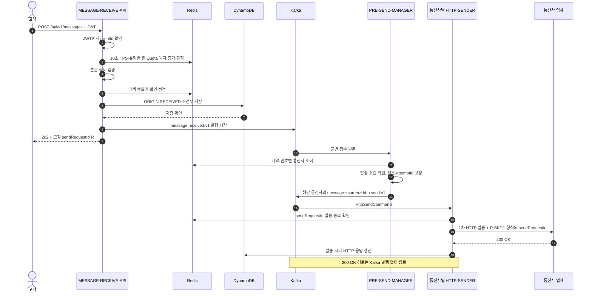
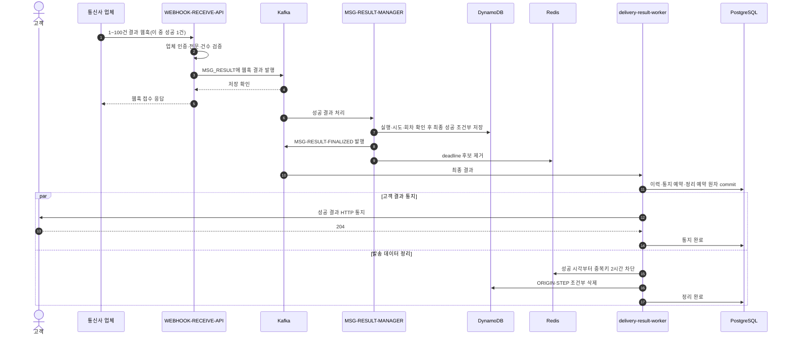
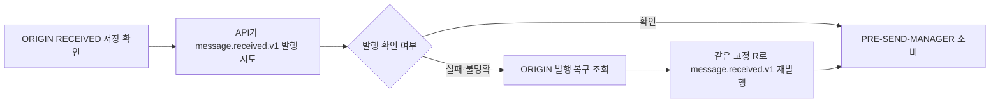
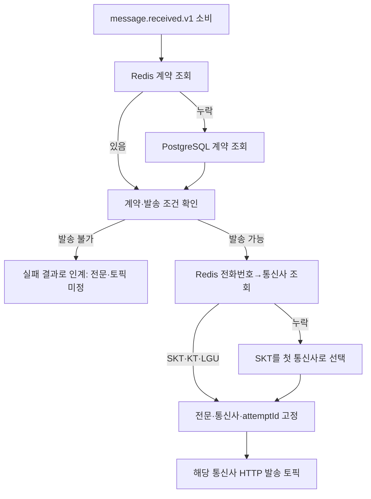
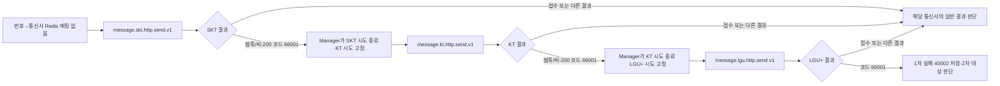
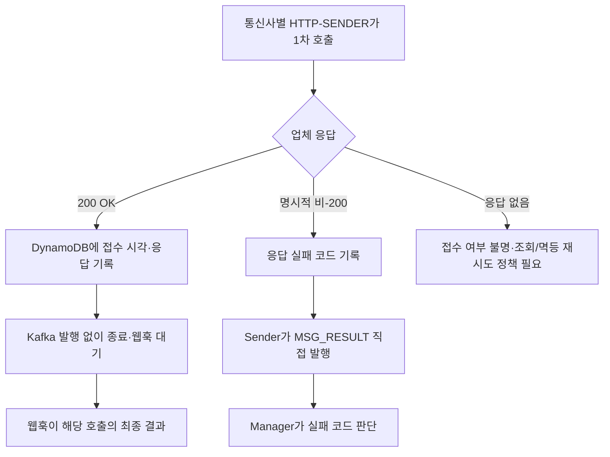
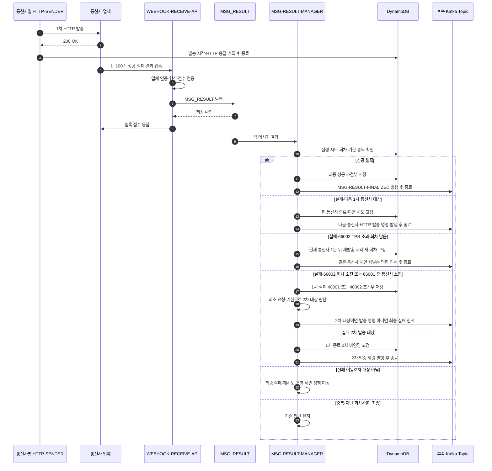
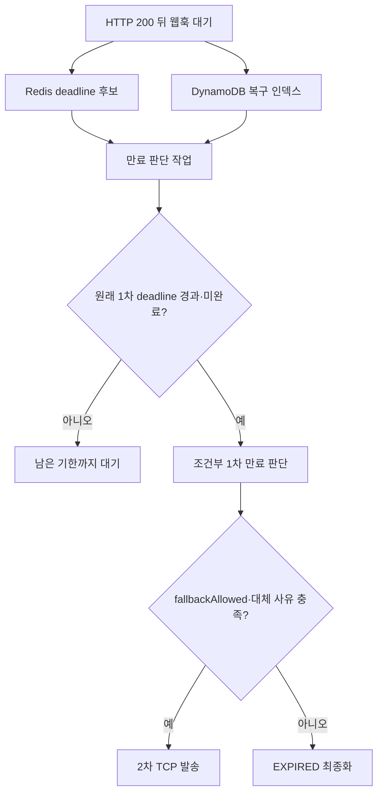
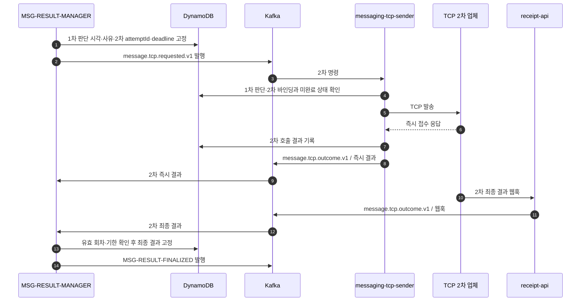
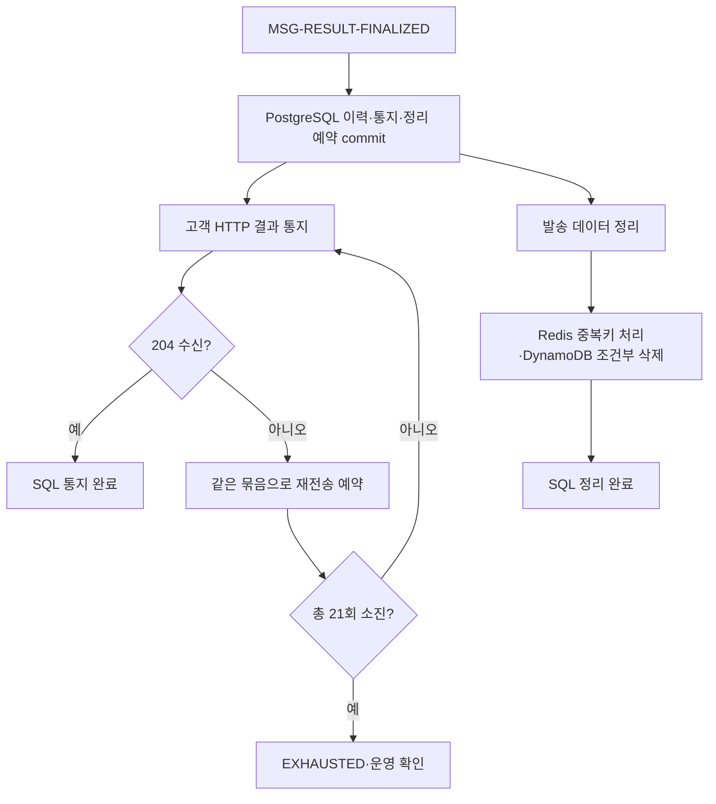

# 메시지 접수부터 최종 결과까지: 케이스별 Call Flow

기준: 2026-10-06. **신규 `/api/v1/messages` 경로의 목표 설계**를 한곳에서 읽기 위한 문서다. 정상 흐름과 실패·복구 분기를 함께 그린다. 현재 구현은 API 접수·ORIGIN 저장·`message.received.v1` 발행, 공통 전문·통신사별 토픽, CDC 캐시 준비와 PRE-SEND-MANAGER 모듈의 참조 조회·첫 통신사 고정 코드, 1차 `66001`·`66002`의 순수 후속 판단까지다. `PRE-SEND-MANAGER`의 Kafka 소비·전문 생성, 통신사별 sender, `WEBHOOK-RECEIVE-API`, `MSG_RESULT` 생산·소비, 신규 결과 판단 경로는 아직 연결되지 않았다. 이관 전 `delivery.*` 및 `message.http.requested.v1` 구현·검증을 신규 경로의 완료로 읽지 않는다. 구현 상태는 [01 현재 상태](01-현재-구현-상태와-남은-작업.md), 결정 근거는 [ADR-026](adr/ADR-026-MESSAGE-RECEIVED와-통신사별-HTTP-발송-분리.md)·[ADR-027](adr/ADR-027-접수-API-Redis-TPS와-유형별-월-Quota.md)을 따른다.

## 읽는 순서와 경계

| 케이스 | 위치 | 최종 결과 |
|---|---|---|
| 1차 정상 성공 | [1](#1-1차-정상-성공) | 성공 웹훅 → 최종 성공 → 고객 통지·정리 |
| 접수 거절·중복·최초 발행 불명확 | [2](#2-접수-거절중복최초-발행-불명확) | API 응답 또는 ORIGIN 기준 복구 |
| 계약·통신사 조회 분기 | [3](#3-pre-send-manager의-계약통신사-조회) | 발송 명령 또는 보류·실패 |
| 번호 매핑 누락·통신사 이동 | [3.1](#31-번호-매핑-누락과-통신사-이동) | SKT → KT → LGU+의 1차 HTTP 경로 |
| 업체 즉시 응답 실패 | [4](#4-업체의-즉시-응답이-실패) | Sender가 `MSG_RESULT`에 직접 인계. 200 성공 경로와 구분 |
| 1~100건 웹훅과 실패 분기 | [5](#5-웹훅-묶음과-실패-분기) | 성공 최종화, 실패 시 1차 이동·2차 판단 |
| 웹훅 미수신·1차 만료 | [6](#6-웹훅-미수신과-1차-만료) | 2차 전환 또는 만료 |
| 2차 TCP 발송 | [7](#7-2차-tcp-발송) | 성공·재시도·최종 실패·만료 |
| 고객 통지 실패·정리 | [8](#8-최종-결과-이후-고객-통지와-정리) | SQL 기준 독립 재개 |
| 중간 종료·저장소 장애 | [9](#9-중간-종료와-저장소-장애) | 저장된 원본·판단 기준 재개 |

현재 확정한 새 경로의 토픽은 `message.received.v1`(API → PRE-SEND-MANAGER), `message.skt.http.send.v1`·`message.kt.http.send.v1`·`message.lgu.http.send.v1`(Manager → 통신사별 sender), `MSG_RESULT`(웹훅 API의 결과 및 통신사별 sender의 명시적 비-200 실패 → MSG-RESULT-MANAGER), `MSG-RESULT-FINALIZED`(최종 결과 인계)다. 1차 HTTP `200 OK`에서는 sender가 Kafka 결과를 발행하지 않는다. 명시적 비-200 실패는 응답 코드와 함께 sender가 `MSG_RESULT`에 직접 발행하며 해당 발송의 웹훅은 오지 않는다. 오류 코드 대역과 결과 전문은 [54 오류 코드 계약](54-메시징-오류-코드와-결과-인계-계약.md)을 따른다. **2차 발송은 아직 기존 목표명** `message.tcp.requested.v1`/`messaging-tcp-sender`로 표기한다. 제안된 `message.tcp.send.v1` 이름은 확정되지 않았다. 2차 결과 수용 경로도 미정이다.

단일 메시지 처리용 Kafka 레코드의 key는 최초 접수에서 발급한 고정 `sendRequestId`(`R`)다. 현행 접수 이벤트의 `executionId`에는 같은 값이 저장되어 있으며 이관 중이다. 고객 ID는 API의 `messageId`이며 UTF-8 최대 40바이트다. 고정 `R`은 하이픈 없는 UUID 32자리다. CDC 참조 데이터 토픽은 별개다. `attemptId`는 1차 HTTP의 통신사별 시도를 식별하고, 동일 통신사 재시도 회차(`invocation`)는 별도로 구분한다. **업체 발송 요청의 `clientMsgId`에 최대 40바이트의 `R:통신사:회차`(예: `R:SKT:1`, 38바이트)를 담고 웹훅 배열 항목의 `clientMsgId`로 그대로 받는다.** 같은 명령의 재전달에는 같은 파생 ID를 쓰며, 새 회차·통신사에는 고정 `R`에서 새 ID를 파생한다. 웹훅 ID에서 `R`·통신사·회차를 얻어 해당 저장 시도와 정확히 대조한다. 공통 `HttpSendCommand`에 이 계약을 반영했으며 실제 Manager 생산·Sender 소비는 아직 구현 전이다. 고객 API 요청과 웹훅 HTTP 요청은 인입마다 별도의 `traceId`를 발급해 추적하고 메시지 키로 사용하지 않는다. 웹훅 한 요청에 여러 메시지가 섞일 수 있으므로 `MSG_RESULT`를 요청 단위 1레코드로 쓸지 결과별 1레코드로 쓸지는 아직 결정하지 않았다. 다른 토픽 사이의 도착 순서는 보장되지 않으므로 최종 판단은 DynamoDB의 조건부 상태 전이로 수렴시킨다.

## 1. 1차 정상 성공

전제: JWT·TPS·Quota 통과, 새 고객 메시지, 계약과 전화번호→통신사 값이 Redis에 있음, 업체가 1차 발송에 HTTP `200 OK`를 반환하고 나중에 성공 웹훅을 보냄, 고객이 최종 통지에 204로 응답함. PostgreSQL → CDC → Redis 투영은 요청 밖에서 먼저 진행된 참조 데이터 갱신이다.

`202`는 ORIGIN 영속 접수 확인이다. Kafka ack, 업체 접수, 최종 성공을 기다리지 않는다. 업체의 `200 OK`는 발송 요청에 대한 HTTP 응답일 뿐 고객 메시지의 최종 성공은 아니다. sender는 DynamoDB 기록을 마치면 이 호출을 끝내고 웹훅을 기다린다.

고객 통지와 발송 데이터 정리는 SQL commit 후 독립 작업이다. 고객 204를 기다려야만 ORIGIN·STEP을 지우는 순서가 아니다. 위 웹훅의 Kafka 레코드를 요청 단위로 만들지, 결과 건별로 나눌지는 미정이며, 어느 쪽이든 Manager는 **각 메시지 결과를 독립적으로** 판단해야 한다.

## 2. 접수 거절·중복·최초 발행 불명확

정상 접수 순서는 `JWT → Redis TPS·분류별 월 Quota 증가·판정 → 본문 상세 검증 → 고객 중복 확인 → ORIGIN 저장 → Kafka send 시작 → 202`다. API는 계약 PostgreSQL을 조회하지 않는다. `messageCategory`를 확인할 수 있는 잘못된 본문과 고객 중복 요청도 사용량에 포함된다.

| 발생 지점 | 흐름 | 고객 응답·후속 |
|---|---|---|
| JWT 거절 또는 `messageCategory` 누락 | 사용량 증가 전 중단 | 접수하지 않음 |
| TPS·월 Quota 초과 | Redis에서 증가와 판정이 한 번에 이뤄짐 | 429, ORIGIN·Kafka 없음. 초과분도 사용량에 포함 |
| 정책 키 누락·형식 오류 | 접수 제어 정책을 판정할 수 없음 | 503, ORIGIN·Kafka 없음 |
| Redis 사용량 검사 연결 실패·타임아웃 | 제한 검사를 우회하는 가용성 정책 | 이후 검증·접수 계속. 이 기간 사용량 누락 가능 |
| 본문 상세 검증 실패 | 사용량 증가 후 중단 | 400, 중복 선점·ORIGIN·Kafka 없음 |
| 동일 고객 중복키 재요청 | Redis 실행 ID로 ORIGIN을 대조 | 같은 실행을 202로 반환·재발행할 수 있음. 원본과 충돌하면 409, 저장 확인 전이면 503 |
| 새 ORIGIN Put의 결과 불명확 | 동일 고정 `R`(현행 코드의 `executionId`)로 강한 일관성 조회 | 같은 원본이 확인되면 202, 확인 불가하면 503. Redis 중복키를 성급히 해제하지 않음 |
| ORIGIN 저장 뒤 Kafka 발행 실패·ack 불명확 | API는 ORIGIN 접수 기준으로 202. 발행 복구 앱이 같은 원문·ID로 재발행 | Kafka 기록 중복 가능, 새 실행을 만들지 않음 |

## 3. PRE-SEND-MANAGER의 계약·통신사 조회

계약 원본과 번호 매핑 원본은 PostgreSQL이며 CDC가 Redis를 갱신한다. **계약 캐시 누락은 PostgreSQL 조회, 번호→통신사 캐시 누락은 SKT 첫 발송**으로 처리한다. 번호 매핑 누락 때문에 접수를 거절하거나 통신사 찾기를 위해 PostgreSQL을 인라인 조회하지 않는다. `messaging-pre-send-manager`에는 ORIGIN 원문과 접수 레코드가 일치할 때 첫 통신사를 조건부로 저장하고, 재전달에서는 그 값을 우선 재사용하는 코드가 있다. 이 저장은 경로 고정이며 발송 중복 선점은 아니다. 한 번 발행한 *통신사 시도*의 전문·`attemptId`는 Kafka 재전달 중 바꾸지 않는다. 현재 계약 테이블에 발송 전문 생성에 필요한 모든 정보가 있는 것도 아니므로 계약·설정 스키마는 추가 설계가 필요하다.

### 3.1 번호 매핑 누락과 통신사 이동

SKT에 보낸 결과의 오류 코드가 `66001`(자사 통신사 아님)이면 `MSG-RESULT-MANAGER`가 해당 통신사 시도를 조건부로 닫고 **같은 실행의 새로운 KT 시도**를 인계한다. KT에서도 `66001`이면 LGU+로 이동한다. `66001`은 명시적 비-200 응답이나 200 뒤 실패 웹훅 어느 쪽에서 받아도 같은 의미이며, **이 코드에서만 타 통신사로 이동한다.** 탐색 순서는 항상 SKT → KT → LGU+이고 이미 시도한 통신사는 제외한다. Redis 매핑으로 KT에 먼저 보낸 뒤 `66001`이면 남은 SKT → LGU+ 순서다. 세 통신사는 모두 1차 HTTP 단계 안의 경로로, 2차 TCP 발송이나 동일 통신사의 재시도 회차가 아니다.

고정 `R`과 고객 `messageId`는 그대로 두고 통신사 시도마다 별도 `attemptId`를 사용한다. 같은 발송 명령의 Kafka 재전달은 같은 `attemptId`·파생 `sendRequestId`로 중복 제어하지만, 다음 통신사로 이동할 때는 `R:KT:1`처럼 새 파생 ID를 쓴다. 중복 웹훅이 와도 이동은 한 번만 저장·발행한다. 이전 통신사·회차의 늦은 결과가 새 시도나 최종 결과를 덮지 않도록 파생 ID·상태를 조건부로 확인한다.

업체별 원본 코드는 `66001`로 정규화한다. 세 통신사가 모두 불일치하면 `MSG-RESULT-MANAGER`가 1차 단계 실패 코드 `40002`(`NO_MATCHING_CARRIER`)를 조건부 저장하고 2차 발송 여부를 판단한다. 이는 1차 단계의 실패이며 전체 메시지의 즉시 최종 실패가 아니다. 다음 통신사 명령을 누가 어떤 원본에서 생성할지와 발견한 통신사를 PostgreSQL 원본에 반영할지는 별도 결정이다.

## 4. 업체의 즉시 응답이 실패

1차 업체 응답의 두 확정 경로는 **HTTP `200 OK` → sender가 DynamoDB 갱신 → Kafka 발행 없이 종료 → 해당 발송의 최종 결과 웹훅 대기**, **명시적 비-200 → 응답 실패 코드·시도 정보를 DynamoDB에 기록 → sender가 `MSG_RESULT` 직접 발행 → 해당 발송에는 웹훅 없음**이다. 연결 실패·타임아웃은 HTTP 응답 자체가 없으므로 업체가 접수했는지 알 수 없는 별도 경우다.

| 즉시 관찰 | 확정된 처리 | 남은 판단 |
|---|---|---|
| HTTP `200 OK` | 발송 시각·HTTP 응답을 DynamoDB에 갱신하고 종료. Kafka 발행 없음. 이후 해당 발송의 최종 결과는 웹훅 | 웹훅 미수신 시 만료 판단 |
| 명시적 비-200 | 응답 실패 코드·시도 정보를 DynamoDB에 기록하고 sender가 `MSG_RESULT`에 `source=HTTP_RESPONSE`로 직접 발행. 이 발송의 웹훅은 오지 않음 | 업체별 코드의 의미와 코드별 통신사 이동·재시도·2차·최종 실패 정책 |
| 타임아웃·응답 불명 | 실제 업체 접수 여부가 불명확 | 업체 멱등키·조회 가능 여부, 재발송/운영 확인 기준. 명시적 비-200과 동일하게 취급하지 않음 |

비-200 실패 코드도 웹훅 실패 코드처럼 Manager가 분류한다. `66001`이면 다음 미시도 통신사, `66002`(TPS 초과)이면 **허용 회차가 남아 있을 때 실패 판단 1분 후 같은 통신사에 다음 회차의 파생 `sendRequestId`로 재발송**한다. 회차가 소진되면 1차 실패 코드 `40001`(`TPS_RETRY_EXHAUSTED`)을 저장하고 2차 발송 여부를 판단한다. `66002`만으로 통신사 이동이나 즉시 2차 발송을 하지 않는다. `MSG_RESULT` 발행 실패·ack 불명은 DynamoDB의 동일 `resultId`·발행 대기 상태에서 복구한다. 발행 실패만으로 업체를 다시 호출하지 않는다. `fallbackAllowed=false`인 실행은 어떤 경로에서도 2차로 보내지 않는다.

공통 `PrimaryHttpFailureDecision`은 이 두 코드에 대해 다음 통신사·다음 회차·가장 이른 재발송 시각 또는 `40001`·`40002`를 계산한다. 이는 **순수 판단**이며 현재 실행이 활성 상태인지, 원래 1차 기한이 남았는지, 같은 결과를 이미 처리했는지 확인하고 DynamoDB에 고정·Kafka에 발행하는 책임은 신규 Manager에 남아 있다.

## 5. 웹훅 묶음과 실패 분기

업체의 HTTP `200 OK`는 최종 수신 성공이 아니다. 업체는 이후 한 번의 웹훅 요청에 **1~100건의 메시지 결과**를 담아 보낼 수 있다. 배열의 각 항목은 `clientMsgId`와 `status`를 담으며 `clientMsgId`는 파생 발송 ID와 같다. `status=success`에는 `error`가 없고 `status=fail`에는 `error: {code, message}`가 반드시 있다. 같은 요청 안에서 `clientMsgId`는 중복되지 않는다. `WEBHOOK-RECEIVE-API`는 업체 인증과 1~100건 형식 검증 후 Kafka `MSG_RESULT` 저장을 확인하고 접수 응답을 반환하며, 개별 메시지의 성공·실패를 판정하지 않는다. **웹훅 API가 실패 응답을 반환하면 업체가 같은 묶음을 재전송한다.** 따라서 다른 요청으로 다시 온 동일 결과는 Manager가 멱등 처리한다. 웹훅 전체를 1개 Kafka 레코드로 보낼지 각 결과를 별도 레코드로 보낼지는 미정이다. 어느 방식을 택해도 Manager는 각 결과를 실행별로 독립 처리한다.

`FAILED` 웹훅이나 명시적 비-200의 코드가 `66001`이면 [3.1의 통신사 이동](#31-번호-매핑-누락과-통신사-이동)을 적용한다. `66002`이면 허용 회차가 남았을 때 실패 판단 1분 후 같은 통신사의 새 회차로 인계한다. 각 경로가 소진되면 각각 `40002`·`40001`로 1차 실패를 확정하고 최초 요청의 `fallbackAllowed`·기한 등으로 2차 대상을 판단한다. 그 밖의 실패도 코드별 정책에 따라 판단한다. **2차 대상이 아닌 실패를 방치하면 최종 결과가 영원히 나오지 않는다.** 그 밖의 실패를 최종 실패로 보낼지, 같은 통신사 재시도 또는 운영 확인으로 남길지는 코드별 정책이 필요하다. 이전 경로의 `RETRY_1S`·`RETRY_10S`·`FALLBACK`·`REJECTED` 기준을 신규 웹훅 코드표로 자동 승계하지 않는다.

**웹훅은 그 1차 발송 호출의 최종 결과다.** 실패 웹훅 뒤 새 통신사 호출이나 2차 발송이 이어질 수 있으므로 전체 메시지의 최종 결과와는 구분한다. 웹훅이 sender의 DynamoDB `200 OK` 기록보다 먼저 도착하더라도 결과 우선순위를 논의할 필요는 없다. Manager는 파생 `sendRequestId`의 `R`·통신사·회차로 저장된 호출을 확인해 웹훅 결과를 조건부 저장하고, 늦은 200 기록은 발송 메타데이터만 보충하며 그 최종 판단을 덮지 않게 한다. `R:SKT:1`의 중복 웹훅이 `R:SKT:2`의 200 이후 도착해도 2회차 결과로 취급하지 않는다.

**업체 멱등키는 파생 `sendRequestId`다.** 업체는 발송 중·성공한 같은 ID의 중복 발송을 약 2시간 차단하고 실패한 ID는 재사용할 수 있다. 현재 이전 `messaging-http-sender`는 HTTP `Idempotency-Key`에 고정 `attemptId`를 쓰므로 신규 경로에 그대로 적용하면 `66002` 또는 실패 웹훅 뒤 새 회차가 업체에서 중복 처리될 수 있다. 논리적 `attemptId`와 고정 `R`은 유지하되 새 회차에는 `R:SKT:2`처럼 새 파생 ID를 부여하고, *같은 회차의 Kafka 재전달*에는 같은 ID를 재사용한다. 업체의 중복 차단 시간이 만료된 뒤의 재전달에 대비해 내부 상태 확인도 필요하며, 보장 시간의 정확한 길이는 확인해야 한다.

## 6. 웹훅 미수신과 1차 만료

HTTP `200 OK` 뒤 웹훅이 오지 않으면 HTTP 성공만으로 최종 성공을 만들지 않는다. 1차 결과 판단 deadline은 **최초 인입 +3시간**이며, Redis는 빠른 만료 후보 일정이고 DynamoDB는 최종 판단·복구의 기준이다. 2차로 전환했다면 2차 결과 판단 deadline은 **1차 결과 판단 시각 +4시간**이다. 이 기한들은 웹훅 API의 수신 만료가 아니다. 업체에는 웹훅 재전송 최대 기간이 없으므로 훨씬 늦게 도착할 수 있다. deadline은 `200 OK` 시점에 새로 시작하지 않는다. **200 경로에서는** Sender가 `MSG_RESULT`를 발행하지 않으므로 웹훅이 없는 실행을 찾는 만료 스케줄러·복구 조회가 별도로 필요하다. Redis 후보를 언제 등록할지는 신규 경로에서 미정이며, 웹훅 소비 뒤에만 등록하면 미수신 실행을 놓친다.

Redis 일정이 유실돼도 DynamoDB 조회로 누락을 찾는다. 인증·형식이 유효한 늦은 웹훅은 API가 Kafka 저장 확인 후 접수 성공으로 응답하고 Manager가 관측하되 이미 확정한 만료·2차 전환·최종 결과를 바꾸지 않는다. 업체의 재전송 최대 기간이 없으므로 정리된 실행이나 알 수 없는 파생 `sendRequestId`도 뒤늦게 도착할 수 있다. 형식이 유효하면 고정 `R`을 Kafka key로 추출하되, 저장 원본·회차가 없으면 새 실행·발송을 만들지 않고 관측 보존·격리한다. 구체적인 보존 위치는 추가 설계가 필요하다. 2차 전환을 늦게 처리해도 2차 deadline을 임의로 연장하지 않는다.

## 7. 2차 TCP 발송

2차는 모든 1차 실패의 기본 경로가 아니다. 기존 목표의 대체 사유는 `FALLBACK_REQUIRED`, `PRIMARY_EXPIRED`, `RETRY_EXHAUSTED_NO_RESPONSE`이며 최초 요청의 `fallbackAllowed`가 참이어야 한다. 신규 `66002` 허용 회차 소진(`40001`)과 세 통신사 `66001` 소진(`40002`)도 **1차 실패를 먼저 저장한 뒤** `fallbackAllowed`·2차 가능 기한 등으로 대상을 판단한다. 2차 대상이 아니면 1차 실패 사유로 최종화한다. 현재 목표 이름은 `message.tcp.requested.v1` → `messaging-tcp-sender`다. 2차 결과 토픽은 기존 목표의 `message.tcp.outcome.v1`을 표기하며, `MSG_RESULT`로 통합할지는 아직 결정되지 않았다.

2차도 코드별 최대 3회 재시도와 웹훅 대기를 적용한다. 기존 목표의 2차 deadline은 **1차 결과 판단 시각 +4시간**이고, 실패·만료 뒤 세 번째 업체로 넘어가지 않는다. 2차 결과가 성공이든 실패든 최종 결과 확정 이후에는 [8번](#8-최종-결과-이후-고객-통지와-정리)으로 합류한다. 이 다이어그램은 이전 DDB 선점 모델을 포함한 목표 기록이며, 신규 1차의 Redis 중복 제어와 2차 발송 보호를 어떻게 맞출지는 구현 전에 확정해야 한다.

## 8. 최종 결과 이후 고객 통지와 정리

`MSG-RESULT-MANAGER`가 최종 결과를 DynamoDB에 고정한 뒤 `MSG-RESULT-FINALIZED`로 인계한다. `delivery-result-worker`는 PostgreSQL에 **최종 이력·고객 통지 예약·정리 예약을 단일 트랜잭션**으로 저장한다. SQL commit 전에는 ORIGIN·STEP을 삭제하지 않는다.

| 케이스 | 후속 흐름 |
|---|---|
| 고객이 결과 HTTP 통지에 204 응답 | 동일 고객 최대 100건 묶음의 통지 완료를 SQL에 기록 |
| 고객 응답이 204가 아니거나 무응답 | 같은 묶음 ID·결과 ID로 SQL 예약에 따라 재전송. 최초 + 최대 20회, 총 21회. 소진하면 운영 확인 대상으로 보존 |
| 고객에게 이미 처리됐지만 204만 유실 | 같은 묶음이 다시 도착할 수 있으므로 고객도 묶음 ID로 중복 제거 |
| 고객 통지와 무관한 정리 | SQL 이력·예약 저장을 확인하고 ORIGIN·STEP을 조건부 삭제. 성공은 Redis 고객 중복키를 성공 시각부터 2시간 차단, 실패·만료는 해당 실행의 키를 제거 |
| SQL 저장 실패 | DynamoDB의 불변 최종 결과를 유지하고 SQL 인계를 재시도. 정리 작업은 시작하지 않음 |

정리와 고객 통지는 SQL commit 이후 병렬로 진행한다. 고객 통지 21회 한도와 업체 발송 단계별 최대 3회 재시도는 서로 다른 정책이다.

## 9. 중간 종료와 저장소 장애

| 중단 위치 | 재개 근거와 지켜야 할 경계 |
|---|---|
| ORIGIN 저장 직후 API 종료·최초 Kafka ack 불명확 | 발행 복구 앱이 ORIGIN의 동일 원문·고정 `R`로 `message.received.v1` 재발행. Kafka 중복 가능 |
| PRE-SEND-MANAGER의 통신사 토픽 발행 ack 불명확 | 같은 통신사·전문·`attemptId`·파생 `sendRequestId`로 재인계. 업체의 같은 ID 중복 차단은 정해진 보장 시간 안에만 적용됨 |
| Redis 발송 중복 정보 유실 | 내부 중복 제어가 약해진다. 같은 호출 명령에는 동일 파생 `sendRequestId`를 업체에 전달해 발송 중·성공한 ID의 약 2시간 중복을 막는 것으로 파악했지만 확인 전이다. 그 이후의 재전달은 내부 상태로 막아야 함 |
| 업체 호출 뒤 sender의 DynamoDB 결과 기록 전 종료 | 업체 효과가 불명확하다. 무조건 새 호출하지 않고 저장 조회·운영 확인·원래 deadline 정책이 필요. 신규 복구 절차 미정 |
| HTTP `200 OK` 뒤 DynamoDB 갱신 실패·응답 불명 | 업체 접수는 됐을 수 있다. 같은 발송을 곧바로 재호출하지 않고 웹훅·저장 상태와 원래 기한으로 복구. 신규 복구 절차 미정 |
| 명시적 비-200 기록 뒤 `MSG_RESULT` 발행 실패·ack 불명확 | DynamoDB의 발행 대기 결과를 동일 `resultId`·고정 `R` key로 재발행. 업체 HTTP 호출을 반복하지 않고 Manager가 중복 결과를 제거 |
| `MSG_RESULT` 소비 후 Manager 판단 저장·후속 Kafka 발행 사이 종료 | DynamoDB에 고정한 판단·명령을 같은 ID로 재발행. 먼저 저장되지 않았다면 원본 결과를 재처리 |
| 웹훅 1~100건의 Kafka 저장 실패·ack 불명확 | `WEBHOOK-RECEIVE-API`가 실패 응답을 반환하면 업체가 같은 묶음을 재전송. 같은 묶음 안의 ID는 유일하지만 재전송 요청 사이에는 결과가 중복되므로 이미 저장된 결과는 Manager가 멱등 처리 |
| 한 웹훅 묶음 중 일부 결과만 처리한 뒤 Manager 종료 | 재전달 시 각 결과의 처리 여부를 독립 확인. Kafka 레코드 단위와 offset 완료 기준은 후속 결정 |
| Redis deadline 일정 유실 | DynamoDB 복구 인덱스로 만료 후보 재발견. Redis 비어 있음 여부에만 의존하지 않음 |
| 최종 DDB 저장 뒤 `MSG-RESULT-FINALIZED` 발행 실패 | DDB의 불변 최종 결과로 같은 최종 결과 레코드 재인계 |
| PostgreSQL commit 뒤 고객 통지·DDB 정리 전 종료 | SQL의 통지·정리 예약으로 각각 재개. 고객 통지 완료와 정리는 독립 |

이 표의 *목표 복구 경계*와 *현재 코드에서 검증된 복구*는 다르다. 신규 sender·Manager·`MSG_RESULT` 경로의 장애 주입 시험은 아직 수행하지 않았다.

## 즉시 실패 인계와 오류 코드

HTTP `200 OK` 경로는 Kafka를 발행하지 않는다. **명시적 비-200 실패는 웹훅이 오지 않으므로 통신사별 sender가 `MSG_RESULT`에 직접 발행한다.** `source=HTTP_RESPONSE`와 웹훅의 `source=WEBHOOK`을 구분하고, 두 경로 모두 고정 `R` key·결과별 안정적인 `resultId`를 사용한다. Sender가 DynamoDB에 실패·발행 대기를 기록한 뒤 Kafka 발행 중 종료하면 같은 결과를 복구 발행한다. Manager는 중복 수신을 조건부 상태 전이로 처리한다.

우리 서비스 코드는 `10000~59999`, 1차 HTTP 3사 정규화 코드는 `60000~69999`, 2차 TCP 업체 정규화 코드는 `70000~79999`를 사용한다. HTTP status와 업체 원본 코드는 별도 필드로 보존한다. 상세 대역과 필드 계약은 [54 오류 코드 계약](54-메시징-오류-코드와-결과-인계-계약.md)에 기록한다. 타임아웃은 비-200 실패로 간주하지 않고 별도 결과 불명 정책을 적용한다.

## 구현 전에 확정할 인터페이스

- `MSG_RESULT`의 웹훅 전문: 요청 추적용 `traceId`와 1~100개 결과. 업체 원문은 `{clientMsgId, status}` 또는 `{clientMsgId, status, error: {code, message}}` 객체의 배열이며 `clientMsgId`가 파생 발송 ID다. `status` 값은 소문자 `success`·`fail`이고, `success`에는 `error`가 없으며 `fail`에는 필수다. 파생 ID에서 고정 `R`·통신사·회차를 얻고 `attemptId`·발송 시각은 저장 원본에서 보강한다. 업체 결과 ID는 없으므로 중복 식별자는 저장 상태와 결합해 설계한다.
- 웹훅 1개를 Kafka 1레코드로 보낼지, 각 메시지 결과를 별도 레코드로 나눌지. **권장안은 결과별 레코드 + 고정 `R` key + 결과별 멱등 ID**다. 메시지별 순서와 독립 재처리가 단순해지지만, 1~100건 중 일부만 Kafka에 저장된 뒤 웹훅 재전달되는 경우를 멱등 처리하고 전체 발행 확인 전 API 성공 응답을 하지 않아야 한다. 묶음 1레코드는 메시지별 key·순서와 부분 실패 처리가 어렵다.
- 명시적 비-200 실패는 sender가 `MSG_RESULT`에 직접 발행한다. 업체별 원본 코드 → 6만 대역 정규화 코드와 코드별 재시도·통신사 이동·2차·최종 실패 정책, DynamoDB 발행 대기 인덱스·복구 작업은 구현 전에 확정한다. HTTP `200 OK` 경로에서 Kafka 발행이 없다는 규칙은 유지한다. 응답이 없는 타임아웃은 별도 분류한다.
- 웹훅이 Sender의 DynamoDB `200 OK` 기록보다 먼저 온 경우에도 웹훅이 해당 시도의 최종 결과라는 규칙을 지키는 조건부 갱신. 늦은 sender 기록은 메타데이터만 보충한다.
- 2차 비대상 실패의 최종 실패·동일 통신사 재시도·운영 확인 기준과 웹훅 미수신 시 만료 판단을 깨우는 주체.
- Manager가 고정 `R`에서 회차별 `R:통신사:회차`를 생성하고 신규 Sender가 이를 업체 멱등키·내부 중복 제어에 사용하도록 연결한다. 업체의 발송 중·성공 시 일정 시간 중복 차단과 웹훅 회신은 확인됐지만 정확한 보장 시간·기산 시점은 확인해야 한다. 공통 명령 타입의 필드는 추가됐지만 생산·소비 경로는 아직 없다. 기존 `Idempotency-Key: attemptId`를 그대로 쓰면 새 재발송이 업체 중복 처리에 막힐 수 있다.
- `66002`는 최초 발송 뒤 같은 통신사에 최대 3회 재시도(총 최대 4회)하며, 각 재발송은 실패 판단 1분 이후다. 소진 시 1차 실패 `40001`을 저장하고 2차 대상을 판단한다. 통신사별 공유 속도 제한, 신규 1차 deadline의 Redis 후보 등록 시점, 재시도 명령의 통신사별 라우팅·지연 예약 방식은 정해야 한다. 기존 단일 sender용 `message.http.retry.v1`을 그대로 신규 경로로 읽지 않는다.
- 세 통신사 모두 `66001`이면 1차 실패 `40002`를 고정하고 2차 대상 여부를 확인한다. 확인된 통신사의 PostgreSQL 반영 여부는 별도 결정이다. 탐색 순서는 매핑 유무와 관계없이 SKT → KT → LGU+에서 이미 시도한 통신사를 제외한다.
- 통신사 불일치의 업체별 원본 코드를 `66001`로 매핑하는 표, 중복·늦은 웹훅에 대한 단일 이동 판단, 다음 통신사 명령의 저장 원본·발행 주체.
- 계약상 발송 불가 결과의 인계 전문·토픽, 계약·발송 설정 스키마.
- sender Redis 선점 TTL·진행 중 중복 처리·DynamoDB 기록 실패 복구, 업체별 동일 `sendRequestId` 중복 차단 시간과 만료 뒤 내부 재전달 방지 범위.
- 2차 토픽·Pod 최종 이름과 2차 즉시 응답·웹훅의 `MSG_RESULT` 통합 여부.

이전 경로의 상세 시험·장애 근거는 [기존 전체 흐름](04-요청-접수부터-최종-결과까지의-전체-흐름.md), [저장소 장애](09-저장소-장애-시-중단-범위와-복구-절차.md), [계약·번호 CDC](52-계약과-번호-통신사-CDC-캐시.md)에 보존한다. 신규 경로 구현이 진행되면 이 문서의 목표·미정·완료 표시를 갱신한다.
