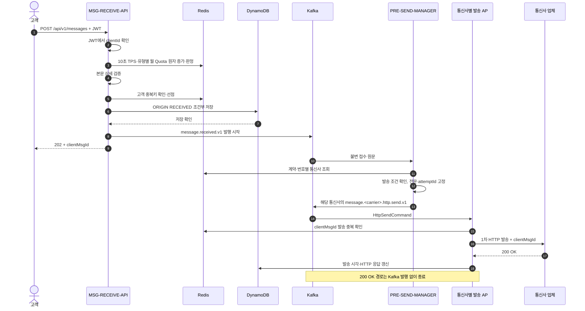
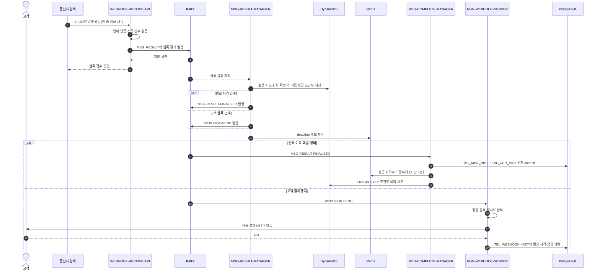
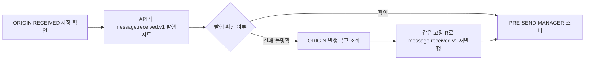
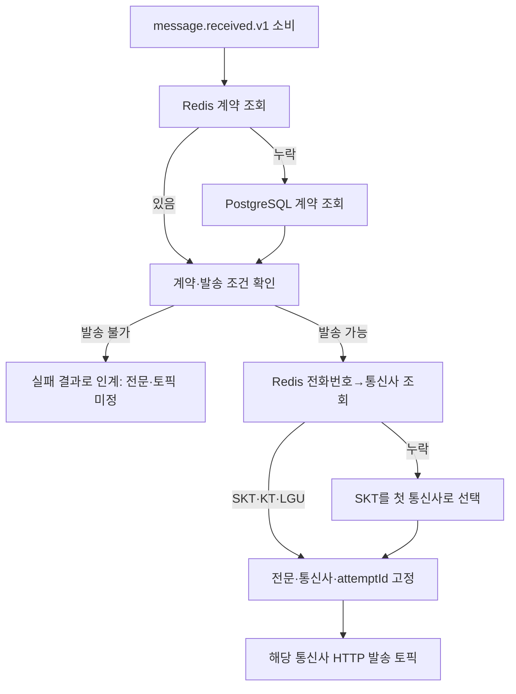
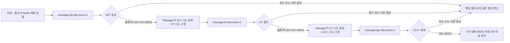
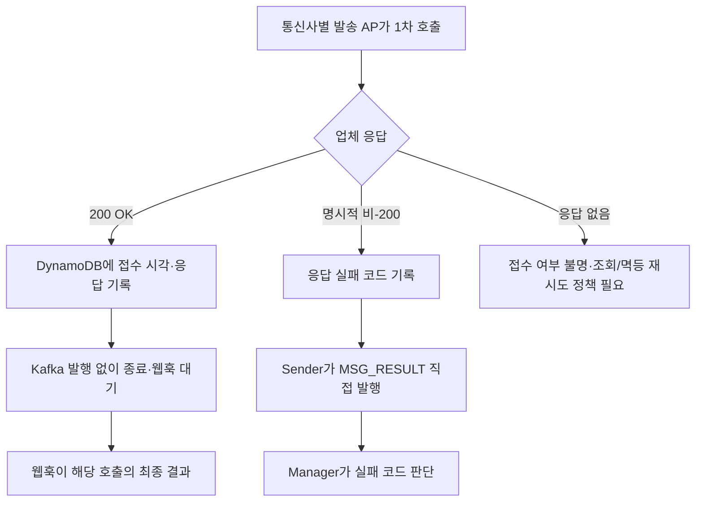
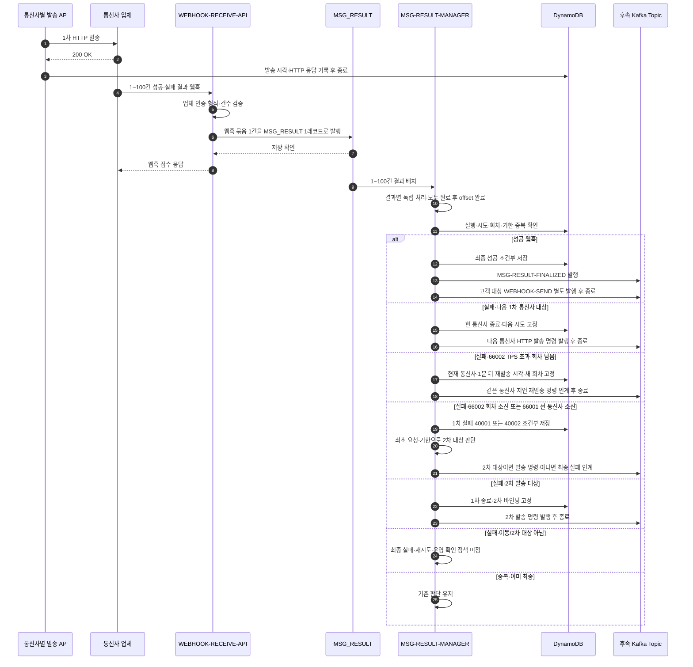
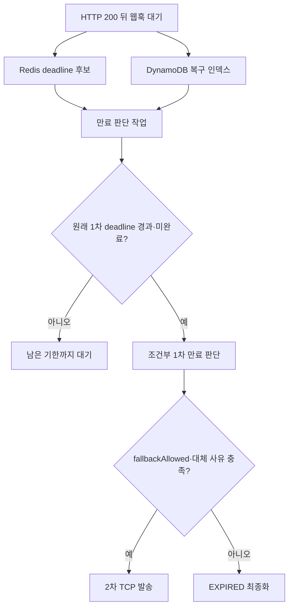
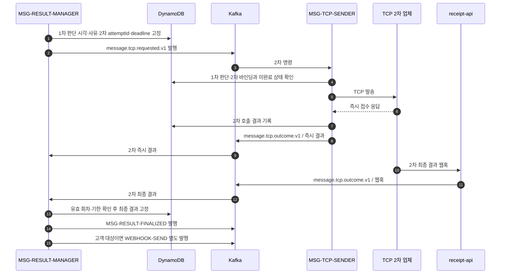
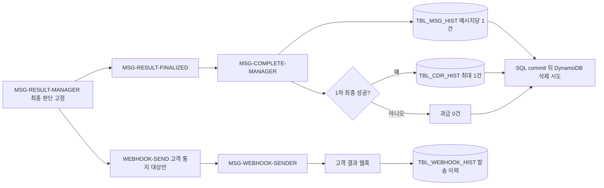

# 메시지 접수부터 최종 결과까지: 케이스별 Call Flow

기준: 2026-10-06. **신규 `/api/v1/messages` 경로의 목표 설계**를 한곳에서 읽기 위한 문서다. 정상 흐름과 실패·복구 분기를 함께 그린다. 현재 구현은 API 접수·ORIGIN 저장·`message.received.v1` 발행, 공통 전문·통신사별 토픽, CDC 캐시 준비와 PRE-SEND-MANAGER 모듈의 참조 조회·첫 통신사 고정 코드, 1차 `66001`·`66002`의 순수 후속 판단까지다. `PRE-SEND-MANAGER`의 Kafka 소비·전문 생성, 통신사별 sender, `WEBHOOK-RECEIVE-API`, `MSG_RESULT` 생산·소비, 신규 결과 판단 경로는 아직 연결되지 않았다. 이관 전 `delivery.*` 및 `message.http.requested.v1` 구현·검증을 신규 경로의 완료로 읽지 않는다. 구현 상태는 [01 현재 상태](01-현재-구현-상태와-남은-작업.md), 결정 근거는 [ADR-026](adr/ADR-026-MESSAGE-RECEIVED와-통신사별-HTTP-발송-분리.md)·[ADR-027](adr/ADR-027-접수-API-Redis-TPS와-유형별-월-Quota.md)을 따른다.

## 읽는 순서와 경계

| 케이스 | 위치 | 최종 결과 |
|---|---|---|
| 1차 정상 성공 | [1](#1-1차-정상-성공) | 성공 웹훅 → 최종 성공 → 고객 통지·정리 |
| 접수 거절·중복·최초 발행 불명확 | [2](#2-접수-거절중복최초-발행-불명확) | API 응답 또는 ORIGIN 기준 복구 |
| 계약·통신사 조회 분기 | [3](#3-pre-send-manager의-계약통신사-조회) | 발송 명령 또는 보류·실패 |
| 번호 매핑 누락·통신사 이동 | [3.1](#31-번호-매핑-누락과-통신사-이동) | SKT → KT → LGU+의 1차 HTTP 경로 |
| 업체 즉시 응답 실패 | [4](#4-업체의-즉시-응답이-실패) | Sender가 `MSG_RESULT`에 직접 인계. 200 성공 경로와 구분 |
| 1~100건 웹훅과 실패 분기 | [5](#5-웹훅-묶음과-실패-분기) | 성공 최종화, 실패 시 1차 이동·2차 판단 |
| 결과 판단 AP의 전체 책임 | [5.1](#51-msg-result-manager의-처리-경계와-후속-연결) | 입력 검증·조건부 판단·후속 발행·완료 인계 |
| 웹훅 미수신·1차 만료 | [6](#6-웹훅-미수신과-1차-만료) | 2차 전환 또는 만료 |
| 2차 TCP 발송 | [7](#7-2차-tcp-발송) | 성공·재시도·최종 실패·만료 |
| 고객 통지 실패·정리 | [8](#8-최종-결과-이후-고객-통지와-정리) | 별도 웹훅 토픽과 완료 이력·과금·DDB 정리 |
| 완료 관리자 상세 처리 | [8.1](#81-msg-complete-manager의-처리-로직) | 메시지당 이력 1건·1차 성공 과금 최대 1건 |
| 중간 종료·저장소 장애 | [9](#9-중간-종료와-저장소-장애) | 저장된 원본·판단 기준 재개 |

현재 확정한 새 경로의 토픽은 `message.received.v1`(API → PRE-SEND-MANAGER), `message.skt.http.send.v1`·`message.kt.http.send.v1`·`message.lgu.http.send.v1`(Manager → 통신사별 sender), `MSG_RESULT`(웹훅 API의 결과 및 통신사별 sender의 명시적 비-200 실패 → MSG-RESULT-MANAGER), `MSG-RESULT-FINALIZED`(완료 관리자 인계), `WEBHOOK-SEND`(결과 관리자 → 고객 웹훅 sender)다. 1차 HTTP `200 OK`에서는 sender가 Kafka 결과를 발행하지 않는다. 명시적 비-200 실패는 응답 코드와 함께 sender가 `MSG_RESULT`에 직접 발행하며 해당 발송의 웹훅은 오지 않는다. 오류 코드 대역과 결과 전문은 [54 오류 코드 계약](54-메시징-오류-코드와-결과-인계-계약.md)을 따른다. 2차 발송 AP명은 `MSG-TCP-SENDER`로 확정했다. 물리 토픽은 현재 목표의 `message.tcp.requested.v1`로 표기하며 제안된 `message.tcp.send.v1` 전환 여부와 2차 결과 수용 경로는 미정이다.

단일 메시지 처리용 Kafka 레코드의 key는 최초 접수에서 발급한 고정 `clientMsgId`다. 고객 ID는 API의 `messageId`이며 UTF-8 최대 40바이트다. `clientMsgId`는 하이픈 없는 UUID 32자리로 만들고 API 202 응답, ORIGIN·Kafka·STEP, 업체 발송 요청·웹훅, 이력·과금에 같은 값을 사용한다. `attemptId`는 내부 통신사 시도, `invocation`은 같은 통신사의 재시도 회차를 구분하며 업체 ID에 붙이지 않는다. 업체 웹훅에는 `clientMsgId`만 돌아온다. 고객 API 요청과 웹훅 HTTP 요청은 인입마다 별도의 `traceId`를 발급해 추적하고 메시지 키로 사용하지 않는다. 한 웹훅 HTTP 요청의 1~100개 결과는 `MSG_RESULT`의 Kafka 1레코드에 담고 배치 key에는 `traceId`를 사용한다. 단일 메시지 명령·HTTP 응답 실패 레코드는 `clientMsgId` key를 사용한다. 웹훅 배치 안의 개별 메시지에 대한 Kafka 파티션 순서와 토픽 간 도착 순서는 보장되지 않으므로 DynamoDB 조건부 상태 전이가 필요하다.

발송·결과 경로의 AP 표기는 다음과 같다. 이는 **논리 AP/Deployment 이름**이며 Maven 모듈명이나 물리 Kafka 토픽명을 일괄 변경한 뜻은 아니다.

| 단계 | AP 이름 | 구현 상태 |
|---|---|---|
| 고객 접수 | `MSG-RECEIVE-API` | `messaging-api`에 신규 접수 경로 구현, 기본 비활성화 |
| 1차 발송 준비 | `PRE-SEND-MANAGER` | `messaging-pre-send-manager`의 참조 조회 준비, Kafka 소비·전문 생성 미연결 |
| 1차 HTTP 발송 | `MSG-SKT-SENDER`, `MSG-KT-SENDER`, `MSG-LGU-SENDER` | 통신사별 Deployment 목표, 신규 소비·발송 구현 전 |
| 웹훅 접수 | `WEBHOOK-RECEIVE-API` | 신규 경로 구현 전. 현재 `receipt-api`는 이전 경로 |
| 결과 판단 | `MSG-RESULT-MANAGER` | 신규 경로 구현 전 |
| 2차 TCP 발송 | `MSG-TCP-SENDER` | 목표 AP명 확정, 신규 경로 구현 전 |
| 1차 성공 과금·메시지 발송 이력·DynamoDB 정리 | `MSG-COMPLETE-MANAGER` | 목표 AP명. `TBL_CDR_HIST`·`TBL_MSG_HIST`는 신규 경로에 아직 미구현 |
| 고객 결과 웹훅 발송 | `MSG-WEBHOOK-SENDER` | `WEBHOOK-SEND` 소비 목표. 현재 `delivery-result-worker`의 통지 책임을 분리해야 함 |

`messaging-http-sender`는 이전 단일 sender 모듈이고, `messaging-publication-recovery-app`·`messaging-reference-cache`는 각각 최초 Kafka 발행 복구와 CDC 캐시 투영을 돕는 별도 AP다. 현재 `delivery-result-worker`는 최종 이력·고객 통지·정리를 한 모듈에서 수행한다. 신규 `MSG-RESULT-FINALIZED` 연결과 `MSG-COMPLETE-MANAGER`·`MSG-WEBHOOK-SENDER` 분리는 아직 구현 전이다.

## 1. 1차 정상 성공

전제: JWT·TPS·Quota 통과, 새 고객 메시지, 계약과 전화번호→통신사 값이 Redis에 있음, 업체가 1차 발송에 HTTP `200 OK`를 반환하고 나중에 성공 웹훅을 보냄, 고객이 최종 통지에 204로 응답함. PostgreSQL → CDC → Redis 투영은 요청 밖에서 먼저 진행된 참조 데이터 갱신이다.

`202`는 ORIGIN 영속 접수 확인이다. Kafka ack, 업체 접수, 최종 성공을 기다리지 않는다. 업체의 `200 OK`는 발송 요청에 대한 HTTP 응답일 뿐 고객 메시지의 최종 성공은 아니다. sender는 DynamoDB 기록을 마치면 이 호출을 끝내고 웹훅을 기다린다.

두 Kafka 토픽 사이와 두 소비 AP 사이의 처리 순서는 보장되지 않는다. 고객 결과 웹훅이 SQL 과금·이력 commit보다 먼저 발송될 수 있으며, 고객 `204`를 기다려야만 ORIGIN·STEP을 지우는 순서는 아니다. 업체 웹훅 HTTP 요청 1건(결과 1~100건)을 `MSG_RESULT` Kafka 레코드 1개로 발행한다. Manager는 배치 안의 **각 메시지 결과를 독립적으로** 판단한다.

## 2. 접수 거절·중복·최초 발행 불명확

정상 접수 순서는 `JWT → Redis TPS·분류별 월 Quota 증가·판정 → 본문 상세 검증 → 고객 중복 확인 → ORIGIN 저장 → Kafka send 시작 → 202`다. API는 계약 PostgreSQL을 조회하지 않는다. `messageCategory`를 확인할 수 있는 잘못된 본문과 고객 중복 요청도 사용량에 포함된다.

| 발생 지점 | 흐름 | 고객 응답·후속 |
|---|---|---|
| JWT 거절 또는 `messageCategory` 누락 | 사용량 증가 전 중단 | 접수하지 않음 |
| TPS·월 Quota 초과 | Redis에서 증가와 판정이 한 번에 이뤄짐 | 429, ORIGIN·Kafka 없음. 초과분도 사용량에 포함 |
| 정책 키 누락·형식 오류 | 접수 제어 정책을 판정할 수 없음 | 503, ORIGIN·Kafka 없음 |
| Redis 사용량 검사 연결 실패·타임아웃 | 제한 검사를 우회하는 가용성 정책 | 이후 검증·접수 계속. 이 기간 사용량 누락 가능 |
| 본문 상세 검증 실패 | 사용량 증가 후 중단 | 400, 중복 선점·ORIGIN·Kafka 없음 |
| 동일 고객 중복키 재요청 | Redis 실행 ID로 ORIGIN을 대조 | 같은 실행을 202로 반환·재발행할 수 있음. 원본과 충돌하면 409, 저장 확인 전이면 503 |
| 새 ORIGIN Put의 결과 불명확 | 동일 `clientMsgId`로 강한 일관성 조회 | 같은 원본이 확인되면 202, 확인 불가하면 503. Redis 중복키를 성급히 해제하지 않음 |
| ORIGIN 저장 뒤 Kafka 발행 실패·ack 불명확 | API는 ORIGIN 접수 기준으로 202. 발행 복구 앱이 같은 원문·ID로 재발행 | Kafka 기록 중복 가능, 새 실행을 만들지 않음 |

## 3. PRE-SEND-MANAGER의 계약·통신사 조회

계약 원본과 번호 매핑 원본은 PostgreSQL이며 CDC가 Redis를 갱신한다. **계약 캐시 누락은 PostgreSQL 조회, 번호→통신사 캐시 누락은 SKT 첫 발송**으로 처리한다. 번호 매핑 누락 때문에 접수를 거절하거나 통신사 찾기를 위해 PostgreSQL을 인라인 조회하지 않는다. `messaging-pre-send-manager`에는 ORIGIN 원문과 접수 레코드가 일치할 때 첫 통신사를 조건부로 저장하고, 재전달에서는 그 값을 우선 재사용하는 코드가 있다. 이 저장은 경로 고정이며 발송 중복 선점은 아니다. 한 번 발행한 *통신사 시도*의 전문·`attemptId`는 Kafka 재전달 중 바꾸지 않는다. 현재 계약 테이블에 발송 전문 생성에 필요한 모든 정보가 있는 것도 아니므로 계약·설정 스키마는 추가 설계가 필요하다.

### 3.1 번호 매핑 누락과 통신사 이동

SKT에 보낸 결과의 오류 코드가 `66001`(자사 통신사 아님)이면 `MSG-RESULT-MANAGER`가 해당 통신사 시도를 조건부로 닫고 **같은 실행의 새로운 KT 시도**를 인계한다. KT에서도 `66001`이면 LGU+로 이동한다. `66001`은 명시적 비-200 응답이나 200 뒤 실패 웹훅 어느 쪽에서 받아도 같은 의미이며, **이 코드에서만 타 통신사로 이동한다.** 탐색 순서는 항상 SKT → KT → LGU+이고 이미 시도한 통신사는 제외한다. Redis 매핑으로 KT에 먼저 보낸 뒤 `66001`이면 남은 SKT → LGU+ 순서다. 세 통신사는 모두 1차 HTTP 단계 안의 경로로, 2차 TCP 발송이나 동일 통신사의 재시도 회차가 아니다.

고정 `clientMsgId`와 고객 `messageId`는 그대로 두고 통신사 시도마다 별도 `attemptId`를 사용한다. 같은 발송 명령의 Kafka 재전달은 저장된 시도·상태로 중복 제어한다. 다음 통신사나 재시도 회차에서도 업체에는 동일한 `clientMsgId`를 보낸다. 중복 웹훅이 와도 이미 적용한 결과에서 재이동하지 않도록 조건부 상태 전이를 쓴다. 이전 시도의 늦은 중복 웹훅과 현재 시도의 웹훅이 같은 ID로 도착하면 확실한 회차 구분은 불가능하다.

업체별 원본 코드는 `66001`로 정규화한다. 세 통신사가 모두 불일치하면 `MSG-RESULT-MANAGER`가 1차 단계 실패 코드 `40002`(`NO_MATCHING_CARRIER`)를 조건부 저장하고 2차 발송 여부를 판단한다. 이는 1차 단계의 실패이며 전체 메시지의 즉시 최종 실패가 아니다. 다음 통신사 명령을 누가 어떤 원본에서 생성할지와 발견한 통신사를 PostgreSQL 원본에 반영할지는 별도 결정이다.

## 4. 업체의 즉시 응답이 실패

1차 업체 응답의 두 확정 경로는 **HTTP `200 OK` → sender가 DynamoDB 갱신 → Kafka 발행 없이 종료 → 해당 발송의 최종 결과 웹훅 대기**, **명시적 비-200 → 응답 실패 코드·시도 정보를 DynamoDB에 기록 → sender가 `MSG_RESULT` 직접 발행 → 해당 발송에는 웹훅 없음**이다. 연결 실패·타임아웃은 HTTP 응답 자체가 없으므로 업체가 접수했는지 알 수 없는 별도 경우다.

| 즉시 관찰 | 확정된 처리 | 남은 판단 |
|---|---|---|
| HTTP `200 OK` | 발송 시각·HTTP 응답을 DynamoDB에 갱신하고 종료. Kafka 발행 없음. 이후 해당 발송의 최종 결과는 웹훅 | 웹훅 미수신 시 만료 판단 |
| 명시적 비-200 | 응답 실패 코드·시도 정보를 DynamoDB에 기록하고 sender가 `MSG_RESULT`에 `source=HTTP_RESPONSE`로 직접 발행. 이 발송의 웹훅은 오지 않음 | 업체별 코드의 의미와 코드별 통신사 이동·재시도·2차·최종 실패 정책 |
| 타임아웃·응답 불명 | 실제 업체 접수 여부가 불명확 | 업체 멱등키·조회 가능 여부, 재발송/운영 확인 기준. 명시적 비-200과 동일하게 취급하지 않음 |

비-200 실패 코드도 웹훅 실패 코드처럼 Manager가 분류한다. `66001`이면 다음 미시도 통신사, `66002`(TPS 초과)이면 **허용 회차가 남아 있을 때 실패 판단 1분 후 같은 `clientMsgId`로 동일 통신사에 재발송**한다. 회차가 소진되면 1차 실패 코드 `40001`(`TPS_RETRY_EXHAUSTED`)을 저장하고 2차 발송 여부를 판단한다. `66002`만으로 통신사 이동이나 즉시 2차 발송을 하지 않는다. `MSG_RESULT` 발행 실패·ack 불명은 DynamoDB의 동일 `resultId`·발행 대기 상태에서 복구한다. 발행 실패만으로 업체를 다시 호출하지 않는다. `fallbackAllowed=false`인 실행은 어떤 경로에서도 2차로 보내지 않는다.

공통 `PrimaryHttpFailureDecision`은 이 두 코드에 대해 다음 통신사·다음 회차·가장 이른 재발송 시각 또는 `40001`·`40002`를 계산한다. 이는 **순수 판단**이며 현재 실행이 활성 상태인지, 원래 1차 기한이 남았는지, 같은 결과를 이미 처리했는지 확인하고 DynamoDB에 고정·Kafka에 발행하는 책임은 신규 Manager에 남아 있다.

## 5. 웹훅 묶음과 실패 분기

업체의 HTTP `200 OK`는 최종 수신 성공이 아니다. 업체는 이후 한 번의 웹훅 요청에 **1~100건의 메시지 결과**를 담아 보낼 수 있다. 배열의 각 항목은 발송 요청과 동일한 `clientMsgId`와 `status`를 담는다. `status=success`에는 `error`가 없고 `status=fail`에는 5자리 숫자 `code`와 `message`를 담은 `error`가 반드시 있다. 같은 요청 안에서 `clientMsgId`는 중복되지 않는다. `WEBHOOK-RECEIVE-API`는 업체 인증과 형식·1~100건·수신 크기를 확인하고 **묶음 전체를 `MSG_RESULT` 1레코드로 발행**한다. Kafka 저장 확인 후 접수 응답을 반환하며, 각 메시지의 성공·실패 판단과 DynamoDB 조회는 하지 않는다. Kafka 저장 실패·ack 불명확이면 실패 응답을 주고 업체가 같은 묶음을 재전송한다. Manager는 배치를 풀어 각 결과를 독립 처리하고, 모두 내구성 있게 처리된 후에만 Kafka offset을 완료한다. 한 항목에서 일시 장애가 나면 배치가 재전달되므로 이미 처리한 항목은 저장 상태로 멱등 처리한다. Kafka 배치 기록은 재전달 때 유지되지만 업체가 HTTP 요청 자체를 재전송하면 새 `traceId`가 붙으므로 `traceId`로 결과 중복을 판정하지 않는다.

**Kafka 기록 단위는 웹훅 요청 1건, 업무 처리 단위는 배열 항목 1건**이다. `MSG-RESULT-MANAGER` 한 AP 안에서 항목을 제한된 병렬성으로 처리하며 100개를 차례로 모두 끝낼 필요는 없다. 항목별 DynamoDB 조건부 전이와 후속 Kafka 발행을 내구성 있게 마친 뒤 배치 offset을 완료한다. 추가 배치 분리 AP나 항목별 재발행 토픽은 현재 경로에 두지 않는다. 다른 배치가 같은 `clientMsgId`를 동시에 처리할 수 있으므로 Kafka 순서에 기대지 않는다. 영구적으로 처리 불가한 항목을 보존·격리하지 못하면 해당 배치가 계속 재시도되므로 이 경로와 100건 배치 부하 시험은 운영 전 필수다.

`FAILED` 웹훅이나 명시적 비-200의 코드가 `66001`이면 [3.1의 통신사 이동](#31-번호-매핑-누락과-통신사-이동)을 적용한다. `66002`이면 허용 회차가 남았을 때 실패 판단 1분 후 같은 통신사의 새 회차로 인계한다. 각 경로가 소진되면 각각 `40002`·`40001`로 1차 실패를 확정하고 최초 요청의 `fallbackAllowed`·기한 등으로 2차 대상을 판단한다. 그 밖의 실패도 코드별 정책에 따라 판단한다. **2차 대상이 아닌 실패를 방치하면 최종 결과가 영원히 나오지 않는다.** 그 밖의 실패를 최종 실패로 보낼지, 같은 통신사 재시도 또는 운영 확인으로 남길지는 코드별 정책이 필요하다. 이전 경로의 `RETRY_1S`·`RETRY_10S`·`FALLBACK`·`REJECTED` 기준을 신규 웹훅 코드표로 자동 승계하지 않는다.

**웹훅은 해당 1차 발송 호출의 최종 결과다.** 실패 웹훅 뒤 새 통신사 호출이나 재시도가 이어질 수 있으므로 전체 메시지의 최종 결과와는 구분한다. 웹훅이 sender의 DynamoDB `200 OK` 기록보다 먼저 도착하면 늦은 200 기록은 발송 메타데이터만 보충한다. Manager는 `clientMsgId`로 실행을 찾고 현재 대기 중인 시도에 결과를 조건부 반영한다. 이미 처리한 결과의 재전달은 무시한다. 단, 업체 웹훅에는 시도 ID가 없으므로 다음 발송의 200 이후 이전 실패 웹훅이 다시 오면 두 회차를 확실히 구별할 수 없다. 이 경우 이전 결과가 현재 시도에 잘못 반영될 위험이 남는다.

**늦은 중복 웹훅 정책 보류:** SKT 1회차가 HTTP `200 OK` 뒤 `66002` 실패 웹훅을 보냈고, 이를 처리해 같은 `clientMsgId`로 SKT 2회차를 발송해 `200 OK`를 받았다고 가정한다. 이때 1회차 실패 웹훅의 중복본이 2회차 결과보다 먼저 오면 현재 시도도 실패한 것으로 오인해 재시도 횟수를 잘못 소진할 수 있다. `66001` 뒤 다른 통신사로 이동한 경우에도 이전 통신사의 중복 웹훅을 새 통신사 결과로 오인할 수 있다. 업체가 웹훅에 시도 식별자를 주지 않으므로 `clientMsgId`만으로 두 결과를 확정적으로 구분할 수 없다. 처리 정책은 추후 결정하며, 그전에는 이 경합이 해결됐다고 간주하지 않는다. 명시적 HTTP 비-200은 해당 호출의 웹훅이 오지 않아 이 사례에 해당하지 않는다.

**업체 멱등키는 고정 `clientMsgId`다.** 업체는 발송 중·성공한 같은 ID의 중복 발송을 약 2시간 차단하고, 실패한 호출에는 같은 ID를 다시 사용할 수 있다고 파악했다. 따라서 `66002` 재시도나 실패 웹훅 뒤 새 시도에서도 같은 `clientMsgId`를 보낸다. 내부 `attemptId`와 `invocation`은 시도 기록·중복 제어에만 쓰며 업체 전문에 덧붙이지 않는다. 같은 ID가 업체 중복 차단에 남아 있는 성공·결과 불명 상태에서는 새 업체 호출을 만들지 않는다. 보장 시간·기산 시점과 만료 뒤 재전달 방지는 별도 확인이 필요하다.

### 5.1 MSG-RESULT-MANAGER의 처리 경계와 후속 연결

`MSG-RESULT-MANAGER`는 **발송 결과를 메시지별 다음 상태와 다음 명령으로 바꾸는 AP**다. 1차 입력은 `WEBHOOK-RECEIVE-API`가 `MSG_RESULT`에 넣은 1~100건 웹훅 배치와 통신사별 sender가 같은 토픽에 직접 넣은 명시적 비-200 실패 1건이다. HTTP `200 OK`만 받은 시점에는 Manager 입력이 없다. 결과가 오지 않은 실행은 별도 만료 판단 작업이 DynamoDB 기준으로 찾아 Manager와 같은 조건부 판단 경계로 인계해야 한다. 2차 TCP 결과도 이 AP가 최종 판단할 목표지만, 현재 목표의 `message.tcp.outcome.v1`을 유지할지 `MSG_RESULT`로 통합할지는 미정이다.

각 입력 항목의 처리 순서는 다음과 같다. 웹훅 배치의 Kafka key인 `traceId`는 요청 추적용이고, **업무 식별자는 항목의 `clientMsgId`**다. 명시적 비-200 레코드는 sender가 기록한 내부 `attemptId`·`invocation`으로 시도를 식별한다. 웹훅 자체에는 이 값이 없다.

1. 출처(`WEBHOOK` 또는 `HTTP_RESPONSE`), 결과 형식·코드와 `clientMsgId`를 해석한다. 웹훅은 현재 대기 중인 저장 시도와 대조하고, 그 호출에 HTTP `200 OK` 기록이 늦게 반영될 수 있음을 허용한다. 명시적 비-200은 sender가 기록한 실패 관찰·`attemptId`와 대조한다.
2. DynamoDB에서 해당 실행의 현재 단계·시도·기한·이미 처리한 결과를 확인한다. 이미 최종화됐거나 2차로 넘어간 결과는 현재 판단을 바꾸지 않는다. 정리돼 원본이 없거나 식별자가 잘못된 결과는 새 실행을 만들지 않고 격리·관측 대상으로 남긴다. 이전 시도의 늦은 중복 웹훅은 같은 `clientMsgId`만으로 완전 판별할 수 없다는 제약이 남는다.
3. 유효한 결과 하나에 대해 상태와 후속 명령을 조건부로 고정한다. 성공 웹훅은 메시지 최종 성공이다. `66001`은 다음 미시도 통신사로 이동하고, `66002`는 최초 발송 후 최대 3회까지 **실패 판단 1분 후** 같은 통신사 새 회차를 예약한다. 각각 소진되면 1차 단계 실패 `40002` 또는 `40001`을 저장한다. 다른 실패는 확정된 코드별 정책에 따라 2차 대상 여부를 판단하며, 미분류 코드를 임의로 재시도하지 않는다.
4. 1차 실패가 확정되면 최초 요청의 `fallbackAllowed`와 2차 기한·대상 사유를 확인한다. 대상이면 2차 시도와 명령을 고정하고 `MSG-TCP-SENDER` 쪽으로 인계한다. 대상이 아니면 메시지 최종 실패를 고정한다. 2차 결과도 유효한 현재 시도일 때 성공·실패·만료 중 하나로 최종 고정한다.
5. 다음 통신사, 지연 재발송, 2차 발송 또는 최종 결과의 **두 토픽 인계**를 저장된 판단과 같은 ID로 재개 가능하게 만든다. 최종 결과 중 고객 웹훅 대상이면 `MSG-RESULT-FINALIZED`와 `WEBHOOK-SEND`를 각각 발행한다. DynamoDB 저장 뒤 어느 한 토픽의 발행·ack가 불명확해도 새 판단을 만들지 않고 누락·불명확한 인계만 같은 내용으로 복구한다. 두 소비 AP도 결과 ID로 중복을 막는다.

| 고정된 판단 | Manager의 후속 인계 | 다음 AP의 책임 |
|---|---|---|
| 1차 성공 또는 2차 최종 결과 | `MSG-RESULT-FINALIZED`와, 고객 웹훅 대상이면 `WEBHOOK-SEND` | `MSG-COMPLETE-MANAGER`는 이력·1차 성공 과금·DDB 정리, `MSG-WEBHOOK-SENDER`는 고객 웹훅 발송 |
| `66001`이고 미시도 통신사가 남음 | 다음 통신사의 `message.<carrier>.http.send.v1` | 해당 `MSG-*-SENDER`가 새 통신사로 1차 HTTP 발송 |
| `66002`이고 재시도 회차가 남음 | 1분 이후 동일 통신사 발송 명령 | 같은 통신사 sender가 같은 `clientMsgId`로 재발송 |
| 1차 실패이고 2차 대상 | `message.tcp.requested.v1` 목표 토픽 | `MSG-TCP-SENDER`가 2차 발송하고 결과를 다시 Manager 쪽에 인계 |
| 1차 실패이고 2차 비대상 | 최종 실패 저장 후 `MSG-RESULT-FINALIZED`와 고객 웹훅 대상의 `WEBHOOK-SEND` | `MSG-COMPLETE-MANAGER`는 이력만 저장하며 과금하지 않음 |
| 중복·늦은 결과 | 새 후속 발행 없음 | 저장된 현재 판단 유지 |

`MSG-COMPLETE-MANAGER`는 **결과를 다시 판단하지 않는다.** 이미 고정된 결과로 `TBL_MSG_HIST` 발송 이력을 저장하고, 1차 발송의 최종 성공이면 `TBL_CDR_HIST` 과금을 저장한 뒤 DynamoDB 데이터 삭제를 시도한다. 고객 결과 웹훅은 `MSG-RESULT-MANAGER`가 `WEBHOOK-SEND`로 직접 인계하고 `MSG-WEBHOOK-SENDER`가 발송한다. 웹훅 배치의 offset은 1~100개 항목 모두의 판단과 필요한 후속 발행이 내구성 있게 완료된 뒤에만 처리한다.

미결정 경계는 2차 결과 토픽·전문, `66001`·`66002` 외 업체 코드별 2차 적격성, 응답 불명·영구적으로 잘못된 배치 항목의 격리 방식, 지연 재발송 예약의 구체적인 발행 방식이다. 현재 구현은 `PrimaryHttpFailureDecision`의 `66001`·`66002` 순수 계산까지만 준비돼 있으며 위 Manager의 소비·조건부 저장·후속 발행과 완료 AP 분리는 구현되지 않았다.

## 6. 웹훅 미수신과 1차 만료

HTTP `200 OK` 뒤 웹훅이 오지 않으면 HTTP 성공만으로 최종 성공을 만들지 않는다. 1차 결과 판단 deadline은 **최초 인입 +3시간**이며, Redis는 빠른 만료 후보 일정이고 DynamoDB는 최종 판단·복구의 기준이다. 2차로 전환했다면 2차 결과 판단 deadline은 **1차 결과 판단 시각 +4시간**이다. 이 기한들은 웹훅 API의 수신 만료가 아니다. 업체에는 웹훅 재전송 최대 기간이 없으므로 훨씬 늦게 도착할 수 있다. deadline은 `200 OK` 시점에 새로 시작하지 않는다. **200 경로에서는** Sender가 `MSG_RESULT`를 발행하지 않으므로 웹훅이 없는 실행을 찾는 만료 스케줄러·복구 조회가 별도로 필요하다. Redis 후보를 언제 등록할지는 신규 경로에서 미정이며, 웹훅 소비 뒤에만 등록하면 미수신 실행을 놓친다.

Redis 일정이 유실돼도 DynamoDB 조회로 누락을 찾는다. 인증·형식이 유효한 늦은 웹훅은 API가 Kafka 저장 확인 후 접수 성공으로 응답하고 Manager가 관측하되 이미 확정한 만료·2차 전환·최종 결과를 바꾸지 않는다. 업체의 재전송 최대 기간이 없으므로 정리된 실행이나 알 수 없는 `clientMsgId`도 뒤늦게 도착할 수 있다. 웹훅 배치 Kafka key는 인입 `traceId`이고 Manager는 각 항목의 `clientMsgId`로 실행을 조회한다. 저장 원본이 없으면 새 실행·발송을 만들지 않고 관측 보존·격리한다. 구체적인 보존 위치는 추가 설계가 필요하다. 2차 전환을 늦게 처리해도 2차 deadline을 임의로 연장하지 않는다.

## 7. 2차 TCP 발송

2차는 모든 1차 실패의 기본 경로가 아니다. 기존 목표의 대체 사유는 `FALLBACK_REQUIRED`, `PRIMARY_EXPIRED`, `RETRY_EXHAUSTED_NO_RESPONSE`이며 최초 요청의 `fallbackAllowed`가 참이어야 한다. 신규 `66002` 허용 회차 소진(`40001`)과 세 통신사 `66001` 소진(`40002`)도 **1차 실패를 먼저 저장한 뒤** `fallbackAllowed`·2차 가능 기한 등으로 대상을 판단한다. 2차 대상이 아니면 1차 실패 사유로 최종화한다. 현재 목표 이름은 `message.tcp.requested.v1` → `MSG-TCP-SENDER`다. 2차 결과 토픽은 기존 목표의 `message.tcp.outcome.v1`을 표기하며, `MSG_RESULT`로 통합할지는 아직 결정되지 않았다.

2차도 코드별 최대 3회 재시도와 웹훅 대기를 적용한다. 기존 목표의 2차 deadline은 **1차 결과 판단 시각 +4시간**이고, 실패·만료 뒤 세 번째 업체로 넘어가지 않는다. 2차 결과가 성공이든 실패든 최종 결과 확정 이후에는 [8번](#8-최종-결과-이후-고객-통지와-정리)으로 합류한다. 이 다이어그램은 이전 DDB 선점 모델을 포함한 목표 기록이며, 신규 1차의 Redis 중복 제어와 2차 발송 보호를 어떻게 맞출지는 구현 전에 확정해야 한다.

## 8. 최종 결과 이후 고객 통지와 정리

`MSG-RESULT-MANAGER`가 메시지별 최종 결과를 DynamoDB에 고정한 뒤 두 인계를 독립적으로 수행한다. `MSG-RESULT-FINALIZED`는 `MSG-COMPLETE-MANAGER`가 소비하고, 고객에게 웹훅을 보내야 하는 결과의 `WEBHOOK-SEND`는 `MSG-WEBHOOK-SENDER`가 소비한다. 완료 관리자는 **`TBL_MSG_HIST`에 최종 메시지당 1건을 저장하고, 1차 발송의 최종 성공일 때만 `TBL_CDR_HIST`에 과금 1건을 저장한 다음 DynamoDB 삭제를 시도**한다. HTTP `200 OK`는 과금 성공 조건이 아니다. SKT에서 `66001`을 받고 KT로 이동해 성공해도 같은 1차 단계의 성공이다.

두 토픽의 발행·소비 순서는 보장되지 않는다. **고객 웹훅이 과금·이력 commit보다 먼저 도착할 수 있다.** 웹훅 sender는 DynamoDB가 이미 정리됐거나 SQL 이력이 아직 없더라도 처리할 수 있도록 `WEBHOOK-SEND`에 고정 `clientMsgId` key·불변 결과 ID·고객 발송에 필요한 전문을 담아 자체 멱등 처리해야 한다. 고객 통지 완료는 과금이나 DynamoDB 삭제의 선행 조건이 아니다. 앞단 Manager는 최종 판단과 두 토픽의 발행 상태를 내구성 있게 관리해, 한 토픽 발행만 성공한 뒤 종료해도 나머지를 같은 결과 ID로 복구해야 한다. 고객 웹훅 대상은 **중간 재시도·통신사 이동을 제외한 최종 성공·실패·만료 모두**로 두는 것을 권장하며 확정이 필요하다.

`WEBHOOK-SEND`는 최종 메시지별 인계가 된다. 기존 고객 통지의 **같은 고객 최대 100건 묶음·총 21회 재시도**를 유지한다면 `MSG-WEBHOOK-SENDER`가 Kafka 소비 뒤 고객별 대기 결과, 고정 묶음 ID·본문, 발송 상태를 자체 저장해야 한다. Kafka offset을 넘긴 뒤 메모리에서만 묶음을 기다리면 AP 종료 시 고객 통지가 유실된다. 한 건씩 발송하도록 바꾸는 선택도 가능하며, 고객 웹훅 묶음 정책은 이번 토픽 분리에 맞춰 확정해야 한다.

`MSG-WEBHOOK-SENDER`는 고객 HTTP 웹훅을 보낸 **후** 별도 `TBL_WEBHOOK_HIST`에 발송 시각·대상·묶음/결과 ID·시도 회차·HTTP 응답 또는 실패를 기록한다. 이 테이블은 `TBL_MSG_HIST`의 메시지 최종 이력, `TBL_CDR_HIST`의 과금 이력과 역할이 다르다. HTTP 발송은 성공했지만 이력 저장 전에 AP가 종료되면 같은 웹훅이 재전송될 수 있으므로 발송 요청에는 재시도 동안 고정되는 웹훅 ID를 넣고 고객도 그 ID로 중복 제거할 수 있어야 한다. `TBL_WEBHOOK_HIST`를 HTTP 요청별·시도별 중 무엇을 한 행으로 둘지는 묶음 정책과 함께 정한다.

### 8.1 MSG-COMPLETE-MANAGER의 처리 로직

| 순서 | 목표 처리 | 멱등·장애 기준 |
|---|---|---|
| 1. 결과 확인 | `MSG-RESULT-FINALIZED` 1레코드에서 고정 `clientMsgId`, 고객의 `messageId`, 고객 식별자·수신번호, 최종 상태·단계·결과 ID를 확인한다. | 같은 결과의 Kafka 재전달은 같은 `clientMsgId`와 결과 ID로 처리한다. 서로 다른 최종 내용은 충돌로 격리한다. |
| 2. 메시지 이력 | **최종 메시지당 `TBL_MSG_HIST` 1건**을 저장한다. 성공·실패·만료와 2차 결과도 최종 메시지이면 기록한다. | `clientMsgId` 고유 제약으로 같은 실행의 중복 이력을 막고 저장된 내용이 같은지 확인한다. |
| 3. 1차 성공 과금 | 최종 단계가 1차이고 최종 결과가 성공일 때만 `TBL_CDR_HIST` 1건을 저장한다. HTTP `200 OK`나 2차 성공은 과금하지 않는다. | `clientMsgId`에 UNIQUE를 걸면 **동일 접수 실행당 CDR 최대 1건**이다. 실패·만료에는 CDR 0건이다. |
| 4. SQL commit | 이력과 해당하는 과금을 같은 DB 트랜잭션으로 commit한다. | commit 전 Kafka offset을 완료하거나 DynamoDB 원본을 삭제하지 않는다. commit 뒤 Kafka ack 유실은 같은 행 대조로 멱등 처리한다. |
| 5. DynamoDB 정리 | SQL commit을 확인하고 해당 `clientMsgId`의 ORIGIN·STEP을 조건부 삭제한다. 실패하면 지표·로그로 남기고, 구성된 DynamoDB TTL을 최후 정리 수단으로 사용한다. | 고객 웹훅 `204`와 무관하다. TTL이 설정·검증됐다면 삭제 실패가 Kafka offset을 막지 않게 할 수 있다. TTL만으로 즉시 삭제됐다고 간주하지 않는다. |

**과금 고유 키는 고정 `clientMsgId` 하나로 둔다.** `TBL_CDR_HIST.client_msg_id`에 접수 시 생성한 값을 저장하고 UNIQUE를 걸면 같은 실행의 Kafka 재전달·통신사 이동·회차 재시도에도 CDR은 최대 1건이다. 업체 요청·웹훅에도 같은 값을 사용한다. 고객이 보낸 `messageId`는 고객 간 동일 값이 가능하므로 전역 UNIQUE로 둘 수 없다. 현재 API는 Redis 중복 키 유실·연결 실패 중 같은 고객 요청을 새 `clientMsgId`로 접수할 수 있다. 두 실행이 모두 1차 성공하면 각 실행별 CDR 1건이 가능하다. 고객의 재요청 자체를 한 건으로 묶는 정책이 필요하면 접수 단계의 ID 복원 규칙을 별도로 정해야 한다.

`TBL_MSG_HIST`는 메시지당 최종 행 1건으로 확정한다. 통신사 이동·`66002` 재시도처럼 여러 시도의 개별 이력이 운영에 필요하다면 이 최종 행의 보존 가능한 상세 정보 또는 별도 시도 이력 저장소를 추가할 수 있다. 최종 행의 필수 내용은 `clientMsgId`, 고객 메시지 식별자, 최종 상태·코드, 최종 통신사/2차 업체, 최종 시각과 고객 조회·늦은 웹훅 대조에 필요한 참조값이다. 과금액·요금 기준 시점·계약 버전은 재처리 때 바뀌지 않도록 CDR에 고정해야 한다. 두 이력 테이블이 같은 PostgreSQL DB라는 현재 가정이 다르면 원자 저장 대신 별도의 대사·복구 방식이 필요하다.

**현재 저장소 코드에는 DynamoDB TTL 설정이 없다.** `ORIGIN`·`STEP` 초기화 코드가 TTL을 활성화하지 않고, 신규 ORIGIN 저장 코드도 TTL 속성을 쓰지 않는다. 외부에서 TTL을 별도로 설정했는지는 확인되지 않았다. TTL에 맡기려면 두 테이블의 TTL 속성과 각 항목의 만료 시각을 추가하고, 최종 결과의 SQL 인계·복구 기간보다 먼저 만료되지 않도록 해야 한다. AWS 문서에 따르면 [TTL은 만료 항목을 백그라운드에서 삭제하며 삭제 전까지 읽기에 나타날 수 있다](https://docs.aws.amazon.com/amazondynamodb/latest/developerguide/ttl-expired-items.html). 따라서 TTL은 삭제 실패의 저장 공간 정리 수단으로 쓰고, 업무상 완료·과금·중복 여부는 SQL 고유 키와 최종 결과 상태로 판단한다. 업체 웹훅에는 최대 만료 기간이 없으므로 정리 후 늦게 온 결과를 구분할 SQL 참조 정보도 필요하다.

현재 `delivery-result-worker`는 **이전 경로**의 `delivery_history`·통지·정리 예약을 처리한다. 새 `TBL_MSG_HIST`·`TBL_CDR_HIST`·`TBL_WEBHOOK_HIST` 저장, 과금 `clientMsgId` 고유 제약, `WEBHOOK-SEND` 생산·소비, DynamoDB TTL 설정은 아직 구현되지 않았다.

## 9. 중간 종료와 저장소 장애

| 중단 위치 | 재개 근거와 지켜야 할 경계 |
|---|---|
| ORIGIN 저장 직후 API 종료·최초 Kafka ack 불명확 | 발행 복구 앱이 ORIGIN의 동일 원문·고정 `clientMsgId`로 `message.received.v1` 재발행. Kafka 중복 가능 |
| PRE-SEND-MANAGER의 통신사 토픽 발행 ack 불명확 | 같은 통신사·전문·`attemptId`·`clientMsgId`로 재인계. 업체의 같은 ID 중복 차단은 정해진 보장 시간 안에만 적용됨 |
| Redis 발송 중복 정보 유실 | 내부 중복 제어가 약해진다. 같은 발송 명령에는 동일 `clientMsgId`를 업체에 전달해 발송 중·성공한 ID의 약 2시간 중복을 막는 것으로 파악했지만 확인 전이다. 그 이후의 재전달은 내부 상태로 막아야 함 |
| 업체 호출 뒤 sender의 DynamoDB 결과 기록 전 종료 | 업체 효과가 불명확하다. 무조건 새 호출하지 않고 저장 조회·운영 확인·원래 deadline 정책이 필요. 신규 복구 절차 미정 |
| HTTP `200 OK` 뒤 DynamoDB 갱신 실패·응답 불명 | 업체 접수는 됐을 수 있다. 같은 발송을 곧바로 재호출하지 않고 웹훅·저장 상태와 원래 기한으로 복구. 신규 복구 절차 미정 |
| 명시적 비-200 기록 뒤 `MSG_RESULT` 발행 실패·ack 불명확 | DynamoDB의 발행 대기 결과를 동일 `resultId`·고정 `clientMsgId` key로 재발행. 업체 HTTP 호출을 반복하지 않고 Manager가 중복 결과를 제거 |
| `MSG_RESULT` 소비 후 Manager 판단 저장·후속 Kafka 발행 사이 종료 | DynamoDB에 고정한 판단·명령을 같은 ID로 재발행. 먼저 저장되지 않았다면 원본 결과를 재처리 |
| 웹훅 배치 1레코드의 Kafka 저장 실패·ack 불명확 | `WEBHOOK-RECEIVE-API`가 실패 응답을 반환하면 업체가 같은 묶음을 재전송. 두 레코드가 모두 저장될 수도 있으므로 Manager가 항목별 저장 상태로 멱등 처리 |
| 한 웹훅 묶음 중 일부 결과만 처리한 뒤 Manager 종료 | 같은 배치 레코드가 재전달된다. 항목별 DynamoDB 조건부 상태로 완료 항목을 멱등 통과하고 남은 항목을 처리한 뒤 offset 완료 |
| Redis deadline 일정 유실 | DynamoDB 복구 인덱스로 만료 후보 재발견. Redis 비어 있음 여부에만 의존하지 않음 |
| 최종 DDB 저장 뒤 `MSG-RESULT-FINALIZED` 발행 실패 | DDB의 불변 최종 결과로 같은 최종 결과 레코드 재인계 |
| 최종 DDB 저장 뒤 `WEBHOOK-SEND` 발행 실패 | `MSG-RESULT-FINALIZED` 발행 성공과 무관하게 같은 최종 결과 ID로 고객 웹훅 인계만 재발행. Sender가 중복 제거 |
| PostgreSQL 이력·과금 commit 뒤 DynamoDB 삭제 실패 | 고객 웹훅 인계와 무관하다. 삭제 실패를 관측하고, TTL을 안전망으로 쓰려면 ORIGIN·STEP에 TTL 설정·만료 속성을 추가해야 함 |

이 표의 *목표 복구 경계*와 *현재 코드에서 검증된 복구*는 다르다. 신규 sender·Manager·`MSG_RESULT` 경로의 장애 주입 시험은 아직 수행하지 않았다.

## 즉시 실패 인계와 오류 코드

HTTP `200 OK` 경로는 Kafka를 발행하지 않는다. **명시적 비-200 실패는 웹훅이 오지 않으므로 통신사별 sender가 `MSG_RESULT`에 직접 발행한다.** `source=HTTP_RESPONSE`와 웹훅 배치의 `source=WEBHOOK`을 구분한다. HTTP 실패 레코드는 고정 `clientMsgId` key, 웹훅 배치 레코드는 인입 `traceId` key를 사용한다. 두 경로의 개별 결과는 안정적인 식별·조건부 상태 전이로 중복을 제거한다. Sender가 DynamoDB에 실패·발행 대기를 기록한 뒤 Kafka 발행 중 종료하면 같은 결과를 복구 발행한다. Manager는 중복 수신을 조건부 상태 전이로 처리한다.

우리 서비스 코드는 `10000~59999`, 1차 HTTP 3사 정규화 코드는 `60000~69999`, 2차 TCP 업체 정규화 코드는 `70000~79999`를 사용한다. HTTP status와 업체 원본 코드는 별도 필드로 보존한다. 상세 대역과 필드 계약은 [54 오류 코드 계약](54-메시징-오류-코드와-결과-인계-계약.md)에 기록한다. 타임아웃은 비-200 실패로 간주하지 않고 별도 결과 불명 정책을 적용한다.

## 구현 전에 확정할 인터페이스

- `MSG_RESULT`의 웹훅 전문: 요청 추적용 `traceId`와 1~100개 결과를 묶은 1레코드. 업체 원문은 `{clientMsgId, status}` 또는 `{clientMsgId, status, error: {code, message}}` 객체의 배열이며 `clientMsgId`는 접수·발송·웹훅에서 동일하다. `status` 값은 소문자 `success`·`fail`이고, `success`에는 `error`가 없으며 `fail`에는 5자리 숫자 `error.code`가 필수다. `attemptId`·회차·발송 시각은 내부 저장 원본에서 보강하되 웹훅에는 시도 식별자가 없어 이전 회차의 늦은 중복을 완전히 구분할 수 없다.
- 웹훅 API 경량화에 맞춰 **요청 1건당 Kafka 1레코드**를 사용한다. Manager는 1~100개 항목을 제한된 병렬성으로 처리하고 전부 완료된 뒤 offset을 완료한다. 배치에 서로 다른 `clientMsgId`가 섞이므로 파티션 순서에 의존하지 않고 항목별 DynamoDB 조건부 전이를 사용한다. 한 항목의 일시 장애는 배치 전체 재처리를 일으킨다. 영구적으로 잘못된 항목의 격리 정책과 Kafka 메시지·HTTP 요청 최대 바이트는 구현 전에 정한다.
- 명시적 비-200 실패는 sender가 `MSG_RESULT`에 직접 발행한다. 업체별 원본 코드 → 6만 대역 정규화 코드와 코드별 재시도·통신사 이동·2차·최종 실패 정책, DynamoDB 발행 대기 인덱스·복구 작업은 구현 전에 확정한다. HTTP `200 OK` 경로에서 Kafka 발행이 없다는 규칙은 유지한다. 응답이 없는 타임아웃은 별도 분류한다.
- 웹훅이 Sender의 DynamoDB `200 OK` 기록보다 먼저 온 경우에도 웹훅이 해당 시도의 최종 결과라는 규칙을 지키는 조건부 갱신. 늦은 sender 기록은 메타데이터만 보충한다.
- 2차 비대상 실패의 최종 실패·동일 통신사 재시도·운영 확인 기준과 웹훅 미수신 시 만료 판단을 깨우는 주체.
- Manager는 접수 시 생성한 `clientMsgId`를 통신사 이동·같은 통신사 재시도에도 그대로 업체에 전달한다. 내부 `attemptId`·회차는 DynamoDB에 저장한다. 업체의 발송 중·성공 시 일정 시간 중복 차단과 실패 후 같은 ID 재사용은 확인된 계약으로 취급하되 정확한 보장 시간·기산 시점은 확인해야 한다. 공통 명령 타입은 바꿨지만 생산·소비 경로는 아직 없다.
- `66002`는 최초 발송 뒤 같은 통신사에 최대 3회 재시도(총 최대 4회)하며, 각 재발송은 실패 판단 1분 이후다. 소진 시 1차 실패 `40001`을 저장하고 2차 대상을 판단한다. 통신사별 공유 속도 제한, 신규 1차 deadline의 Redis 후보 등록 시점, 재시도 명령의 통신사별 라우팅·지연 예약 방식은 정해야 한다. 기존 단일 sender용 `message.http.retry.v1`을 그대로 신규 경로로 읽지 않는다.
- 세 통신사 모두 `66001`이면 1차 실패 `40002`를 고정하고 2차 대상 여부를 확인한다. 확인된 통신사의 PostgreSQL 반영 여부는 별도 결정이다. 탐색 순서는 매핑 유무와 관계없이 SKT → KT → LGU+에서 이미 시도한 통신사를 제외한다.
- 통신사 불일치의 업체별 원본 코드를 `66001`로 매핑하는 표, 중복·늦은 웹훅에 대한 단일 이동 판단, 다음 통신사 명령의 저장 원본·발행 주체.
- 계약상 발송 불가 결과의 인계 전문·토픽, 계약·발송 설정 스키마.
- sender Redis 선점 TTL·진행 중 중복 처리·DynamoDB 기록 실패 복구, 업체별 동일 `clientMsgId` 중복 차단 시간과 만료 뒤 내부 재전달 방지 범위.
- 2차 물리 토픽 최종 이름과 2차 즉시 응답·웹훅의 `MSG_RESULT` 통합 여부. AP명 `MSG-TCP-SENDER`는 확정됐다.

이전 경로의 상세 시험·장애 근거는 [기존 전체 흐름](04-요청-접수부터-최종-결과까지의-전체-흐름.md), [저장소 장애](09-저장소-장애-시-중단-범위와-복구-절차.md), [계약·번호 CDC](52-계약과-번호-통신사-CDC-캐시.md)에 보존한다. 신규 경로 구현이 진행되면 이 문서의 목표·미정·완료 표시를 갱신한다.
