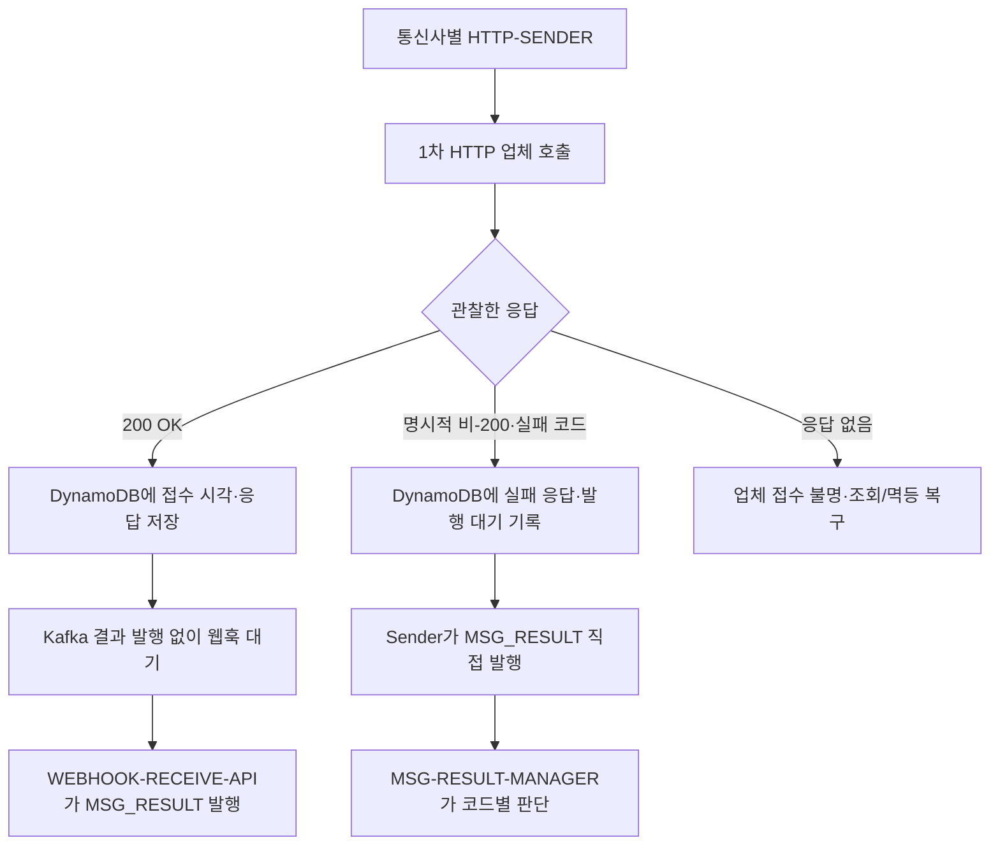

# 메시징 오류 코드와 결과 인계 계약

기준: 2026-10-05. 신규 메시징 경로의 오류 코드 네임스페이스와 `MSG_RESULT` 입력 규칙이다. [케이스별 Call Flow](53-신규-메시지-케이스별-Call-Flow.md) 및 [ADR-026](adr/ADR-026-MESSAGE-RECEIVED와-통신사별-HTTP-발송-분리.md)에 연결한다. 기존 단일 sender와 시뮬레이터의 문자열 코드 `RETRY_1S`·`FALLBACK` 등은 이관 전 계약이며 신규 통신사 코드표가 아니다.

## 오류 코드 대역

| 대역 | 소유자·용도 | 현재 배정 또는 상태 |
|---|---|---|
| `10000~59999` | 우리 메시징 서비스가 정의하고 고객에게 반환하거나 내부 최종 사유에 기록하는 코드 | 인증 `10000`대·JWT `11000`대, 요청 제어 `30000`대, 공통 API `50000`대 적용. `20000`·`40000`대는 추후 배정 |
| `60000~69999` | 1차 HTTP 발송을 받는 SKT·KT·LGU+의 실패를 우리 서비스에서 표현하는 정규화 코드 | SKT `60000~61999`, KT `62000~63999`, LGU+ `64000~65999`를 예약. 세 통신사 공통 동작 코드는 `66000~66999`에서 배정 |
| `70000~79999` | 2차 TCP 업체 실패를 우리 서비스에서 표현하는 정규화 코드 | 실제 응답 코드·매핑표 확정 전 |

HTTP 상태 코드(예: `429`, `503`)와 위 **업무 오류 코드**는 별도 필드다. 통신사나 TCP 업체의 원본 코드가 문자열·숫자이거나 우리 대역과 다를 수 있으므로 `providerErrorCode`를 원문으로 보존하고, 합의된 매핑 결과를 `normalizedErrorCode`에 둔다. 업체가 공통 코드를 직접 보내면 두 필드에 같은 값을 기록할 수 있다. 모르는 원본 코드는 임의로 재시도·통신사 이동·2차 발송 대상으로 추정하지 않고 분류 대기/운영 확인으로 보낸다. 성공 결과에는 실패 코드를 넣지 않는다. 다른 업체 코드의 구체적인 의미·2차 대상 표는 별도 확정한다.

| 공통 코드 | 의미 | `MSG-RESULT-MANAGER`의 후속 동작 |
|---|---|---|
| `66001` `NOT_OUR_CARRIER` | 호출한 통신사의 가입 번호가 아님 | 해당 호출을 실패로 닫고 아직 시도하지 않은 **다음 1차 HTTP 통신사**로 이동. 이 코드에서만 통신사 이동 |
| `66002` `TPS_EXCEEDED` | 호출한 통신사의 TPS 초과 | **같은 통신사**에 지연 재발송. 다음 통신사나 2차 TCP로 즉시 전환하지 않음 |

이 두 코드는 세 통신사에서 같은 의미로 사용한다. HTTP 응답의 명시적 실패든 200 뒤 웹훅 실패든 `sendRequestId`로 호출을 찾은 뒤 같은 코드별 판단을 적용한다. `66001` 이동은 같은 메시지의 1차 단계 안에서 일어나며, `66002` 재발송은 같은 통신사의 새 `invocation`·새 `sendRequestId`를 사용한다. 동일 명령의 Kafka 재전달만 기존 `sendRequestId`를 재사용한다. TPS 지연 시간·회차 한도 소진 시 처리와 마지막 통신사까지 모두 `66001`일 때의 최종 처리는 아직 정해야 한다.

기존 공개 API의 4자리 응답 코드를 5자리로 바꾸는 계약 변경이다. 현재 코드의 `1000~1003` → `10000~10003`, `1010~1014` → `11000~11004`, `3000~3004` → `30000~30004`, `9000~9003` → `50000~50003`에 대응한다. 과거 검증 자료에 기록된 숫자는 당시 관측값으로 유지한다. 신규 1차·2차 발송 업체 시뮬레이터의 6만/7만 코드 전환은 해당 신규 경로 구현 시 적용한다.

## 1차 HTTP 응답에서 `MSG_RESULT`까지

명시적 비-200 뒤에는 그 호출의 웹훅이 오지 않으므로 **통신사별 HTTP-SENDER가 직접 `MSG_RESULT`에 발행**한다. 중간 웹훅 API를 거치지 않는다. 발행 key는 `executionId`이고, 결과의 출처는 `source=HTTP_RESPONSE`다. 웹훅 API의 결과는 `source=WEBHOOK`이며, 같은 Manager가 처리한다. HTTP `200 OK`의 Sender는 Kafka 결과를 발행하지 않는다. 웹훅은 그 개별 호출의 최종 결과이며, 늦은 200 저장이 웹훅 판단을 덮지 않는다.

결과별 최소 공통 필드는 `resultId`, `executionId`, `attemptId`, `invocation`, `sendRequestId`, `source`, `carrier`, `status`, `observedAt`이다. **업체 웹훅에는 우리가 보낸 `sendRequestId`가 포함된다.** 따라서 Manager는 이를 현재 발송 호출과 대조하고 지난 회차·중복 결과를 분리한다. 실패일 때 `normalizedErrorCode`와 `providerErrorCode`를 포함하고, HTTP 응답에서 온 결과에는 `httpStatus`를 포함한다. 웹훅의 나머지 실제 회신 필드와 1~100건 묶음의 Kafka 레코드 단위는 확정해야 한다.

Sender는 비-200 관찰과 안정적인 `resultId`·발행 대기 상태를 DynamoDB에 먼저 기록한 뒤 Kafka 저장 확인까지 직접 발행한다. 저장 뒤 발행 전 종료하거나 Kafka ack가 불명확하면 같은 `resultId`로 재발행하며 Manager가 중복을 제거한다. 발행 실패만으로 업체에 HTTP를 다시 호출하지 않는다. 타임아웃은 비-200 응답이 아니며 업체 접수 여부가 불명확하므로 이 실패 결과로 꾸며 발행하지 않는다.

## 다음 확인 사항과 권장안

1. **TPS 재발송 간격과 과부하 제어:** 통신사별 설정 지연에 지터를 적용하고, 업체가 유효한 재시도 대기 시간을 제공하면 설정한 상한 안에서 우선 사용한다. 여러 Pod가 `66002`를 동시에 받으면 개별 메시지의 지연만으로는 재폭주할 수 있으므로 통신사별 공유 속도 제한도 함께 설계한다. 기존 1차의 최초 1회 + 최대 3회 재시도와 원래 deadline을 넘기지 않는다. 정확한 기본 지연과 한도 소진 뒤 최종 실패/2차 판단은 확정 전이다.
2. **통신사 탐색 종료:** 번호 캐시가 없으면 SKT → KT → LGU+를 적용한다. 캐시에 통신사가 있는데 그 통신사가 `66001`을 반환했을 때 남은 통신사의 순서와 세 곳 모두 `66001`일 때의 최종 사유를 정해야 한다. 권장안은 이미 시도한 통신사를 건너뛰고 고정 순서로 남은 통신사를 한 번씩만 시도한 뒤 최종 실패로 닫는 것이다.
3. **업체 멱등성과 1~100건 웹훅 전문:** 웹훅의 *각 결과 항목*에 `sendRequestId`가 들어오는지 확인한다. 같은 명령 재전달·Redis 유실 때 업체가 같은 `sendRequestId`를 중복 발송으로 인식하는지도 별도 확인이 필요하다. 권장안은 업체가 이를 멱등키로 사용하고, 우리 웹훅 API는 결과별 Kafka 레코드와 결과별 중복 식별자를 사용하는 것이다.
