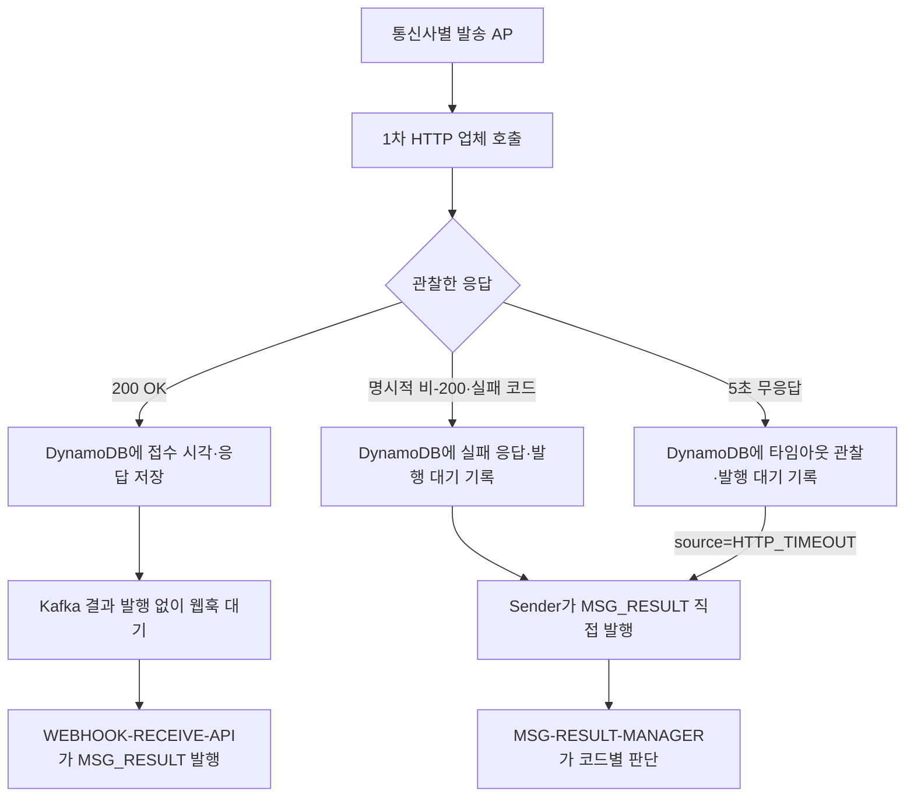

# 메시징 오류 코드와 결과 인계 계약

기준: 2026-10-06. 신규 메시징 경로의 오류 코드 네임스페이스와 `MSG_RESULT` 입력 규칙이다. [케이스별 Call Flow](53-신규-메시지-케이스별-Call-Flow.md) 및 [ADR-026](adr/ADR-026-MESSAGE-RECEIVED와-통신사별-HTTP-발송-분리.md)에 연결한다. 기존 단일 sender와 시뮬레이터의 문자열 코드 `RETRY_1S`·`FALLBACK` 등은 이관 전 계약이며 신규 통신사 코드표가 아니다.

## 오류 코드 대역

| 대역 | 소유자·용도 | 현재 배정 또는 상태 |
|---|---|---|
| `10000~59999` | 우리 메시징 서비스가 정의하고 고객에게 반환하거나 내부 최종 사유에 기록하는 코드 | 인증 `10000`대·JWT `11000`대, 요청 제어 `30000`대, 1차 단계 실패 `40000`대, 공통 API `50000`대 적용. `20000`대는 추후 배정 |
| `60000~69999` | 1차 HTTP 발송을 받는 SKT·KT·LGU+의 실패를 우리 서비스에서 표현하는 정규화 코드 | SKT `60000~61999`, KT `62000~63999`, LGU+ `64000~65999`를 예약. 세 통신사 공통 동작 코드는 `66000~66999`에서 배정 |
| `70000~79999` | 2차 TCP 업체 실패를 우리 서비스에서 표현하는 정규화 코드 | 실제 응답 코드·매핑표 확정 전 |

HTTP 상태 코드(예: `429`, `503`)와 위 **업무 오류 코드**는 별도 필드다. 통신사나 TCP 업체의 원본 코드를 `providerErrorCode`로 보존하고 합의된 5자리 코드를 `normalizedErrorCode`로 둔다. `66001`·`66002` 외 6만 대역 1차 실패는 통신사 이동·동일 통신사 재시도 없이 1차 단계 실패로 고정하고, 2차 발송 전문이 있으면 TCP로 인계하며 없으면 최종 실패·고객 웹훅으로 인계한다. 알 수 없는 원본 코드의 6만 대역 정규화 매핑은 구현 전에 정한다. 성공 결과에는 실패 코드를 넣지 않는다.

| 공통 코드 | 의미 | `MSG-RESULT-MANAGER`의 후속 동작 |
|---|---|---|
| `66001` `NOT_OUR_CARRIER` | 호출한 통신사의 가입 번호가 아님 | 해당 호출을 실패로 닫고 아직 시도하지 않은 **다음 1차 HTTP 통신사**로 이동. 이 코드에서만 통신사 이동 |
| `66002` `TPS_EXCEEDED` | 호출한 통신사의 TPS 초과 | **실패 판단 1분 후 같은 통신사**에 새 회차로 재발송. 다음 통신사나 2차 TCP로 즉시 전환하지 않음 |

이 두 코드는 세 통신사에서 같은 의미로 사용한다. HTTP 명시적 실패는 sender가 기록한 내부 `attemptId`·회차로, 웹훅은 `clientMsgId`로 현재 대기 시도를 찾아 같은 코드별 판단을 적용한다. `66001` 이동은 같은 메시지의 1차 단계 안에서 일어나며 통신사 탐색 순서는 **SKT → KT → LGU+에서 이미 시도한 통신사를 제외한 순서**다. Redis 번호 매핑으로 KT에 먼저 보냈다가 `66001`을 받았다면 남은 순서는 SKT → LGU+다. `66002`의 가장 이른 재발송 시각은 실패 판단 후 1분이며 업체 발송에는 같은 `clientMsgId`를 사용한다. 회차는 내부 시도 상태에만 기록한다.

| 우리 서비스 1차 단계 실패 코드 | 발생 조건 | 다음 판단 |
|---|---|---|
| `40001` `TPS_RETRY_EXHAUSTED` | 같은 통신사에서 `66002`가 최초 1회 + 재시도 3회(총 4회) 이어짐 | **1차 단계 실패**로 저장하고 2차 발송 전문 존재 여부 평가 |
| `40002` `NO_MATCHING_CARRIER` | SKT·KT·LGU+가 모두 `66001` 반환 | **1차 단계 실패**로 저장하고 2차 발송 전문 존재 여부 평가 |
| `40003` `NO_RESPONSE_RETRY_EXHAUSTED` | HTTP 응답 5초 타임아웃이 최초 1회 + 1분 간격 재시도 3회(총 4회) 이어짐 | **1차 단계 실패**로 저장하고 2차 발송 전문 존재 여부 평가 |

`66001`·`66002`는 개별 업체 결과이고 `40001`·`40002`·`40003`은 우리 서비스가 확정한 1차 단계 실패 사유다. 다른 6만 대역 실패는 해당 정규화 코드를 1차 실패 사유로 저장한다. Manager는 1차 실패와 판단 시각을 DynamoDB에 조건부로 고정한 뒤 `secondarySendPayload`가 있으면 2차 TCP 명령을 인계하고, 없으면 최종 실패를 고정해 `MSG-RESULT-FINALIZED`와 고객 대상 `WEBHOOK-SEND`에 인계한다. 2차 판단·발행 중 종료해도 같은 판단과 명령 ID로 재개해야 한다.

공통 `PrimaryHttpFailureDecision`은 `66001`·`66002`의 다음 통신사·회차·1분 이후 재시도, 5초 무응답의 1분 이후 재시도 또는 1차 실패, 그 외 6만 대역 실패의 1차 단계 종료를 계산한다. 2차 전환은 저장된 `secondarySendPayload`의 존재 여부로 결정한다. 아직 `MSG-RESULT-MANAGER`의 상태 확인·조건부 저장·후속 명령 발행에는 연결되지 않았다.

기존 공개 API의 4자리 응답 코드를 5자리로 바꾸는 계약 변경이다. 현재 코드의 `1000~1003` → `10000~10003`, `1010~1014` → `11000~11004`, `3000~3004` → `30000~30004`, `9000~9003` → `50000~50003`에 대응한다. 과거 검증 자료에 기록된 숫자는 당시 관측값으로 유지한다. 신규 1차·2차 발송 업체 시뮬레이터의 6만/7만 코드 전환은 해당 신규 경로 구현 시 적용한다.

## 1차 HTTP 응답에서 `MSG_RESULT`까지

명시적 비-200 뒤에는 그 호출의 웹훅이 오지 않으므로 **통신사별 발송 AP가 직접 `MSG_RESULT`에 발행**한다. 중간 웹훅 API를 거치지 않는다. 발행 key는 고정 `clientMsgId`이고 결과의 출처는 `source=HTTP_RESPONSE`다. 웹훅 API의 결과는 `source=WEBHOOK`이며 같은 Manager가 처리한다. HTTP `200 OK`의 Sender는 Kafka 결과를 발행하지 않는다. 웹훅은 그 개별 호출의 최종 결과이며 늦은 200 저장이 웹훅 판단을 덮지 않는다.

업체 웹훅은 **1~100개 결과의 배열**로 오며 각 항목은 `clientMsgId`와 `status`를 담는다. `status=success`이면 `error`가 없고 `status=fail`이면 `error: {code, message}`가 반드시 있다. `error.code`는 5자리 JSON 숫자이며 1차 통신사 실패는 6만 대역이다. 발송 요청의 `clientMsgId`는 웹훅에도 그대로 온다. 한 요청 안에서 `clientMsgId`는 중복되지 않으며 업체가 별도의 회차·결과 ID를 주지는 않는다.

웹훅 API는 업체 인증·형식·건수·수신 크기만 확인하고 **웹훅 요청 전체를 `MSG_RESULT` 1레코드**로 발행한다. API는 개별 `clientMsgId`로 DynamoDB를 조회하거나 업무 결과를 판단하지 않는다. 배치의 Kafka key는 인입 `traceId`이며 Manager가 각 `clientMsgId`로 현재 저장 시도를 조회한다. HTTP 응답 실패는 같은 토픽에 1개 결과를 발행하며 key는 `clientMsgId`다. 토픽의 `source=WEBHOOK` 배치와 `source=HTTP_RESPONSE` 단건은 명시적으로 구분한다. Manager가 정규화한 개별 결과에는 안정적인 `resultId`, 고정 `clientMsgId`, 내부 `attemptId`·`invocation`, `source`, `carrier`, `status`, `observedAt`을 둔다. 실패에는 `normalizedErrorCode`와 `providerErrorCode`, HTTP 응답 결과에는 `httpStatus`를 포함한다. 재전송에도 안정적인 개별 `resultId` 생성과 영구적으로 잘못된 항목의 격리 경로는 구현 전에 정한다.

업체는 **웹훅 접수 API가 실패 응답을 주면 같은 결과 묶음을 재전송**하며, 업체 측 재전송 최대 기간은 없다. 한 묶음 안에 중복 ID가 없다는 보장은 서로 다른 재전송 요청 사이의 중복 제거를 대신하지 않는다. API는 배치 레코드의 Kafka 저장 확인 전에는 웹훅 성공 응답을 하지 않는다. ack가 불명확하면 업체가 같은 묶음을 재전송할 수 있다. Manager는 추가 분리 AP 없이 배치 내부 항목을 제한된 병렬성으로 처리하고 모든 항목을 내구성 있게 처리한 뒤 Kafka offset을 완료한다. 한 항목에서 일시 장애가 나면 전체 배치가 재전달되므로 이미 반영한 결과는 저장 상태로 멱등 처리한다. 단, 이전 실패 웹훅이 다음 200 이후 재전송되면 같은 `clientMsgId`만으로는 어느 시도의 결과인지 확정할 수 없다.

**우리 쪽 1차 결과 판단 기한은 최초 인입 +3시간, 2차 판단 기한은 1차 결과 판단 시각 +4시간이다.** 이는 웹훅 API의 수신 종료 시간이 아니다. 업체가 그 후에도 웹훅을 보낼 수 있으므로 인증·형식이 유효한 늦은 결과도 API가 Kafka에 인계하고 저장 확인 후 접수 성공을 응답한다. Manager는 만료·2차 전환·최종 확정된 업무 상태를 되돌리지 않고 늦은 결과를 관측한다. 정리된 실행이나 모르는 `clientMsgId`의 웹훅도 새 발송·새 최종 결과로 만들지 않는다. 웹훅 배치 key는 인입 `traceId`이며 Manager는 각 항목의 `clientMsgId`로 실행을 찾는다. 저장된 실행이 없는 결과의 관측 보존·격리 경로는 구현 전에 정한다. 인증·형식이 잘못된 요청은 별도 거절한다.

Sender는 명시적 비-200과 5초 무응답 관찰을 서로 다른 출처로 DynamoDB에 먼저 기록하고 `MSG_RESULT`에 직접 발행한다. 타임아웃 레코드는 `source=HTTP_TIMEOUT`이며 업체 실패 코드를 꾸며 넣지 않는다. 저장 뒤 발행 전 종료하거나 Kafka ack가 불명확하면 같은 `resultId`로 재발행하며 Manager가 중복을 제거한다. Manager는 타임아웃 뒤 1분 이후 동일 통신사·동일 `clientMsgId` 재발송을 예약하고 최초 1회+재시도 3회를 소진하면 `40003`으로 1차 단계를 닫는다. 발행 실패만으로 업체에 HTTP를 다시 호출하지 않는다. 타임아웃 때 업체가 실제 접수했을 가능성과 늦은 웹훅 경합은 남으므로 이미 확정된 최종 결과를 뒤집지 않는다.

2차 TCP 명령은 `MSG-TCP-SENDER`가 Redis에서 시도 중복을 확인·선점한 뒤 발송한다. TCP 업체가 같은 호출에서 바로 반환한 응답을 DynamoDB에 기록하고 `MSG_RESULT`에 `source=TCP_RESPONSE`인 단건으로 인계한다. 2차 업체 웹훅은 사용하지 않는다. TCP 응답의 7만 대역 정규화 표, 무응답 타임아웃과 재시도 기준, 중복 선점 TTL은 후속 계약이다.

## 다음 확인 사항과 권장안

1. **업체의 중복 차단 시간:** 발송 중·성공한 같은 `clientMsgId`를 약 2시간 막고 실패한 호출에는 같은 ID를 재사용할 수 있다고 파악했다. 정확한 보장 시간·기산 시점은 확인 전이다. 1차 업무 기한은 3시간이므로 마지막 1시간이나 늦은 복구에서 업체 보장만으로 중복을 막을 수 없다. 내부 발송 상태와 업체 효과 조회·운영 확인 기준이 필요하다.
2. **무기한 늦은 웹훅:** 업체 재전송 간격은 미확인이고 최대 기간은 없다. 유효한 웹훅은 Kafka 저장 확인 후 접수 성공으로 응답해 재전송을 멈추며, Manager가 늦거나 모르는 ID를 업무 상태 변경 없이 관측한다. 정리된 실행의 관측 보존 위치와 영구적으로 잘못된 배치 항목의 격리 경로는 정해야 한다. 웹훅 Kafka 단위는 요청별 1레코드(`traceId` key)다. deadline 직전에 도착하고 Kafka 소비가 지연된 결과의 수신 시각·만료 경합도 별도 결정이다.
3. **1차 소진 뒤 2차 조건:** `66002`와 5초 무응답은 각각 최초 1회 뒤 최대 3회 재시도(총 최대 4회)하고, 각 재발송은 1분 이후다. 소진하면 각각 `40001`·`40003`으로 1차를 닫는다. 세 통신사 `66001` 소진은 `40002`다. 다른 6만 대역 실패는 즉시 1차를 닫는다. 2차 발송 전문이 있으면 TCP로 인계하고 없으면 고객 웹훅을 포함해 최종 실패로 마감한다. 여러 Pod가 동시에 `66002`를 받았을 때 통신사별 공유 속도 제한은 구현 전에 정한다.
